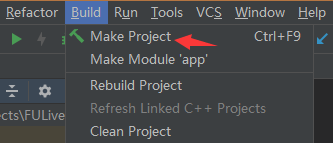
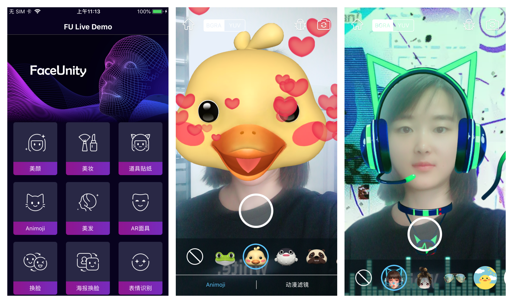

# Demo运行说明文档-Android

级别：Public 

更新日期：2021-04-19

SDK版本: 7.4.0

------
### 最新更新内容：

**2021-04-19 v7.4.0:**

1.版本重构，调整代码结果
2.接入最新库底层库7.4.0
3.新增精品贴纸、自定义人像分割等新功能

------
### 目录：

本文档内容目录：

[TOC]

------
### 1. 简介

本文档旨在说明如何将Faceunity Nama SDK的 Android Demo运行起来，体验Faceunity Nama SDK的功能。

FULiveDemoDroid 是 Android 平台上，集成相芯人脸跟踪及视频特效开发包（简 Nama SDK）的集成示例。

集成了 Faceunity 面部跟踪、美颜、Animoji、道具贴纸、AR面具、表情识别、音乐滤镜、人像分割、手势识别、哈哈镜等功能。

Demo新增了一个展示Faceunity产品列表的主界面，新版Demo将根据客户证书权限来控制用户可以使用哪些产品。  

------
### 2. Demo文件结构

本小节，描述Demo文件结构，各个目录，以及重要文件的功能。

```
+Kotlin_FaceUnity_Demo
  +app 			                            // app 模块
    +libs
      -fu_core-release.aar                  // 特效SDK
    +src
      +main
        +assets      
          +animoji                          // 动漫滤镜 
          +bg_seg_green                     // 绿幕抠像 
          +change_face                      // 海报换脸 
          +effect                           // 各种道具
            +action                         // 动作识别
            +ar                             // AR 面具
            +big_head                       // 搞笑大头
            +expression                     // 表情识别
            +facewarp                       // 哈哈镜
            +gesture                        // 手势识别 
            +musicfilter                    // 音乐滤镜
            +normal                         // 道具贴纸 
            +segment                        // 人像分割 
          +graphics                          
            -body_slim.bundle               // 美体
            -controller_cpp.bundle          // PTA
            -face_beautification.bundle     // 美颜
            -face_makeup.bundle             // 美妆
            -fuzzytoonfilter.bundle         // 动漫滤镜
            -fxaa.bundle                    // 3D抗锯齿
            -tongue.bundle                  // 舌头驱动
          +hair_seg                         // 美发
          +light_makeup                     // 轻美妆
            +blusher...                     // 腮红等资源
            -light_makeup.bundle            // 轻美妆道具
          +makeup                           // 美妆
            +combination_bundle             // 组合妆 bundle 资源
            +config_json                    // 组合妆 json 资源
            +item_bundle                    // 美妆子妆 bundle 资源
            -color_setup.json               // 颜色配置
          +model                            // AI驱动
            -ai_face_processor.bundle       // 人脸驱动
            -ai_hairseg.bundle              // 头发分割驱动
            -ai_hand_processor.bundle       // 手势驱动
            -ai_human_processor.bundle      // 人体驱动
          +pta                              // 全身 Avatar
            +boy                            // 男孩效果道具
            +gesture                        // 手势算法模型
            +girl                           // 女孩效果道具
            -controller_config.bundle       // controller 配置文件
            -default_bg.bundle              // 白色背景
        +java                               // Java 源码
        +res                                // App 资源文件

  +fu_ui                                    // UI 模块封装 
    +src
      +main
        +java                              // Java 源码 
  +doc		    	                       // 开发文档目录
  +README.md	 	                       // 工程说明文档
```

------

### 3. 运行Demo 

#### 3.1 开发环境
##### 3.1.1 支持平台
```
Android API 19 及以上，GLES 2.0 及以上
```
##### 3.1.2 开发环境
```
Android Studio 3.4 及以上
```

#### 3.2 准备工作 

- 下载 [FULiveDemoDroid](https://github.com/Faceunity/FULiveDemoDroid) 工程
- 获取证书:
  1. 拨打电话 **0571-88069272** 
  2. 发送邮件至 **marketing@faceunity.com** 进行咨询。

#### 3.3 相关配置

Android 端发放的证书为 authpack.java 文件，如果您已经获取到鉴权证书，将证书文件放到工程中 app 模块 com.faceunity.app 包下即可。

#### 3.4 编译运行

- 点击 Sync 按钮，同步一下工程。或者 Build-->Make Projects。



- 点击 Run 按钮运行，部署到手机上。


- Demo 运行效果。



------
### 4. 常见问题 

如有使用问题，请联系技术支持。