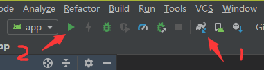

# Demo运行说明文档-Android

级别：Public 

更新日期：2021-07-13

SDK版本: 7.4.1

------
### 最新更新内容：

**2021-07-13 v7.4.1:**

- 更新精品贴纸8款，包含2款PK游戏，5款装饰及互动贴纸，1款全身驱动道具
- 更新2款中国风Animoji模型
- 修复人像分割贴纸效果问题，修复后人像分割结果和贴纸效果会同时出现
- 修复一些bug，包括高分辨率磨皮效果问题，人脸检测与贴纸绘制的时序问题

**2021-04-19 v7.4.0:**
- 【Demo层】重构特效Demo，将面向过程变成改为面向对象，整体结构逻辑更清晰，客户调用更便捷。同时具有节省内存、优化itemID自动销毁逻辑、精简用户传入信息过程，低耦合性提高架构灵活度等多方优势
- 新增情绪识别功能，支持8种基本的饱满情绪检测
- 新增内容服务模块，展示游戏道具及精品贴纸，主要包括游戏类、情节类、头饰类、氛围类等丰富的特效道具
- 新增异步接口，改善用户在低端设备上帧率不足问题
- 优化美体性能，Android端帧率上升24%，iOS端耗时下降13%
- 优化人像分割性能，Andriod端帧率上升39%，iOS耗时下降39%
- 优化人像分割效果，主要包括优化缝隙问题，使人像分割更加贴合人体，不会有明显空隙；提升人体分割准确性，减少背景误识别情况
- 增加人像分割新玩法，开放用户自定义背景接口，便于用户快速换背景；支持人像描边玩法，可自定义描边的宽度、距离、颜色
- 增加Animoji无尾熊模型；优化Animoji面部驱动效果，提升驱动后模型的稳定性和灵敏度
- 优化美妆效果，主要包括唇部遮挡时口红不再显现；提升美瞳的贴合度；增加多款美瞳素材

**2021-01-25 v7.3.2:**

- 优化人脸表情跟踪驱动性能。
- fuSetup 函数改为线程安全。
- fuSetUp 、fuCreateItemFromPackage、fuLoadAIModel函数增加异常处理，增强鲁棒性。
- 修复自定义哈哈镜功能效果问题。
- 修复SDK在Mac 10.11上crash问题。
- 修复SDK在贴纸和Animoji混用时crash问题。

**2020-12-29 v7.3.0:**

- 优化美妆性能，和V7.2比，标准美妆Android端帧率提升29%，iOS端帧率提升17%；标准美颜+标准美妆，集成入第三方推流1小时后，在低端机上帧率高于15fps，可流畅运行。
- 优化美体性能，和V7.2比，性能显著提升，Android端帧率提升26%，CPU降低32%；iOS端帧率提升11%，CPU降低46%，内存降低45%。
- 优化背景分割性能，和V7.2比，性能显著提升，Android端帧率提升64%，CPU降低25%；iOS端帧率提升41%，CPU降低47%，内存降低44%。请使用ai_human_processor_mb_fast.bundle。
- 优化美体功能效果，优化大幅度运动时，头部和肩部位置附近物体变形幅度大的问题；人体在画面中出现消失时过渡更自然；遮挡情况美体效果更加稳定，不会有高频持续抖动情况。
- 优化表情识别功能，提高识别准确性，共能识别17种表情动作，对应新增FUAITYPE_FACEPROCESSOR_EXPRESSION_RECOGNIZER。
- 优化绿幕抠像效果，提高边缘准确度。
- 优化人脸表情跟踪驱动效果，优化首帧检测模型显示较慢问题，加强细微表情跟踪，优化人脸转动时模型明显变小问题。
- 优化全身Avatar跟踪驱动效果，针对做连续高频大幅度运动的情况，如跳舞等场景，整体模型稳定性，尤其手臂稳定性提升，抖动情况显著改善。
- 优化美颜亮眼下眼睑溢色问题。
- 新增人脸拖拽变形功能，可使用FUCreator 2.1.0进行变形效果编辑。
- 新增美颜美型模块瘦圆眼功能，效果为使眼睛整体放大，尤其是纵向放大明显。
- 新增支持手势回调接口fuSetHandGestureCallBack，详见接口文档。
- 控花、控雨、控雪道具重新制作，优化跟踪效果不连贯的问题。

**2020-9-24 v7.2.0:**

1. 新增绿幕抠像功能，支持替换图片、视频背景等。
2. 美颜模块新增瘦颧骨、瘦下颌骨功能。
3. 优化美颜性能以及功耗，解决集成入第三方推流服务时易发热掉帧问题。
4. 优化手势识别功能的效果以及性能，提升识别稳定性和手势跟随性效果，优化手势识别时cpu占有率。
5. 优化PC版各个功能性能，帧率提升显著。美发、美体、背景分割帧率提升30%以上，美颜、Animoji、美妆、手势等功能也有10%以上的帧率提升。
6. 优化包增量，SDK分为lite版，和全功能版本。lite版体积更小，包含人脸相关的功能(海报换脸除外)。
7. 优化人脸跟踪稳定性，提升贴纸的稳定性。
8. 提供独立核心算法SDK，接口文档详见算法SDK文档。
9. 人脸算法能力接口封装，算法demo中新增包括人脸特征点位、表情识别和舌头动作3项核心人脸能力。
------
### 目录：

本文档内容目录：

[TOC]

------
### 1. 简介

本文档旨在说明如何将Faceunity Nama SDK的 Android Demo运行起来，体验Faceunity Nama SDK的功能。

FULiveDemoDroid 是 Android 平台上，集成相芯人脸跟踪及视频特效开发包（简 Nama SDK）的集成示例。

集成了 Faceunity 面部跟踪、美颜、Animoji、道具贴纸、AR面具、表情识别、音乐滤镜、人像分割、手势识别、哈哈镜等功能。

Demo新增了一个展示Faceunity产品列表的主界面，新版Demo将根据客户证书权限来控制用户可以使用哪些产品。  

------
### 2. Demo文件结构

本小节，描述Demo文件结构，各个目录，以及重要文件的功能。

```
+Kotlin_FaceUnity_Demo
  +app 			                            // app 模块
    +libs
      -fu_core-release.aar                  // 特效SDK
    +src
      +main
        +assets      
          +animoji                          // 动漫滤镜 
          +bg_seg_green                     // 绿幕抠像 
          +change_face                      // 海报换脸 
          +effect                           // 各种道具
            +action                         // 动作识别
            +ar                             // AR 面具
            +big_head                       // 搞笑大头
            +expression                     // 表情识别
            +facewarp                       // 哈哈镜
            +gesture                        // 手势识别 
            +musicfilter                    // 音乐滤镜
            +normal                         // 道具贴纸 
            +segment                        // 人像分割 
          +graphics                         // 图形效果道具
            -body_slim.bundle               // 美体道具
            -controller_cpp.bundle          // 全身 Avatar 道具
            -face_beautification.bundle     // 美颜道具
            -face_makeup.bundle             // 美妆道具
            -fuzzytoonfilter.bundle         // 动漫滤镜道具
            -fxaa.bundle                    // 3D 绘制抗锯齿
            -tongue.bundle                  // 舌头跟踪数据包
          +hair_seg                         // 美发
          +light_makeup                     // 轻美妆
            +blusher...                     // 腮红等资源
            -light_makeup.bundle            // 轻美妆道具
          +makeup                           // 美妆
            +combination_bundle             // 组合妆 bundle 资源
            +config_json                    // 组合妆 json 资源
            +item_bundle                    // 美妆子妆 bundle 资源
            -color_setup.json               // 颜色配置
          +model                            // 算法能力模型
            -ai_face_processor.bundle       // 人脸识别AI能力模型
            -ai_face_processor_lite.bundle  // 人脸识别AI能力模型，轻量版
            -ai_hairseg.bundle              // 头发识别AI能力模型
            -ai_hand_processor.bundle       // 手势识别AI能力模型
            -ai_human_processor.bundle      // 人体点位AI能力模型
          +pta                              // 全身 Avatar
            +bear                           // 熊效果道具
            +boy                            // 男孩效果道具
            +gesture                        // 手势算法模型
            +girl                           // 女孩效果道具
            -controller_config.bundle       // controller 配置文件
            -default_bg.bundle              // 白色背景
        +java                               // Java 源码
        +res                                // App 资源文件

  +fu_ui                                    // UI 模块
    +src
      +main
        +java                              // Java 源码 
  +doc		    	                       // 开发文档目录
  +README.md	 	                       // 工程说明文档
```

------

### 3. 运行Demo 

#### 3.1 开发环境
##### 3.1.1 支持平台
```
Android API 19 及以上，GLES 2.0 及以上
```
##### 3.1.2 开发环境
```
Android Studio 3.4 及以上
```

#### 3.2 准备工作 

- 下载 [FULiveDemoDroid](https://github.com/Faceunity/FULiveDemoDroid) 工程
- 获取证书:
  1. 拨打电话 **0571-89774660** 
  2. 发送邮件至 **marketing@faceunity.com** 进行咨询。

#### 3.3 相关配置

Android 端发放的证书为 authpack.java 文件，如果您已经获取到鉴权证书，将证书文件放到工程中 app 模块 com.faceunity.app 包下即可。

#### 3.4 编译运行

- 点击 Sync 按钮，同步一下工程。或者 Build-->Make Projects。


- 点击 Run 按钮运行，部署到手机上。



- Demo 运行效果。


------
### 4. 常见问题 

如有使用问题，请联系技术支持。