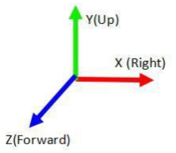

# Android Nama Java API 参考文档

级别：Public
更新日期：2021-07-13
SDK版本: 7.4.1

------
### 最新更新内容：

**2021-07-13 v7.4.1:**
- 更新精品贴纸8款，包含2款PK游戏，5款装饰及互动贴纸，1款全身驱动道具
- 更新2款中国风Animoji模型
- 修复人像分割贴纸效果问题，修复后人像分割结果和贴纸效果会同时出现
- 修复一些bug，包括高分辨率磨皮效果问题，人脸检测与贴纸绘制的时序问题

**2021-04-19 v7.4.0:**

 - 优化2D人体点位和美体性能。
 - 优化人像分割效果和性能。优化手臂和手识别不稳定问题，优化背景误识别问题。修复人像分割偏移问题。
 - 优化美妆效果。优化美瞳贴合效果和溢色问题；优化唇妆遮挡效果，遮挡时口红不再显现。
 - 优化Animoji面部驱动效果。优化小幅度动作，如小幅度张嘴和眨眼时，驱动效果更加灵敏。
 - 优化情绪识别，支持8种基本情绪识。
 - 新增接口fuSetUseAsyncAIInference，支持异步模式，开启异步模式，帧率提升，可改善客户在一些低端设备上帧率不足问题。
 - 新增fuRender接口，为所有业务统一渲染接口，详见接口定义。
 - 新增接口 fuSetInputBufferMatrix，fuSetInputCameraBufferMatrixState，fuSetInputTextureMatrix，fuSetInputCameraTextureMatrixState，fuSetOutputMatrix，fuSetOutputMatrixState，用于设置图像转换矩阵，用于调整输出图像方向，详见接口定义。


**2021-01-25 v7.3.2:**

1. 优化人脸表情跟踪驱动性能。

2. fuSetup 函数改为线程安全。

3. fuSetUp 、fuCreateItemFromPackage、fuLoadAIModel函数增加异常处理，增强鲁棒性。

4. 修复自定义哈哈镜功能效果问题。

5. 修复SDK在Mac 10.11上crash问题。

6. 修复SDK在贴纸和Animoji混用时crash问题。  

**2020-12-29 v7.3.0:**

1. 优化美妆性能，和V7.2比，标准美妆Android端帧率提升29%，iOS端帧率提升17%；标准美颜+标准美妆，集成入第三方推流1小时后，在低端机上帧率高于15fps，可流畅运行。
2. 优化美体性能，和V7.2比，性能显著提升，Android端帧率提升26%，CPU降低32%；iOS端帧率提升11%，CPU降低46%，内存降低45%。
3. 优化背景分割性能，和V7.2比，性能显著提升，Android端帧率提升64%，CPU降低25%；iOS端帧率提升41%，CPU降低47%，内存降低44%。
4. 优化美体功能效果，优化大幅度运动时，头部和肩部位置附近物体变形幅度大的问题；人体在画面中出现消失时过渡更自然；遮挡情况美体效果更加稳定，不会有高频持续抖动情况。
5. 优化表情识别功能，提高识别准确性，共能识别17种表情动作。
6. 优化绿幕抠像效果，提高边缘准确度。
7. 优化人脸表情跟踪驱动效果，优化首帧检测模型显示较慢问题，加强细微表情跟踪，优化人脸转动时模型明显变小问题。
8. 优化全身Avatar跟踪驱动效果，针对做连续高频大幅度运动的情况，如跳舞等场景，整体模型稳定性，尤其手臂稳定性提升，抖动情况显著改善。
9. 优化美颜亮眼下眼睑溢色问题。
10. 新增人脸拖拽变形功能，可使用FUCreator 2.1.0进行变形效果编辑。
11. 新增美颜美型模块瘦圆眼功能，效果为使眼睛整体放大，尤其是纵向放大明显。
12. 新增支持手势回调接口fuSetHandGestureCallBack，详见接口文档。
13. 新增AI能力，表情识别，AITYPE为FUAITYPE_FACEPROCESSOR_EXPRESSION_RECOGNIZER。

**2020-9-24 v7.2.0:**

1. 新增绿幕抠像功能，支持替换图片、视频背景等，详见绿幕抠像功能文档。
2. 美颜模块新增瘦颧骨、瘦下颌骨功能。
3. 优化美颜性能以及功耗，优化集成入第三方推流服务时易发热掉帧问题。
4. 优化手势识别功能的效果以及性能，提升识别稳定性和手势跟随性效果，优化手势识别时cpu占有率。
5. 优化PC版各个功能性能，帧率提升显著。美发、美体、背景分割帧率提升30%以上，美颜、Animoji、美妆、手势等功能也有10%以上的帧率提升。
6. 优化包增量，SDK分为lite版，和全功能版本。lite版体积更小，包含人脸相关的功能(海报换脸除外)。
7. 优化人脸跟踪稳定性，提升贴纸的稳定性。
8. 提供独立核心算法SDK，接口文档详见算法SDK文档([FUAI_C_API_参考文档.md](./FUAI_C_API_参考文档.md))。
9. fuGetFaceInfo接口新增三个参数，分别为：舌头方向(tongue_direction)，表情识别(expression_type)，头部旋转信息欧拉角参数(rotation_euler)。
10. 新增fuOnDeviceLostSafe函数，详见接口文档。
11. 新增fuSetFaceProcessorDetectMode函数，人脸识别跟踪区分图片模式和视频模式，详见接口文档。
12. 新增人体动作识别动作定义文档([人体动作识别文档.md](../resource/docs/人体动作识别文档.md))。
13. 新增ai_hand_processor.bundle，替代ai_gesture.bundle，提供手势识别跟踪能力。

**2020-7-29 v7.1.0:**

1. 新增美颜锐化功能，见美颜参数文档。
2. 优化美颜磨皮效果，保留更多的高频细节。
3. 添加fuHumanProcessorGetFov接口。
4. 添加fuHumanProcessorSetFov接口。

------

### 目录：

本文档内容目录：

[TOC]

------

### 1. 简介

本文是相芯人脸跟踪及视频特效开发包（以下简称 Nama SDK）的底层接口文档。该文档中的 Nama API 为底层 native 接口，可以直接用于 PC/iOS/Android NDK/Linux 上的开发。其中，iOS和Android平台上的开发可以利用SDK的应用层接口（Objective-C/Java），相比本文中的底层接口会更贴近平台相关的开发经验。

SDK相关的所有调用要求在同一个线程中顺序执行，不支持多线程。少数接口可以异步调用（如道具加载），会在备注中特别注明。SDK所有渲染线程调用的接口需要保持 OpenGL context 一致，否则会引发纹理数据异常。如果需要用到SDK的绘制功能，则渲染线程的所有调用需要预先初始化OpenGL环境，没有初始化或初始化不正确会导致崩溃。我们对OpenGL的环境要求为 GLES 2.0 以上。具体调用方式，可以参考各平台 demo。

底层接口根据作用逻辑归为六类：初始化、加载道具、主运行接口、销毁、功能接口、P2A相关接口。

------

### 2. APIs
#### 2.1 初始化

##### fuSetup 初始化接口

```java
@Deprecated
public static native int fuSetup(byte[] v3data, byte[] ardata, byte[] authdata);
public static native int fuSetup(byte[] v3data, byte[] authdata);
```

**接口说明：**

初始化系统环境，加载系统数据，并进行网络鉴权。必须在调用SDK其他接口前执行，否则会引发崩溃。

第一个接口已废弃，建议采用第二个。

**参数说明：**

`v3data` v3.bundle 字节数组。**注意：**SDK 6.6.0 后 v3 不再使用，该参数传 `new byte[0]` 即可。

`ardata` 已废弃，传 null 即可

`authdata` 鉴权数据字节数组

**返回值：**

返回非0值代表成功，返回0代表失败。如初始化失败，可以通过 `fuGetSystemError` 获取错误代码。

**备注：**

App 启动后只需要 setup 一次即可，其中 authpack.A() 鉴权数据声明在 authpack.java 中。必须配置好有效的证书，SDK 才能正常工作。

根据应用需求，鉴权数据也可以运行时提供（如网络下载），不过要注意证书泄露风险，防止证书被滥用。

##### fuSetupLocal 离线初始化接口

初始化系统环境，加载系统数据，并进行离线鉴权。必须在调用SDK其他接口前执行，否则会引发崩溃。

```java
public static native byte[] fuSetupLocal(byte[] v3data, byte[] authdata, byte[] offlinedata);
```

**接口说明：**

初始化系统环境，加载系统数据，并进行离线鉴权。必须在调用SDK其他接口前执行，否则会引发崩溃。

**参数说明：**

`v3data` v3.bundle 字节数组。**注意：**SDK 6.6.0 后 v3 不再使用，该参数传 `new byte[0]` 即可。

`authdata` 鉴权数据字节数组

`offlinedata` 离线鉴权数据字节数组，第一次调用传 null，之后调用传该函数返回值。

**返回值：**

云端返回的鉴权数据，需要保存到本地，用于离线鉴权，使用时作为 `offlinedata` 参数。

**备注：**

App 启动后只需要 setup 一次即可，其中 authpack.A() 鉴权数据声明在 authpack.java 中。必须配置好有效的证书，SDK 才能正常工作。

根据应用需求，鉴权数据也可以运行时提供（如网络下载），不过要注意证书泄露风险，防止证书被滥用。

第一次使用需要联网鉴权，鉴权成功后返回离线证书，请妥善保存离线证书数据。之后使用不需要联网。

如果初始化失败，可以通过 `fuGetSystemError` 获取错误代码。

----

##### fuIsLibraryInit 检测接口是否已经初始化

**接口说明：**

检测接口是否已经初始化。

```java
public static native int fuIsLibraryInit();
```

__返回值:__  

返回状态0为未初始化，1为已初始化。

-----

##### fuCreateTexForItem 为特定道具创建纹理

**接口说明：**为特定的道具创建纹理，并将纹理 id 设置给道具参数，供道具使用。

```java
public static native int fuCreateTexForItem(int item, String name, byte[] value, int width, int height);
```

__参数:__  
`item`：道具 handle
`name `：道具参数名
`value`：图片 RGBA buffer
`width`：图片宽度
`height`：图片高度
__返回值:__  

返回状态 0 为失败，1 为成功。

------

##### fuDeleteTexForItem 释放创建的纹理

**接口说明：**释放由 fuCreateTexForItem 创建纹理。

```java
public static native int fuDeleteTexForItem(int item, String name);
```

__参数:__  
`item`：道具 handle
`name`：道具参数名
__返回值:__  

返回状态 0 为失败，1 为成功。

------

##### fuSetDefaultRotationMode 设置默认的人脸朝向

**接口说明：**设置默认的人脸朝向。

```java
public static native void fuSetDefaultRotationMode(int rotationMode);
```

__参数:__  

`rotationMode`：要设置的人脸朝向，取值范围为 0-3，分别对应人脸相对于图像数据旋转0度、90度、180度、270度。 

__备注:__  

Android 平台的原生相机数据为横屏，需要进行该设置加速首次识别。根据经验，Android 前置摄像头一般设置参数 1，后置摄像头一般设置参数 3，部分手机存在例外。取值与设备方向和相机方向有关，自动计算的代码可以参考 FULiveDemo 中 FURenderer 类相关方法。

旧接口 `fuSetDefaultOrientation` 已废弃，请使用 `fuSetDefaultRotationMode` 设置。

--------

##### fuSetFaceProcessorDetectMode 设置人脸识别模式
**接口说明：**SDK人脸识别模式分为图片模式和视频模式。图片模式更为及时，视频模式性能更优。  

```java
public static native int fuSetFaceProcessorDetectMode(int mode);
```
__参数:__  

`in]`：0为图像模式，1为视频模式。 

__返回值:__  

1为成功，0为失败。

------

##### fuSetInputCameraMatrix 设置输入纹理的转正方式

**接口说明：**为 `fuRenderBundles`、`fuRenderBundlesWithCamera`、`fuRenderBundlesSplitView` 函数，设置输入纹理的转正方式，转为人像竖屏模式。  

```java
public static native void fuSetInputCameraMatrix(int flip_x, int flip_y, int rotate_mode);
```

__参数:__  

`flip_x`：水平翻转输入。 
`flip_y`：垂直翻转输入。 
`rotate_mode`：旋转输入，0为0度，1为90度，2为180度，3为270度。

-------

##### fuRotateImage 函数

旋转或者翻转图像。  

```java
public static native int fuRotateImage(RotatedImage outImage, byte[] inputImage, int imageFormat, int inputWidth, int inputHeight, int rotateMode, int flipX, int flipY);
```

__参数:__  

`outImage`：输出图像
`inputImage`：输入图像
`imageformat`：输入图像的格式。
`inputWidth`：输入图像的宽。 
`inputHeight`：输入图像的高。
``rotateMode`：旋转输入，0为0度，1为90度，2为180度，3为270度。 
`flipX`：水平翻转输入。 
`flip_Y`：垂直翻转输入。 

**返回值：**

`int` 返回 1 代表成功，返回 0 代表失败。

----

##### fuLoadAIModelFromPackage 加载 AI 模型接口

**接口说明：**

SDK6.6.0 新增接口，在fuSetup后，可以预先加载未来可能需要使用到的AI能力。AI模型和SDK一起发布，在Assets目录下。该函数不需要 GL 环境，可以异步调用。

```java
public static native int fuLoadAIModelFromPackage(byte[] data, int type);
```

__参数说明:__

`data`： 内存指针，指向SDK提供的 ai****.bundle 文件内容，为AI能力模型。

`type`：描述bundle对应的AI能力类型，如下：

```c
typedef enum FUAITYPE{
	FUAITYPE_BACKGROUNDSEGMENTATION=1<<1,//背景分割,7.0.0及以上版本可使用FUAITYPE_HUMAN_PROCESSOR_SEGMENTATION
	FUAITYPE_HAIRSEGMENTATION=1<<2,		//头发分割，7.0.0及以上版本可使用FUAITYPE_FACEPROCESSOR_HAIRSEGMENTATION
	FUAITYPE_HANDGESTURE=1<<3,			//手势识别
	FUAITYPE_TONGUETRACKING=1<<4,		//暂未使用
	FUAITYPE_FACELANDMARKS75=1<<5,		//废弃
	FUAITYPE_FACELANDMARKS209=1<<6,		//废弃
	FUAITYPE_FACELANDMARKS239=1<<7,		//高级人脸特征点，7.0.0之后实际为241点
	FUAITYPE_HUMANPOSE2D=1<<8,			//2D身体点位，7.0.0及以上版本可使用FUAITYPE_HUMAN_PROCESSOR_2D_DANCE
	FUAITYPE_BACKGROUNDSEGMENTATION_GREEN=1<<9,//绿幕分割
	FUAITYPE_FACEPROCESSOR=1<<10，				//人脸算法模块，默认带低质量高性能表情跟踪
	FUAITYPE_FACEPROCESSOR_FACECAPTURE = 1 << 11,	//高质量表情跟踪
  	FUAITYPE_FACEPROCESSOR_FACECAPTURE_TONGUETRACKING = 1 << 12,	//高质量表情跟踪模式下额外进行舌头追踪
  	FUAITYPE_FACEPROCESSOR_HAIRSEGMENTATION = 1 << 13,	//人脸算法模式下进行头发分割
  	FUAITYPE_FACEPROCESSOR_HEADSEGMENTATION = 1 << 14,	//人脸算法模式下进行头部分割
  	FUAITYPE_FACEPROCESSOR_EXPRESSION_RECOGNIZER = 1 << 15, //表情识别
  	FUAITYPE_HUMAN_PROCESSOR = 1 << 16,			//人体算法模块
  	FUAITYPE_HUMAN_PROCESSOR_DETECT = 1 << 17,	//人体算法模式下进行每帧都进行全图人体检测，性能相对较差
  	FUAITYPE_HUMAN_PROCESSOR_2D_SELFIE = 1 << 18,//人体算法模式下进行2D半身点位
  	FUAITYPE_HUMAN_PROCESSOR_2D_DANCE = 1 << 19,//人体算法模式下进行2D全身点位
  	FUAITYPE_HUMAN_PROCESSOR_2D_SLIM = 1 << 20,//人体算法模式下进行2D全身点位，针对美体场景优化全身关键点检测模式，拥有更快的性能
  	FUAITYPE_HUMAN_PROCESSOR_3D_SELFIE = 1 << 21,//人体算法模式下进行3D半身点位
  	FUAITYPE_HUMAN_PROCESSOR_3D_DANCE = 1 << 22,//人体算法模式下进行3D全身点位
  	FUAITYPE_HUMAN_PROCESSOR_SEGMENTATION = 1 << 23 //人体算法模式下进行人体分割
}FUAITYPE;
```

__返回值:__

`int` 返回1代表成功，返回0代表失败。

可以通过 fuReleaseAIModel 释放模型，以及通过 fuIsAIModelLoaded 查询AI能力模型是否已经加载。

__备注:__  

AI 能力会随 SDK 一起发布，存放在 assets/model目录中。

- ai_bgseg.bundle 为背景分割AI能力模型，对应FUAITYPE_BACKGROUNDSEGMENTATION。7.0.0之后版本，可以统一使用ai_human_processor.bundle对应的全身mask模块。
- ai_hairseg.bundle 为头发分割AI能力模型，对应FUAITYPE_HAIRSEGMENTATION。7.0.0之后版本，可以统一使用ai_face_processor.bundle对应的头发mask模块。
- ai_hand_processor.bundle ( ai_gesture.bundle 7.2.0 后废弃） 为手势识别AI能力模型，对应FUAITYPE_HANDGESTURE。 
- ai_facelandmarks75.bundle 为脸部特征点75点AI能力模型。	//废弃
- ai_facelandmarks209.bundle 为脸部特征点209点AI能力模型。	//废弃
- ai_facelandmarks239.bundle 为脸部特征点239点AI能力模型。	//废弃
- ai_humanpose.bundle 为人体2D点位AI能力模型，对应FUAITYPE_HUMANPOSE2D。7.0.0之后版本，可以统一使用ai_human_processor.bundle对应的人体点位模块。
- ai_bgseg_green.bundle 为绿幕背景分割AI能力模型，对应FUAITYPE_BACKGROUNDSEGMENTATION_GREEN。
- ai_face_processor.bundle 为人脸特征点、表情跟踪以及头发mask、头部mask、表情识别等AI能力模型，需要默认加载，对应FUAITYPE_FACEPROCESSOR。
- ai_human_processor.bundle 为人体算法能力模型，包括人体检测、2D人体关键点（全身、半身）、人体3D骨骼（全身、半身）、人像mask、动作识别等能力，对应FUAITYPE_HUMAN_PROCESSOR。__注意:__ ai_human_processor_mb_fast.bundle为手机背景分割高性能版本。

##### fuReleaseAIModel 释放 AI 模型接口

**接口说明：**

当不需要使用特定的AI能力时，可以释放其资源，节省内存空间。

```java
public static native int fuReleaseAIModel(int type);
```

__参数说明:__

`type`：描述bundle对应的AI能力类型，详见上面 `fuLoadAIModelFromPackage ` 参数说明。

__返回值:__

`int` 1为已释放，0为未释放。

__备注:__  

AI能力模型内存占用不高，建议长驻内存。  

------

##### fuIsAIModelLoaded  是否加载 AI 模型接口

**接口说明：**

获取AI能力是否已经加载的状态。

```java
public static native int fuIsAIModelLoaded(int type);
```

__参数说明:__

`type`：描述bundle对应的AI能力类型，详见上面 `fuLoadAIModelFromPackage ` 参数说明。

__返回值:__

`int` 0为未加载，1为加载。

__备注:__  

AI能力模型内存占用不高，建议长驻内存。

--------

##### fuGetLogLevel 获取当前日志级别

**接口说明：**

获取当前日志级别。

```java
public static native int fuGetLogLevel();
```

__返回值:__

FULOGLEVEL，定义如下：

```C
typedef enum FULOGLEVEL {
  FU_LOG_LEVEL_TRACE = 0, //调试日志，每帧多次
  FU_LOG_LEVEL_DEBUG = 1, //调试日志，每帧一次或多次信息
  FU_LOG_LEVEL_INFO = 2,  //正常信息日志，程序运行过程中出现一次的信息，系统信息等
  FU_LOG_LEVEL_WARN = 3,  //警告级日志
  FU_LOG_LEVEL_ERROR = 4, //错误级日志
  FU_LOG_LEVEL_CRITICAL = 5, //错误且影响程序正常运行日志
  FU_LOG_LEVEL_OFF = 6 //关闭日志输出
} FULOGLEVEL;
```

------

##### fuSetLogLevel 设置当前日志级别

**接口说明：**

设置当前日志级别，默认INFO级别。设置FU_LOG_LEVEL_OFF时关闭全部日志，设置日志时大于等于当前级别的日志才能正常输出。

```java
public static native int fuSetLogLevel(int level);
```

__参数:__

`level`：设置当前日志级别，详见 FULOGLEVEL 定义。

__返回值:__

1 表示成功，0 表示失败。

------

##### fuOpenFileLog 打开文件日志

**接口说明：**

打开文件日志，默认 nullptr 使用 console 日志。

```java
public static native int fuOpenFileLog(String file_pullname, int max_file_size, int max_files);
```

__参数:__

`file_pullname`：日志文件名，全路径，由外部决定日志文件位置，如果为 nullptr 表示使用默认的 console 日志。
`max_file_size`：日志文件最大文件大小，超过将重置。
`max_files`：轮换日志文件数量，多个日志文件中进行轮转。

__返回值:__

1 表示成功，0 表示失败。

-----

##### fuHexagonInitWithPath 初始化Hexagon dsp加速功能

**接口说明：**

初始化Hexagon dsp加速功能，启用dsp加速后，可以降低部分算法的计算耗时，提升性能。

支持dsp加速的算法有：人体检测算法、人体骨骼关键点算法。

dsp运行时需要动态加载如下四个动态库：libhexagon_interface.so,libHexagon_nn_skel.so,libHexagon_nn_skel_v65.so,libHexagon_nn_skel_v66.so，本接口在初始化时需要传入这四个动态库的路径

```java
public static native void fuHexagonInitWithPath(String var0);
```

__参数:__

`var0`：dsp依赖的动态库的路径。

__备注:__  
Android设备集成了较新的高通cpu才支持dsp加速，目前支持的cpu有：骁龙835、骁龙660/820/821、骁龙710/845、骁龙855、骁龙865。

目前dsp加速功能还处于内部试用阶段，可能存在兼容问题，不建议客户大规模集成使用。

----

##### LoadConfig.loadLibrary 自定义动态库加载的路径

**接口说明：**

用于加载外部的动态库。如果您要使用该功能，确保在使用 faceunity 静态方法和静态内部类之前调用，一般在 fuSetup 之前即可。

```java
public static void loadLibrary(String soDir);
```

**参数：**

`soDir`: so 文件路径，例如 /data/data/com.faceunity.fulivedemo/app_libs/arm64-v8a/，该路径下需包含 libCNamaSDK.so 和  libfuai.so 两个库，建议将 so 文件放在应用程序私有目录，避免对外暴露的风险。

**备注：**

在部分支持 64 位动态库的Android 5.0 机型上，动态加载 64 位的 so 会出现异常，是系统底层 bug 所致，建议使用 32 位的库。

-----

#### 2.2 加载道具包

##### fuCreateItemFromPackage   通过道具二进制文件创建道具接口

```java
public static native int fuCreateItemFromPackage(byte[] data);
```

**接口说明：**

加载道具包，使其可以在主运行接口中被执行。一个道具包可能是一个功能模块或者多个功能模块的集合，加载道具包可以在流水线中激活对应的功能模块，在同一套SDK调用逻辑中实现即插即用。

**参数说明：**

`data ` 道具二进制文件

**返回值：**

`int ` 创建的道具句柄

**备注：**

该接口可以和渲染异步执行，不需要 GL 环境，为了避免加载道具阻塞渲染线程，建议异步调用。

---

##### fuItemSetParam    为道具设置参数接口（三个重载接口）

```java
public static native int fuItemSetParam(int item, String name, double value);
public static native int fuItemSetParam(int item, String name, double[] value);
public static native int fuItemSetParam(int item, String name, String value);
```

**接口说明：**

修改或设定道具包中变量的值。可以支持的道具包的变量名、含义、及取值范围需要参考道具的文档。

**参数说明：**

`item ` 道具句柄

`name ` 参数名

`value ` 参数值，只支持 double 、 double[] 、String

**返回值：**

`int ` 执行结果：返回 0 代表设置失败，大于 0 表示设置成功

---

##### fuItemGetParam    从道具中获取 double 型参数值接口

```java
public static native double fuItemGetParam(int item,String name);
```

**接口说明：**

获取道具中 double 变量的值。可以支持的道具包的变量名、含义、及取值范围需要参考道具的文档。

**参数说明：**

`item ` 道具句柄

`name ` 参数名

**返回值：**

`double ` 参数值

**备注：**

该接口可以和渲染线程异步执行。

---

##### fuItemGetParamString   从道具中获取 String 型参数值接口

```java
public static native String fuItemGetParamString(int item,String name);
```

**接口说明：**

获取道具中 String 变量的值。可以支持的道具包的变量名、含义、及取值范围需要参考道具的文档。

**参数说明：**

`item ` 道具句柄

`name ` 参数名

**返回值：**

`String ` 参数值

**备注：**

该接口可以和渲染线程异步执行。

---

#### 2.3 主运行接口

##### fuDualInputToTexture  视频处理双输入接口

```java
public static native int fuDualInputToTexture(byte[] img, int tex_in, int flags, int w, int h, int frame_id, int[] h);
```

**接口说明：**

将输入的图像数据，送入SDK流水线进行处理，并输出处理之后的图像数据。该接口会执行所有道具要求、且证书许可的功能模块，包括人脸检测与跟踪、美颜、贴纸或avatar绘制等。

**参数说明：**

`img ` 图像数据byte[]，支持的格式为：NV21（默认）、I420、RGBA

`tex_in ` 图像数据纹理ID

`flags ` flags，可以指定数据img数据格式，返回纹理ID的道具镜像等，详见后文”Android 双输入“部分说明

`w ` 图像数据的宽

`h ` 图像数据的高

`frame_id ` 当前处理的视频帧序数

`items ` 包含多个道具句柄的int数组

**返回值：**

`int ` 被处理过的的图像数据纹理ID。返回值小于等于0为异常，具体信息通过`fuGetSystemError`获取。纹理返回的数据为 2D。

**备注：**

该绘制接口需要OpenGL环境，环境异常会导致崩溃。

美颜处理后的图像数据默认不会写回 img，参数 flags 设置为 `FU_ADM_FLAG_ENABLE_READBACK` 就会以相同宽高写回 img。如果需要自定义输出数据，请调用带有 readback 参数的 `fuDualInputToTexture` 接口。

该输入模式可以减少一次 CPU-GPU 间数据传输，在 Android 平台上可以显著优化性能，因此**推荐**尽可能使用该接口。

---

##### fuRenderDualInput  视频处理双输入接口，自定义 byte[] 数据回写

```java
public static native int fuRenderDualInput(int w, int h, int frame_id, int[] items, int tex_in, int flags, byte[] img, int imgType, int readback_w, int readback_h, byte[] readback_img);
```

**接口说明：**

将输入的图像数据，送入SDK流水线进行处理，并输出处理之后的图像数据。该接口会执行所有道具要求、且证书许可的功能模块，包括人脸检测与跟踪、美颜、贴纸或avatar绘制等。

**参数说明：**
`w ` 图像数据的宽

`h ` 图像数据的高

`frame_id ` 当前处理的视频帧序数

`items ` 包含多个道具句柄的int数组

`tex_in ` 图像数据纹理ID

`flags ` flags，可以指定数据img数据格式，返回纹理ID的道具镜像等，详见后文”Android 双输入“部分说明

`img ` 图像数据byte[]，支持的格式为：NV21（默认）、I420、RGBA

`imgType ` 图像数据类型，faceunity.FU_FORMAT_NV21_BUFFER  faceunity.FU_FORMAT_RGBA_BUFFER faceunity.FU_FORMAT_I420_BUFFER   YUV：0

`readback_w ` 需要回写的图像数据的宽

`readback_h ` 需要回写的图像数据的高

`readback_img ` 需要回写的图像数据byte[]

**返回值：**

`int ` 被处理过的的图像数据纹理ID。返回值小于等于0为异常，具体信息通过`fuGetSystemError`获取。纹理返回的数据为 2D。

**备注：**

该绘制接口需要OpenGL环境，环境异常会导致崩溃。

美颜处理后的图像数据默认不会写回 img，参数 flags 设置为 `FU_ADM_FLAG_ENABLE_READBACK` 就会以相同宽高写回 img。

---

##### fuRenderTexture 视频处理单纹理输入接口

```java
 public static native int fuRenderTexture(int w, int h, int frame_id, int[] items, int tex_in, int flags);
```

**接口说明：**

将输入的图像数据，送入SDK流水线进行处理。该接口会执行所有道具要求、且证书许可的功能模块，包括人脸检测与跟踪、美颜、贴纸或avatar绘制等。

**参数说明：**

`w ` 图像数据的宽

`h ` 图像数据的高

`frame_id ` 当前处理的视频帧序数

`items ` 包含多个道具句柄的int数组

`tex_in ` 图像纹理 ID

`flags ` flags，可以指定返回纹理ID的道具镜像等，详见后文”Android 双输入“部分说明

**返回值：**

`int ` 被处理过的的图像数据纹理ID。返回值小于等于0为异常，具体信息通过`fuGetSystemError`获取。纹理返回的数据为 2D。

**备注：**

该绘制接口需要OpenGL环境，环境异常会导致崩溃。

如果需要自定义输出数据，请调用带有 readback 参数的 `fuRenderToTexture` 接口。

-------

##### fuRenderImg   视频处理单图象输入接口

```java
public static native int fuRenderImg(int w, int h, int frame_id, int[] items, int flags, byte[] img, int imgType, int readback_w, int readback_h, byte[] readback_img);

```

**接口说明：**

将输入的图像数据，送入SDK流水线进行处理，并输出处理之后的图像数据。该接口会执行所有道具要求、且证书许可的功能模块，包括人脸检测与跟踪、美颜、贴纸或avatar绘制等。

**参数说明：**

`w ` 图像数据的宽

`h ` 图像数据的高

`frame_id ` 当前处理的视频帧序数

`items ` 包含多个道具句柄的int数组

`flags ` flags，可以指定返回纹理ID的道具镜像等，详见后文”Android 双输入“部分说明

`img ` 图像数据byte[]，被处理过的的图像数据会回写到该byte[]中

`imgType ` 图像数据类型，faceunity.FU_FORMAT_NV21_BUFFER  faceunity.FU_FORMAT_RGBA_BUFFER faceunity.FU_FORMAT_I420_BUFFER   YUV：0

`readback_w ` 需要回写的图像数据的宽

`readback_h ` 需要回写的图像数据的高

`readback_img ` 需要回写的图像数据byte[]

**返回值：**

`int ` 被处理过的的图像数据纹理ID。返回值小于等于0为异常，具体信息通过`fuGetSystemError`获取。纹理返回的数据为 2D。

**备注：**

该绘制接口需要OpenGL环境，环境异常会导致崩溃。

美颜处理后的图像数据默认会以相同宽高写回 img。如果需要自定义输出数据，请调用带有 readback 参数的 `fuRenderToNV21Image` 接口。

---

 

##### fuRenderYUV    视频处理单输入接口，YUV数据格式

```java
 public static native int fuRenderYUV(int w, int h, int frame_id, int[] items, int flags, byte[] y_buffer, byte[] u_buffer, byte[] v_buffer, int y_stride, int u_stride, int v_stride, boolean read_back);

```

**接口说明：**

将输入的图像数据，送入SDK流水线进行处理，并输出处理之后的图像数据。该接口会执行所有道具要求、且证书许可的功能模块，包括人脸检测与跟踪、美颜、贴纸或avatar绘制等。

将 items 中的道具绘制到 YUV 三通道的图像中。

**参数说明：**

`w ` 图像宽度

`h ` 图像高度

`frame_id ` 当前处理的视频帧序数，每次处理完对其进行加 1 操作，不加 1 将无法驱动道具中的特效动画

`items ` 包含多个道具句柄的 int 数组，包括普通道具、美颜道具、手势道具等

`flags ` flags，可以指定返回纹理ID的道具镜像等

`y_buffer ` Y帧图像数据byte[]

`u_buffer ` U帧图像数据byte[]

`v_buffer ` V帧图像数据byte[]

`y_stride ` Y帧stride

`u_stride ` U帧stride

`v_stride ` V帧stride

`read_back ` 是否需要回写


**返回值：**

`int ` 被处理过的的图像数据纹理ID。返回值小于等于0为异常，具体信息通过`fuGetSystemError`获取。纹理返回的数据为 2D。

**备注：**

该绘制接口需要OpenGL环境，环境异常会导致崩溃。

---

##### fuBeautifyImage   视频处理接口，只美颜不进行人脸识别

```java
public static native int fuBeautifyImage(int tex_in, int flags, int w, int h, int frame_id, int[] items);
```

**接口说明：**

将输入的图像数据，送入SDK流水线进行全图美化，并输出处理之后的图像数据。该接口只执行图像层面的美化处理（包括滤镜、美肤），不执行人脸跟踪以及所有人脸相关的操作（如美型）。由于功能集中，相比```fuRenderItemsEx``` 接口执行美颜道具，该接口所需计算更少，执行效率更高。

**参数说明：**

`tex_in ` 图像数据纹理ID

`flags `  flags，可以指定返回纹理ID的道具镜像等，详见后文”Android 双输入“部分说明

`w ` 图像宽度

`h ` 图像高度

`frame_id ` 当前处理的视频帧序数，每次处理完对其进行加 1 操作，不加 1 将无法驱动道具中的特效动画

`items ` 包含多个道具句柄的 int 数组，包括普通道具、美颜道具、手势道具等

**返回值：**

`int ` 被处理过的的图像数据纹理ID。返回值小于等于0为异常，具体信息通过`fuGetSystemError`获取。纹理返回的数据为 2D。

**备注：**

该接口正常生效需要传入的道具中必须包含美颜道具（随SDK分发，文件名通常为`face_beautification.bundle`）。

该绘制接口需要OpenGL环境，环境异常会导致崩溃。

--------

##### fuRenderBundles 函数

将输入的图像数据，送入SDK流水线进行处理，并输出处理之后的图像数据。该接口会执行Controller、FXAA、CartoonFilter等道具要求、且证书许可的功能模块，包括人脸检测与跟踪、身体追踪、Avatar绘制、FXAA抗锯齿、卡通滤镜后处理等。

```java
public static native int fuRenderBundles(AvatarInfo avatar_info, int flags, int w, int h, int frame_id, int[] items);
```

__参数:__  

`avatar_info` Avatar 模型信息，传入默认构造的实例。

`flags ` 可以指定返回纹理ID的道具镜像等，详见后文”Android 双输入“部分说明。

`w ` 输入的图像宽度

`h ` 输入的图像高度

`frame_id`：当前处理的帧序列号，用于控制道具中的动画逻辑。

`items ` 包含多个道具句柄的 int 数组，其中每个标识符应为调用 ```fuCreateItemFromPackage``` 函数的返回值，并且道具内容没有被销毁。

__返回值:__  

处理之后的输出图像的纹理ID。

__备注:__  

即使在非纹理模式下，函数仍会返回输出图像的纹理ID。虽然输出的图像可能是多种可选格式，但是绘制工作总是通过GPU完成，因此输出图像的纹理ID始终存在。输出的OpenGL纹理为SDK运行时在当前OpenGL context中创建的纹理，其ID应与输入ID不同。输出后使用该纹理时需要确保OpenGL context保持一致。  

该绘制接口需要OpenGL环境，环境异常会导致崩溃。

-------

##### fuRenderBundlesWithCamera 函数

将输入的图像数据，送入SDK流水线进行处理，并输出处理之后的图像数据，同时绘制相机原始画面。该接口会执行Controller、FXAA、CartoonFilter等道具要求、且证书许可的功能模块，包括人脸检测与跟踪、身体追踪、Avatar绘制、FXAA抗锯齿、卡通滤镜后处理等。

```java
public static native int fuRenderBundlesWithCamera(byte[] img, int tex_in, int flags, int w, int h, int frame_id, int[] items);
```

__参数:__  

`img ` 图像数据 byte[]，支持的格式为：NV21（默认）、I420、RGBA

`tex_in ` 输入图像纹理 ID

`flags ` 可以指定返回纹理ID的道具镜像等，详见后文”Android 双输入“部分说明。

`w ` 输入的图像宽度

`h ` 输入的图像高度

`frame_id`：当前处理的帧序列号，用于控制道具中的动画逻辑。

`items ` 包含多个道具句柄的 int 数组，其中每个标识符应为调用 ```fuCreateItemFromPackage``` 函数的返回值，并且道具内容没有被销毁。

__返回值:__  

处理之后的输出图像的纹理ID。

__备注:__  

即使在非纹理模式下，函数仍会返回输出图像的纹理ID。虽然输出的图像可能是多种可选格式，但是绘制工作总是通过GPU完成，因此输出图像的纹理ID始终存在。输出的OpenGL纹理为SDK运行时在当前OpenGL context中创建的纹理，其ID应与输入ID不同。输出后使用该纹理时需要确保OpenGL context保持一致。  

该绘制接口需要OpenGL环境，环境异常会导致崩溃。

------

##### fuRenderBundlesSplitView 函数

将输入的图像数据，送入SDK流水线进行处理，并输出处理之后的图像数据。该接口会执行Controller、FXAA、CartoonFilter等道具要求、且证书许可的功能模块，包括人脸检测与跟踪、身体追踪、Avatar绘制、FXAA抗锯齿、卡通滤镜后处理等。

相比 ```fuRenderBundlesEx``` 该接口使用分屏绘制，输入图像和虚拟Avatar将绘制在两个视口。

```java
public static native int fuRenderBundlesSplitView(AvatarInfo avatar_info, int flags, int w, int h, int frame_id, int[] items, SplitViewInfo split_view_info);
```

__参数:__  

`avatar_info` Avatar 模型信息，传入默认构造的实例。

`flags ` 可以指定返回纹理ID的道具镜像等，详见后文”Android 双输入“部分说明。

`w ` 输入的图像宽度

`h ` 输入的图像高度

`frame_id`：当前处理的帧序列号，用于控制道具中的动画逻辑。

`items ` 包含多个道具句柄的 int 数组，其中每个标识符应为调用 ```fuCreateItemFromPackage``` 函数的返回值，并且道具内容没有被销毁。

`split_view_info`：分屏接口参数，详细的格式列表参加后续章节 [输入输出格式列表](#输入输出格式列表) 。

__返回值:__  

处理之后的输出图像的纹理ID。

__备注:__  

即使在非纹理模式下，函数仍会返回输出图像的纹理ID。虽然输出的图像可能是多种可选格式，但是绘制工作总是通过GPU完成，因此输出图像的纹理ID始终存在。输出的OpenGL纹理为SDK运行时在当前OpenGL context中创建的纹理，其ID应与输入ID不同。输出后使用该纹理时需要确保OpenGL context保持一致。

该绘制接口需要OpenGL环境，环境异常会导致崩溃。

---

##### fuAvatarToTexture 视频处理接口，依据fuTrackFace获取到的人脸信息来绘制画面

```java
public static native int fuAvatarToTexture(float[] pupilPos, float[] expression, float[] rotation, float[] rmode, int flags, int w, int h, int frame_id, int[] items, int isTracking);
```

**接口说明：**

依据fuTrackFace获取到的人脸信息来绘制画面。

**参数说明：**

`pupilPos ` 眼球方向，长度2

`expression `  表情系数，长度46

`rotation ` 人脸三维旋转，返回值为旋转四元数，长度4

`rmode ` 人脸朝向，0-3分别对应手机四种朝向，长度1

`flags `  flags，可以指定返回纹理ID的道具镜像等，详见后文”Android 双输入“部分说明

`w ` 图像宽度

`h ` 图像高度

`frame_id ` 当前处理的视频帧序数，每次处理完对其进行加 1 操作，不加 1 将无法驱动道具中的特效动画

`items ` 包含多个道具句柄的 int 数组，包括普通道具、美颜道具、手势道具等

`isTracking ` 是否识别到人脸，可直接传入`fuIsTracking`方法获取到的值

**返回值：**

`int ` 被处理过的的图像数据纹理ID。返回值小于等于0为异常，具体信息通过`fuGetSystemError`获取。纹理返回的数据为 2D。

**备注：**

该绘制接口需要OpenGL环境，环境异常会导致崩溃。

----

##### fuTrackFace   人脸信息跟踪接口

```java
public static native void fuTrackFace(byte[] img, int format, int w, int h);
```

**接口说明：**

对于输入的图像数据仅执行人脸跟踪操作，其他所有图像和绘制相关操作均不执行，因此该函数没有图像输出。由于该函数不执行绘制相关操作，仅包含CPU计算，可以在没有OpenGL环境的情况下正常运行。该函数执行人脸跟踪操作后，结果产生的人脸信息通过 `fuGetFaceInfo` 接口进行获取。

**参数说明：**

`img ` 图像数据byte[]

`format` 输入图像格式：`FU_FORMAT_RGBA_BUFFER` 、 `FU_FORMAT_NV21_BUFFER` 、 `FU_FORMAT_NV12_BUFFER` 、 `FU_FORMAT_I420_BUFFER`

`w ` 图像数据的宽度

`h ` 图像数据的高度

**返回值：**

`int ` 检测到的人脸个数，返回 0 代表没有检测到人脸。

**备注：**

该接口不需要 OpenGL 环境，可以在渲染线程之外调用。

----

##### fuTrackFaceWithTongue  在跟踪人脸表情的同时，跟踪舌头blendshape系数

```java
public static native void fuTrackFaceWithTongue(byte[] img, int format, int w, int h);
```

**接口说明：**

同``` fuTrackFace``` ，在跟踪人脸表情的同时，跟踪舌头blendshape系数。 对于输入的图像数据仅执行人脸跟踪操作，其他所有图像和绘制相关操作均不执行，因此该函数没有图像输出。由于该函数不执行绘制相关操作，仅包含CPU计算，可以在没有OpenGL环境的情况下正常运行。该函数执行人脸跟踪操作后，结果产生的人脸信息通过 ```fuGetFaceInfo``` 接口进行获取。

**参数说明：**

`img ` 图像数据byte[]

`format` 输入图像格式：`FU_FORMAT_RGBA_BUFFER` 、 `FU_FORMAT_NV21_BUFFER` 、 `FU_FORMAT_NV12_BUFFER` 、 `FU_FORMAT_I420_BUFFER`

`w ` 图像数据的宽度

`h ` 图像数据的高度

**返回值：**

`int ` 检测到的人脸个数，返回 0 代表没有检测到人脸。

**备注：**

需要调用 `fuLoadTongueModel` 加载 tongue.bundle，才能开启舌头跟踪。

不需要 OpenGL 环境，可以在渲染线程之外调用。

---

#### 2.4 销毁道具包

##### fuDestroyItem 销毁单个道具接口

```java
public static native void fuDestroyItem(int item);
```

**接口说明：**

通过道具句柄销毁道具，并释放相关资源，销毁道具后请将道具句柄设为 0 ，以避免 SDK 使用无效的句柄而导致程序出错。

**参数说明：**

`item ` 道具句柄

__备注:__  

该函数调用后，会即刻释放道具标识符，道具占用的内存无法瞬时释放，需要等 SDK 后续执行主处理接口时通过 GC 机制回收。

---

##### fuDestroyAllItems 销毁所有道具接口

```java
public static native void fuDestroyAllItems();
```

**接口说明：**

销毁全部道具，并释放相关资源，销毁道具后请将道具句柄数组中的句柄设为 0 ，以避免 SDK 使用无效的句柄而导致程序出错。

__备注:__  

该函数必须在有context的情况下调用,该函数会即刻释放系统所占用的资源。但不会破坏 ```fuSetup``` 的系统初始化信息，应用临时挂起到后台时可以调用该函数释放资源，再次激活时无需重新初始化系统。  

----

##### fuOnDeviceLost 释放内存资源

**接口说明：**

特殊函数，当程序退出或OpenGL context准备销毁时，调用该函数，会进行资源清理和回收，所有系统占用的内存资源会被释放，包括GL的GPU资源以及内存。

```java
public static native void fuOnDeviceLost();
```

__备注:__  

该函数必须在有context的情况下调用，且context必须和在fuRender开头的系列渲染函数的context保持一致，否则可能由于context 发生变化，OpenGL 资源相关的内存可能会发生泄露。

-------

##### fuOnDeviceLostSafe 释放 CPU 资源
**特殊函数**，当客户端调用代码存在逻辑BUG时，可能会导致OpenGL Context状态异常，此时fuOnDeviceLost无法成功释放GPU资源进而导致应用崩溃，若无法有效定位客户端BUG，可以使用本函数替代。本函数只负责释放CPU资源，对GPU资源不进行销毁操作，借由外部context的销毁统一维护。

```java
public static native void fuOnDeviceLostSafe();
```

__备注:__  

1. 请优先使用fuOndeviceLost函数，仅当OpenGL环境异常时使用本函数；

2. 不恰当的调用会造成OpenGL 资源相关的内存发生泄露，不恰当调用包括：在同一个OpenGL Context下，重复调用本函数；

----

##### fuDestroyLibData 释放初始化相关资源
**接口说明：**

特殊函数，当不再需要Nama SDK时，可以释放由fuSetup初始化所分配的相关资源。调用后，人脸跟踪以及道具绘制功能将失效，fuRender 相关接口、```fuTrackFace```等函数将失败。如需使用，需要重新调用 ```fuSetup```进行初始化。

```java
public static native void fuDestroyLibData();
```

##### fuHexagonTearDown 关闭dsp加速功能
**接口说明：**

关闭dsp加速功能，释放资源

```java
public static native void fuHexagonTearDown();
```

---

#### 2.5 功能接口 - 系统

##### TRANSFORM_MATRIX 定义
一张图像最多只有8个方位方向，TRANSFORM_MATRIX定义了将一张图像进行变换，变换的顺序为先逆时针旋转，然后镜像。
```C
typedef enum TRANSFORM_MATRIX {
  /*
   * 8 base orientation cases, first do counter-clockwise rotation in degree,
   * then do flip
   */
  DEFAULT = 0,             // no rotation, no flip
  CCROT0 = DEFAULT,        // no rotation, no flip
  CCROT90,                 // counter-clockwise rotate 90 degree
  CCROT180,                // counter-clockwise rotate 180 degree
  CCROT270,                // counter-clockwise rotate 270 degree
  CCROT0_FLIPVERTICAL,     // vertical flip
  CCROT0_FLIPHORIZONTAL,   // horizontal flip
  CCROT90_FLIPVERTICAL,    // first counter-clockwise rotate 90 degree，then
                           // vertical flip
  CCROT90_FLIPHORIZONTAL,  // first counter-clockwise rotate 90 degree，then
                           // horizontal flip
  /*
   * enums below is alias to above enums, there are only 8 orientation cases
   */
  CCROT0_FLIPVERTICAL_FLIPHORIZONTAL = CCROT180,
  CCROT90_FLIPVERTICAL_FLIPHORIZONTAL = CCROT270,
  CCROT180_FLIPVERTICAL = CCROT0_FLIPHORIZONTAL,
  CCROT180_FLIPHORIZONTAL = CCROT0_FLIPVERTICAL,
  CCROT180_FLIPVERTICAL_FLIPHORIZONTAL = DEFAULT,
  CCROT270_FLIPVERTICAL = CCROT90_FLIPHORIZONTAL,
  CCROT270_FLIPHORIZONTAL = CCROT90_FLIPVERTICAL,
  CCROT270_FLIPVERTICAL_FLIPHORIZONTAL = CCROT90,
} TRANSFORM_MATRIX;
```
DEFAULT或CCROT0默认输入方向不做处理。CCROT90为逆时针旋转90度。CCROT90_FLIPVERTICAL为先逆时针旋转90度，然后再竖直方向翻转。如下图所示，


------

##### fuSetInputTextureMatrix 函数

设置输入源纹理朝向

```java
/**
 \brief input description for fuRender api, use to transform the input gpu
 texture to portrait mode(head-up). then the final output will portrait mode.
 the outter user present render pass should use identity matrix to present the
 result.
 \param tex_trans_mat, the transform matrix use to transform the input
 texture to portrait mode.
 \note when your input is cpu buffer only don't use
 this api, fuSetInputCameraBufferMatrix will handle all case.
 */
public static native void fuSetInputTextureMatrix(int tMat);
```
__参数:__  
`tMat`：旋转类别，参见TRANSFORM_MATRIX定义。
CCROT0：0
CCROT90：1
CCROT180：2
CCROT270：3
CCROT0_FLIPVERTICAL：4
CCROT0_FLIPHORIZONTAL：5
CCROT90_FLIPVERTICAL：6
CCROT90_FLIPHORIZONTAL：7

##### fuSetInputCameraTextureMatrixState 函数

```java
public static native void fuSetInputCameraTextureMatrixState(int enable);
```

**接口说明：**

设置由`fuSetInputTextureMatrix`设置的TransformMatrix是否生效。

**参数说明：**

`enable`: 1 生效，0 不生效

------

##### fuSetInputBufferMatrix 函数

```java
/**
 \brief input description for fuRender api, use to transform the input cpu
 buffer to portrait mode(head-up). then the final output will portrait mode. the
 outter user present render pass should use identity matrix to present the
 result.
 \param buf_trans_mat, the transform matrix use to transform the input
 cpu buffer to portrait mode.
 \note when your input is gpu texture only don't
 use this api, fuSetInputCameraTextureMatrix will handle all case.
 */
public static native void fuSetInputBufferMatrix(int tMat);
```
**接口说明：**

设置输入源Buffer朝向

**参数说明：**

`tMat`：旋转类别，参见TRANSFORM_MATRIX定义。
CCROT0：0
CCROT90：1
CCROT180：2
CCROT270：3
CCROT0_FLIPVERTICAL：4
CCROT0_FLIPHORIZONTAL：5
CCROT90_FLIPVERTICAL：6
CCROT90_FLIPHORIZONTAL：7

##### fuSetInputCameraBufferMatrixState 函数

```java
public static native void fuSetInputCameraTextureMatrixState(int enable);
```

**接口说明：**

设置由`fuSetInputBufferMatrix`设置的TransformMatrix是否生效。

**参数说明：**

`enable`: 1 生效，0 不生效

------

##### fuSetOutputMatrix 函数

```java
/**
 \brief add optional transform for final result, when use
 fuSetInputCameraTextureMatrix/fuSetInputCameraBufferMatrix, we means the output
 is in portrait mode(head-up), and the outter user present render pass should
 use identity matrix to present the result. but in some rare case, user would
 like to use a diffent orientation output. in this case,use
 fuSetInputCameraTextureMatrix/fuSetInputCameraBufferMatrix(portrait mode), then
 use the additional fuSetOutputMatrix to transform the final result to perfer
 orientation.
 \note Don't use this api unless you have to!
 */
public static native void fuSetOutputMatrix(int bMat);
```
**接口说明：**

修改输出数据朝向

**参数说明：**

`tMat`：旋转类别，参见TRANSFORM_MATRIX定义。
CCROT0：0
CCROT90：1
CCROT180：2
CCROT270：3
CCROT0_FLIPVERTICAL：4
CCROT0_FLIPHORIZONTAL：5
CCROT90_FLIPVERTICAL：6
CCROT90_FLIPHORIZONTAL：7

__备注:__  
当使用`fuSetInputCameraTextureMatrix`,`fuSetInputCameraBufferMatrix`设置TransformMatrix后，如需要再调整输出图像buffer，可以`fuSetOutputMatrix`进一步调整输出方向。 

------

##### fuSetOutputMatrixState 函数
```java
/**
 \brief set additional transform matrix state, turn on or turn off
 */
public static native void fuSetOutputMatrixState(int enable);
```

**接口说明：**
设置由`fuSetOutputMatrix`设置的TransformMatrix是否生效。


**参数说明：**

`enable`: 1 生效，0 不生效

------

##### fuSetUseAsyncAIInference 函数 
```java
/**
 * \brief set use async ai inference.
 * \param use_async,
 * ture or false.
 */
public static native int fuSetUseAsyncAIInference(int use);
```

**接口说明：**

设置是否使用AI异步模式。

**参数说明：**

`use`： 1 开启，0 关闭 

**返回值：**

1为设置成功，0设置失败 

**备注: ** 

当开启异步时，整体渲染帧率能够提升，CPU占用率也升高。

------

##### fuBindItems 函数

将资源道具绑定到controller道具上

```java
public static native int fuBindItems(int item_src, int[] items)
```

__参数:__  

`item_src`：目标道具的标识符，目标道具将作为controller，管理和使用资源道具，目标道具需要有OnBind函数。标识符应为调用 ```fuCreateItemFromPackage``` 函数的返回值，并且道具没有被销毁。
`items`：需要绑定的资源道具列表对应的标识符数组。标识符应为调用 ```fuCreateItemFromPackage``` 函数的返回值，并且道具没有被销毁。

------

##### fuUnbindItems 函数

将资源道具从controller道具上解绑

```java
public static native int fuUnBindItems(int item_src, int[] items);
```

__参数:__  

`item_src`：目标道具的标识符，目标道具将作为controller，管理和使用资源道具，目标道具需要有OnUnbind函数。该标识符应为调用 ```fuCreateItemFromPackage``` 函数的返回值，并且道具没有被销毁。
`items`：需要解绑的资源道具列表对应的标识符数组。

__备注:__  

销毁资源道具前，需要将资源道具从Controller道具上解绑。

-------

##### fuOnCameraChange  切换摄像头时调用

```java
public static native void fuOnCameraChange();
```

**接口说明：**

在相机数据来源发生切换时调用（例如手机前/后置摄像头切换），用于重置人脸跟踪状态

**备注：**

在其他人脸信息发生残留的情景下，也可以调用该函数来清除人脸信息残留。

--------

##### fuSetTongueTracking 开启舌头的跟踪

```java
public static native int fuSetTongueTracking(int enable);
```

**接口说明：**

开启舌头的跟踪。

**参数说明：**

`enable`: 1 开启舌头跟踪，0 关闭舌头跟踪

__备注:__  

当使用`fuTrackFaceWithTongue`接口时，加载了tongue.bundle后，需要`fuSetTongueTracking(1)`开启舌头跟踪的支持。 
如果道具本身带舌头bs，则不需要主动开启。

----

##### fuIsTracking  判断是否检测到人脸

```java
public static native int fuIsTracking();
```

**接口说明：**

获取当前人脸跟踪状态，返回正在跟踪的人脸数量。

**返回值：**

`int ` 检测到的人脸个数，返回 0 代表没有检测到人脸

**备注：**

正在跟踪的人脸数量会受到 `fuSetMaxFaces` 函数的影响，不会超过该函数设定的最大值。

----

#####  fuSetMultiSamples 设置MSAA抗锯齿功能的采样数
```java
public static native int fuSetMultiSamples(int samples);
```
**接口说明：**

设置 MSAA 抗锯齿功能的采样数。默认为 0，处于关闭状态。

__参数说明:__  

`samples`：默认为 0，处于关闭状态。samples 要小于等于设备 GL_MAX_SAMPLES，通常可以设置 4。

__返回值:__

设置后系统的采样数，设置成功返回 samples。 

__备注:__  

该功能为硬件抗锯齿功能，需要 ES3 的 Context。

----

##### fuSetMaxFaces 设置系统跟踪的最大人脸数

```java
public static native int fuSetMaxFaces(int n);
```

**接口说明：**

设置系统跟踪的最大人脸数。默认值为1，该值增大会降低人脸跟踪模块的性能，推荐在所有可以设计为单人脸的情况下设置为1。

**参数说明：**

`n` 设置多人模式开启的人脸个数，最多支持 8 个

**返回值：**

`int ` 上一次设置的人脸个数

---

##### fuSetHandGestureCallBack 设置手势识别回调

**接口说明：**

设置手势识别回调函数，当开启手势功能，通过fuRenderXXX接口进行渲染时，识别到人手时调用回调函数。

```java
public static native void fuSetHandGestrueListener(faceunity.OnHandGestureListener listener);
```

**参数说明：**

回调接口。设置 null 清除回调接口。

__返回值:__  

无

__备注:__  

当触发时，回调函数会被调用，且带有一个参数表示，识别到的第一个手势，参见FUAIGESTURETYPE。多个手势同时识别到时可以在回调中再通过fuHandDetectorGetResultNumHands 和fuHandDetectorGetResultGestureType获取详细手势信息。  

此回调只有在fuRenderXXX接口时会回调，使用fuTrackFaceXXXX接口时，请通过fuHandDetectorGetResultNumHands 和fuHandDetectorGetResultGestureType获取详细手势信息。

----

##### fuGetFaceInfo 获取人脸信息

```java
public static native int fuGetFaceInfo(int face_id, String name, float[] value);
```

**接口说明：**

在主接口执行过人脸跟踪操作后，通过该接口获取人脸跟踪的结果信息。获取信息需要证书提供相关权限，目前人脸信息权限包括以下级别：默认、Landmark、Avatar。

**参数说明：**

`face_id ` 被检测的人脸 ID ，未开启多人检测时传 0 ，表示检测第一个人的人脸信息；当开启多人检测时，其取值范围为 [0 ~ maxFaces-1] ，取其中第几个值就代表检测第几个人的人脸信息

`name ` 人脸信息参数名： "landmarks" , "eye_rotation" , "translation" , "rotation" ....

`value ` 作为容器使用的 float 数组指针，获取到的人脸信息会被直接写入该 float 数组。

**返回值**

`int ` 返回 1 代表获取成功，返回 0 代表获取失败，具体错误信息通过`fuGetSystemError`获取。如果返回值为 0 且无控制台打印，说明所要求的人脸信息当前不可用。

__备注:__  

所有支持获取的信息、含义、权限要求如下：

| 信息名称       | 长度 | 类型|含义                                                         | 权限     |
| -------------- | ---- | ------------------------------------------------------------ | -------- | -------- |
| face_rect      | 4    | float |人脸矩形框，图像分辨率坐标，数据为 (x_min, y_min, x_max, y_max) | 默认     |
| rotation_mode  | 1    | int |识别人脸相对于设备图像的旋转朝向，取值范围 0-3，分别代表旋转0度、90度、180度、270度 | 默认     |
| failure_rate[已废弃] | 1    | float |人脸跟踪的失败率，表示人脸跟踪的质量。取值范围为 0-2，取值越低代表人脸跟踪的质量越高 | 默认     |
| is_calibrating | 1    | int |表示是否SDK正在进行主动表情校准，取值为 0 或 1。             | 默认     |
| focal_length   | 1    | float| SDK当前三维人脸跟踪所采用的焦距数值                          | 默认     |
| landmarks      | 75*2 | float|人脸 75 个特征点，图像分辨率坐标                             | Landmark |
| landmarks_ar | 75*3 | float |人脸 75 个特征点，3D空间坐标，需使用投影矩阵计算，见下文示例代码 | Avatar |
| rotation       | 4    | float|人脸三维旋转，数据为旋转四元数\*                              | Landmark |
| translation    | 3    | float|人脸三维平移，数据为 (x, y, z)                               | Landmark |
| eye_rotation   | 4    | float| 眼球旋转，数据为旋转四元数\*，上下22度，左右30度。                                  | Landmark |
| eye_rotation_xy   | 2    | float| 眼球旋转，数据范围为[-1,1]，第一个通道表示水平方向转动，第二个通道表示垂直方向转动                                  | Landmark |
| expression     | 46   | float| 人脸表情系数，表情系数含义可以参考《Expression Guide》       | Avatar   |
| expression_with_tongue     | 56   | float | 1-46为人脸表情系数，同上expression，表情系数含义可以参考《Expression Guide》。47-56为舌头blendshape系数       | Avatar   |
| armesh_vertex_num     | 1   |int| armesh三维网格顶点数量       | armesh   |
| armesh_face_num     | 1   | int| armesh三维网格三角面片数量       | armesh   |
| armesh_vertices     | armesh_vertex_num * 3   |float| armesh三维网格顶点位置数据       | armesh   |
| armesh_uvs     | armesh_vertex_num * 2   |float| armesh三维网格顶点纹理数据       | armesh   |
| armesh_faces     | armesh_face_num * 3   |int| armesh三维网格三角片数据       | armesh  |
| armesh_trans_mat     | 4x4 |float| armesh 的transformation。 __注意:__ 1. 获取'armesh_trans_mat'前需要先获取对应脸的'armesh_vertices'。2. 该trans_mat,相比使用'position'和'rotation'重算的transform更加准确，配合armesh，更好贴合人脸。 | armesh  |
| tongue_direction | 1 |int| 舌头方向，数值对应 FUAITONGUETYPE 定义，见下表。 | Avatar |
| expression_type | 1 |int| 表情识别，数值对应 FUAIEXPRESSIONTYPE定义，见下表。 | Avatar |
| rotation_euler | 3 |float| 返回头部旋转欧拉角，分别为roll、pitch、yaw | 默认 |

*注：*旋转四元数转换为欧拉角可以参考 [该网页](https://en.wikipedia.org/wiki/Conversion_between_quaternions_and_Euler_angles)。

```C
typedef enum FUAITONGUETYPE {
  FUAITONGUE_UNKNOWN = 0,
  FUAITONGUE_UP = 1 << 1,
  FUAITONGUE_DOWN = 1 << 2,
  FUAITONGUE_LEFT = 1 << 3,
  FUAITONGUE_RIGHT = 1 << 4,
  FUAITONGUE_LEFT_UP = 1 << 5,
  FUAITONGUE_LEFT_DOWN = 1 << 6,
  FUAITONGUE_RIGHT_UP = 1 << 7,
  FUAITONGUE_RIGHT_DOWN = 1 << 8,
} FUAITONGUETYPE;
```

```C
typedef enum FUAIEXPRESSIONTYPE {
  FUAIEXPRESSION_UNKNOWN = 0,
  FUAIEXPRESSION_BROW_UP = 1 << 1, //抬眉毛
  FUAIEXPRESSION_BROW_FROWN = 1 << 2,//皱眉
  FUAIEXPRESSION_LEFT_EYE_CLOSE = 1 << 3,//闭左眼
  FUAIEXPRESSION_RIGHT_EYE_CLOSE = 1 << 4,//闭右眼
  FUAIEXPRESSION_EYE_WIDE = 1 << 5,//睁大眼睛
  FUAIEXPRESSION_MOUTH_SMILE_LEFT = 1 << 6,//抬左边嘴角
  FUAIEXPRESSION_MOUTH_SMILE_RIGHT = 1 << 7,//抬右边嘴角
  FUAIEXPRESSION_MOUTH_FUNNEL = 1 << 8,//嘴型O
  FUAIEXPRESSION_MOUTH_OPEN = 1 << 9,//嘴型'啊'
  FUAIEXPRESSION_MOUTH_PUCKER = 1 << 10,//嘟嘴
  FUAIEXPRESSION_MOUTH_ROLL = 1 << 11,//抿嘴
  FUAIEXPRESSION_MOUTH_PUFF = 1 << 12,//鼓脸
  FUAIEXPRESSION_MOUTH_SMILE = 1 << 13,//微笑
  FUAIEXPRESSION_MOUTH_FROWN = 1 << 14,//撇嘴
  FUAIEXPRESSION_HEAD_LEFT = 1 << 15,//左转头
  FUAIEXPRESSION_HEAD_RIGHT = 1 << 16,//右转头
  FUAIEXPRESSION_HEAD_NOD = 1 << 17,//点头
} FUAIEXPRESSIONTYPE;
```

-----

##### fuGetFaceIdentifier 获取正在跟踪人脸的标识符

**接口说明：**获取正在跟踪人脸的标识符，用于在 SDK 外部对多人情况下的不同人脸进行区别。

```java
public static native int fuGetFaceIdentifier(int face_id);
```

__参数:__  

`face_id`：人脸编号，表示识别到的第 x 张人脸，从 0 开始。

__返回值:__  

所要求的人脸标识符。

__备注:__  

跟踪失败会改变标识符，包括快速的重跟踪。

----

##### fuGetOpenGLSupported 判定当前的GL环境是否支持

**接口说明：**

判定当前的GL环境是否支持，1为支持，0为不支持。

```java
public stativ native int fuGetOpenGLSupported();
```

__备注:__  

不支持时可能无法正常渲染。

------

##### fuGetVersion  获取 SDK 版本信息

```java
public static native String fuGetVersion();
```

**接口说明：**

获取当前 SDK 版本号。一个常量字符串指针，版本号表示如下：“主版本号\_子版本号\-版本校检值”

**返回值：**

`String `：版本信息

----

##### fuGetModuleCode   获取证书的鉴权码

```java
public static native int fuGetModuleCode(int i);
```

**接口说明：**

获取证书的module code。module code用于识别识别证书是否具有某些特定的功能。该接口一般情况下不需要使用，需要使用时请联系技术支持。

**参数说明：**

`i`：第 i 个module code。 

**返回值：**

`int `：为各个功能的bitmask，详询技术支持。

----

##### fuGetSystemError 返回系统错误

```java
public static native int fuGetSystemError();
```

**接口说明：**

返回系统错误，该类错误一般为系统机制出现严重问题，导致系统关闭，因此需要重视。

**返回值：**

系统错误代码。

**备注：**

返回系统错误代码后，可以通过 `fuGetSystemErrorString` 函数解析最重要的错误信息。

系统错误代码及其含义如下：

| 错误代码 | 错误信息                          |
| -------- | --------------------------------- |
| 1        | 随机种子生成失败                  |
| 2        | 机构证书解析失败                  |
| 3        | 鉴权服务器连接失败                |
| 4        | 加密连接配置失败                  |
| 5        | 客户证书解析失败                  |
| 6        | 客户密钥解析失败                  |
| 7        | 建立加密连接失败                  |
| 8        | 设置鉴权服务器地址失败            |
| 9        | 加密连接握手失败                  |
| 10       | 加密连接验证失败                  |
| 11       | 请求发送失败                      |
| 12       | 响应接收失败                      |
| 13       | 异常鉴权响应                      |
| 14       | 证书权限信息不完整                |
| 15       | 鉴权功能未初始化                  |
| 16       | 创建鉴权线程失败                  |
| 17       | 鉴权数据被拒绝                    |
| 18       | 无鉴权数据                        |
| 19       | 异常鉴权数据                      |
| 20       | 证书过期                          |
| 21       | 无效证书                          |
| 22       | 系统数据解析失败                  |
| 0x100    | 加载了非正式道具包（debug版道具） |
| 0x200    | 运行平台被证书禁止                |

----

##### fuGetSystemErrorString 返回系统错误信息

```java
public static native String fuGetSystemErrorString(int code);
```

**接口说明：**

解析系统错误代码，并返回可读信息。

__参数说明:__  

`code`：系统错误代码，一般为 ```fuGetSystemError``` 所返回的代码。

__返回值:__  

一个常量字符串，解释了当前错误的含义。

__备注:__  

当多个错误存在的情况下，该函数会返回当前最为重要的错误信息。

----

##### fuCheckDebugItem 检查一个道具包是否为非正式道具包

```java
public static native int fuCheckDebugItem(byte[] data);
```

**接口说明：**

检查一个道具包是否为非正式道具包（debug版道具）。

__参数:__  

`data`：道具包的字节数组

__返回值:__  

返回值 0 代表该道具为正式道具，返回值 1 代表该道具为非正式道具（debug版道具），返回值 -1 代表该道具数据异常。

__备注:__  

如果系统加载过非正式版道具，会导致系统进入倒计时，并在倒计时结束时关闭。如果系统提示 “debug item used”，或系统在运行1分钟后停止，则需要利用该函数检查所有加载过的道具，如果有非正式道具需要进行正确的道具签名。

道具签名流程请联系技术支持。

----

##### fuSetCropState 开启和关闭裁剪功能

**接口说明：**

开启和关闭裁剪功能，参数设为0关闭，设为1开启。

```java
public static native int fuSetCropState(int state);
```

__参数:__  

*state*：是否开启和关闭裁剪功能，参数设为0关闭，设为1开启。

__返回值:__  

返回状态0为关闭，1开启。

------

##### fuSetCropFreePixel 自由裁剪接口

**接口说明：**

自由裁剪接口：x0,y0为裁剪后的起始坐标（裁剪前为（0,0）），x1,y1为裁剪后的终止坐标（裁剪前为（imageWidth,imageHeight））。

```java
public static native int fuSetCropFreePixel(int x0, int y0, int x1, int y1);
```

__参数:__  

*(x0,y0)*：x0, y0 为裁剪后的起始坐标（裁剪前为（0,0））
*(x1,y1)*：x1, y1 为裁剪后的终止坐标（裁剪前为（imageWidth,imageHeight））

__返回值:__  

返回状态0为失败，1成功。

----

#### 2.6 功能接口 - 效果

##### fuSetFocalLengthScale 修改系统焦距

```java
public static native void fuSetFocalLengthScale(float scale);
```

**接口说明：**

修改系统焦距（效果等价于focal length, 或FOV），影响三维跟踪、AR效果的透视效果。

**参数说明：**

`scale`：焦距调整的比例系数，1.0 为默认值。建议取值范围为 0.1 ~ 2.0。

__备注:__  

系数小于等于0为无效输入。

-----

#### 2.7 功能接口 - 算法

##### fuFaceProcessorSetMinFaceRatio  函数

设置人脸检测距离的接口

```java
public static native void fuFaceProcessorSetMinFaceRatio(float ratio);
```

__参数:__  

`ratio`：数值范围0.0至1.0，最小人脸的大小和输入图形宽高短边的比值。默认值 0.2。

------

##### fuSetTrackFaceAIType  函数

设置 fuTrackFace 算法运行类型接口

```java
public static native void fuSetTrackFaceAIType(int ai_type);
```

__参数:__  

`ai_type`：aitype，详见 FUAITYPE 定义。

------

##### fuSetFaceProcessorFov  函数

设置 FaceProcessor 人脸算法模块跟踪 fov

```java
public static native int fuSetFaceProcessorFov(float fov);
```

__参数:__  

`fov`：fov，要设置的FaceProcessor人脸算法模块跟踪 fov。

__返回值:__  1 表示成功，0 表示失败。

__备注:__  
默认值：FUAITYPE_FACEPROCESSOR_FACECAPTURE 模式下 8.6 度(角度值)，FUAITYPE_FACEPROCESSOR 模式下 25 度(角度值)，参数推荐范围 [5°，60°]，距离默认参数过远可能导致效果下降。

------

##### fuHumanProcessorReset  函数

重置 HumanProcessor 人体算法模块状态。

```java
public static native void fuHumanProcessorReset();
```

------

##### fuHumanProcessorSetMaxHumans  函数

设置HumanProcessor人体算法模块跟踪人体数。默认值是 1，最大值无上限；性能随人数增加线性下降。

```C
public static native void fuHumanProcessorSetMaxHumans(int max_humans);
```

__参数:__  

`max_humans`：设置能够跟踪的最大人体数。

------

##### fuHumanProcessorGetNumResults  函数

获取 HumanProcessor 人体算法模块跟踪人体数。

```java
public static native int fuHumanProcessorGetNumResults();
```

__返回值:__  当前跟踪到人体数。

------

##### fuHumanProcessorGetResultTrackId  函数

获取 HumanProcessor 人体算法模块跟踪 Id。

```C
public static native int fuHumanProcessorGetResultTrackId(int index);
```

__参数:__  

`index`：第 index 个人体，从 0 开始，不超过 fuHumanProcessorGetNumResults。
__返回值:__  当前跟踪到人体 id。

------

##### fuHumanProcessorGetResultRect  函数

获取 HumanProcessor 人体算法模块跟踪人体框。

```java
public static native int fuHumanProcessorGetResultRect(int index, float[] rect);
```

__参数:__  

`index`：第 index 个人体，从 0 开始，不超过 fuHumanProcessorGetNumResults。
`rect`：当前跟踪到人体的人体框，4个 float 大小。

__返回值:__  1 表示成功，0 表示失败。

------

##### fuHumanProcessorGetResultJoint2ds  函数

获取 HumanProcessor 人体算法模块跟踪人体2D 关键点。

```java
public static native int fuHumanProcessorGetResultJoint2ds(int index, float[] joint2ds);
```

__参数:__  

`index`：第 index 个人体，从 0 开始，不超过 fuHumanProcessorGetNumResults。
`joint2ds`：当前跟踪到人体的人体2D 关键点，长度 50。返回数据格式为一维数组：[x0,y0, x1,y1, x2,y2...,x24,y24]，数值单位是：**像素。** 2D人体关键点共有25个点，相应的的点位和 index 如图所示：

  

__返回值:__ 1 表示成功，0 表示失败。

------

##### fuHumanProcessorGetFov  函数

获取HumanProcessor人体算法模块跟踪人体3D关键点时使用的fov。

```java
/**
 \brief get ai model HumanProcessor's tracking fov, use to 3d joint projection.
 */
public static native float fuHumanProcessorGetFov();
```

__参数:__  
无。

__返回值:__  
HumanProcessor人体算法模块跟踪人体3D关键点时使用的fov  

__备注:__  
无。

------

##### fuHumanProcessorSetFov  函数

设置HumanProcessor人体算法模块跟踪人体3D关键点时使用的fov，默认30度。

```java
/**
 \brief set ai model HumanProcessor's tracking fov, use to 3d joint projection.
 */
public static native void fuHumanProcessorSetFov(float fov);
```

__参数:__  
*fov [in]*：设置HumanProcessor人体算法模块跟踪人体3D关键点时使用的fov，角度制。  

__返回值:__    
无。

__备注:__  
无。

--------

##### fuHumanProcessorGetResultJoint3ds  函数

获取 HumanProcessor 人体算法模块跟踪人体3D 关键点。

```java
public static native int fuHumanProcessorGetResultJoint3ds(int index, float[] joint3ds);
```

__参数:__  

`index`：第 index 个人体，从 0 开始，不超过 fuHumanProcessorGetNumResults。  
`joint3ds`：当前跟踪到人体的人体3D骨骼信息，长度固定。返回数据格式为：[x0,y0,z0, x1,y1,z1, x2,y2,z2, ..., x24,y24,z24]。数值单位是：**厘米**。3D人体关键点共有25个点，相应的点位示意图如图所示：  
  

__返回值:__  1 表示成功，0 表示失败。

**备注：**

输出3D点是在相机坐标系下（右手坐标系）的结果，所以需要设置绘制这些3D点的渲染器的相机FOV和算法FOV相同（不考虑绘制对齐的话可以不用设置FOV），fuHumanProcessorGetFov获取FOV。
  

------

##### fuHumanProcessorSetBonemap  函数

在决定获取骨骼动画帧数据之前，需要在初始化阶段调用fuHumanProcessorSetBonemap接口设置算法内部的bonemap。

```java
public static native void fuHumanProcessorSetBonemap(byte[] data);
```

__参数:__  

`data`：bonemap json，参考bonemap.json，详询我司技术支持。  

__备注:__  
在决定获取骨骼动画帧数据之前，需要在初始化阶段调用fuHumanProcessorSetBonemap接口设置算法内部的bonemap，bonemap的示例：boneMap.json，详询我司技术支持。

目前算法对于bonemap有严格要求，需要和示例bonemap完全一致（骨骼名称、骨骼长度、骨骼的初始pose，后续算法测会优化此处，降低要求）。

然后需要调用fuHumanProcessorSetFov或者fuHumanProcessorGetFov设置算法内部FOV和渲染器FOV相同。

------

##### fuHumanProcessorGetResultTransformArray  函数

获取Model坐标系下的和 bonemap 中对应骨骼的local变换帧数据。

```java
public static native void fuHumanProcessorGetResultTransformArray(int index, float[]data);
```

__参数:__  

`index`：第 index 个人体，从 0 开始，不超过 fuHumanProcessorGetNumResults。  
`data`：返回的浮点数组。

__返回值:__  数据格式如下

[M0, M1, M2, ..., Mn] 其中Mx表示列主序存储的bonemap中对应index骨骼的当前姿态的局部变换矩阵（4 * 4），长度为16 * n的数组，其中n为bonemap中骨骼数。

------

##### fuHumanProcessorGetResultModelMatrix  函数

获取 Model 矩阵，列主序存储的 4x4矩阵，长度为16的数组。

```java
public static native void fuHumanProcessorGetResultModelMatrix(int index, float[]matrix);
```

__参数:__  

`index`：第index个人体，从0开始，不超过fuHumanProcessorGetNumResults。  
`data`：返回的浮点数组。

__返回值:__  获取Model 矩阵，列主序存储的 4*4矩阵，长度为16的数组

-------

##### fuHumanProcessorGetResultHumanMask  函数

获取 HumanProcessor 人体算法模块全身 mask。

```java
public static native int fuHumanProcessorGetResultHumanMask(int index,float[] mask);
```

__参数:__  

`index`：第 index 个人体，从 0 开始，不超过 fuHumanProcessorGetNumResults。  
`mask`：当前HumanProcessor人体算法模块全身mask，长度由 mask_width * mask_height 决定 。

__返回值:__  1 表示成功，0 表示失败。

------

##### fuFaceProcessorGetResultHairMask  函数

获取 HumanProcessor 人体算法模块头发 mask。

```java
public static native int fuFaceProcessorGetResultHairMask(int index,float[] mask);
```

__参数:__  

`index`：第 index 个人体，从 0 开始，不超过 fuHumanProcessorGetNumResults。  
`mask`：当前HumanProcessor人体算法模块头发mask，长度由 mask_width * mask_height 决定。

__返回值:__  1 表示成功，0 表示失败。

------

##### fuFaceProcessorGetResultHeadMask  函数

获取 HumanProcessor 人体算法模块头部mask。

```java
public static native int fuFaceProcessorGetResultHeadMask(int index,float[] mask);
```

__参数:__  

`index`：第 index 个人体，从 0 开始，不超过 fuHumanProcessorGetNumResults。  
`mask_width`： 当前 HumanProcessor 人体算法模块头部 mask，长度由 mask_width * mask_height 决定。

__返回值:__  1 表示成功，0 表示失败。

------

##### fuHumanProcessorGetResultActionType  函数

获取 HumanProcessor 人体算法模块跟踪人体动作类型。

```C
public static native int fuHumanProcessorGetResultActionType(int index);
```

__参数:__  

`index`：第 index 个人体，从 0 开始，不超过 fuHumanProcessorGetNumResults。  
__返回值:__  人体算法模块跟踪人体动作类型。

------

##### fuHumanProcessorGetResultActionScore  函数

获取 HumanProcessor 人体算法模块跟踪人体动作置信度

```java
public static native float fuHumanProcessorGetResultActionScore(int index);
```

__参数:__  

`index`：第 index 个人体，从 0 开始，不超过 fuHumanProcessorGetNumResults。  
__返回值:__  人体算法模块跟踪人体动作置信度。

------

##### fuHandDetectorGetResultNumHands  函数

获取 HandGesture 手势算法模块跟踪手势数量。需加载 ai_hand_processor.bundle

```C
public static native int fuHandDetectorGetResultNumHands();
```

__返回值:__ 算法模块跟踪手势数量。

------

##### fuHandDetectorGetResultHandRect  函数

获取HandGesture手势算法模块跟踪手势框。

```java
public static native int fuHandDetectorGetResultHandRect(int index, float[] rect);
```

__参数:__  
`index`：第 index 个手势，从 0 开始，不超过 fuHandDetectorGetResultNumHands 结果。  

`rect`：手势算法模块跟踪手势框，长度为 4。

__返回值:__  1 表示成功，0 表示失败。

------

##### fuHandDetectorGetResultGestureType  函数

获取 HandGesture 手势算法模块跟踪手势类别。

```java
public static native int fuHandDetectorGetResultGestureType(int index);
```

__参数:__  
`index`：第 index 个手势，从 0 开始，不超过 fuHandDetectorGetResultNumHands 结果。  

__返回值:__ 手势算法模块跟踪手势类别 。

```C
typedef enum FUAIGESTURETYPE {
  FUAIGESTURE_NO_HAND = -1,
  FUAIGESTURE_UNKNOWN = 0,
  FUAIGESTURE_THUMB = 1,
  FUAIGESTURE_KORHEART = 2,
  FUAIGESTURE_SIX = 3,
  FUAIGESTURE_FIST = 4,
  FUAIGESTURE_PALM = 5,
  FUAIGESTURE_ONE = 6,
  FUAIGESTURE_TWO = 7,
  FUAIGESTURE_OK = 8,
  FUAIGESTURE_ROCK = 9,
  FUAIGESTURE_CROSS = 10,
  FUAIGESTURE_HOLD = 11,
  FUAIGESTURE_GREET = 12,
  FUAIGESTURE_PHOTO = 13,
  FUAIGESTURE_HEART = 14,
  FUAIGESTURE_MERGE = 15,
  FUAIGESTURE_EIGHT = 16,
  FUAIGESTURE_HALFFIST = 17,
  FUAIGESTURE_GUN = 18,
} FUAIGESTURETYPE;
```

------

##### fuHandDetectorGetResultHandScore  函数

获取 HandGesture 手势算法模块跟踪手势置信度。

```C
public static native float fuHandDetectorGetResultHandScore(int index);
```

__参数:__  
`index`：第 index 个手势，从 0 开始，不超过 fuHandDetectorGetResultNumHands 结果。  
__返回值:__ 手势算法模块跟踪手势置信度。

------

#### 2.8 P2A 相关接口

##### fuAvatarBindItems 将普通道具绑定到avatar道具的接口

```java
public static native int fuAvatarBindItems(int avatar_item, int[] items, int[] contracts);
```

**接口说明：**

+ 该接口主要应用于 P2A 项目中，将普通道具绑定到 avatar 道具上，从而实现道具间的数据共享，在视频处理时只需要传入 avatar 道具句柄，普通道具也会和 avatar 一起被绘制出来。
+ 普通道具又分免费版和收费版，免费版有免费版对应的 contract 文件，收费版有收费版对应的文件，当绑定时需要同时传入这些 contracts 文件才能绑定成功。注： contract 的创建和普通道具创建方法一致

**参数说明：**

`avatar_item ` avatar 道具句柄

`items ` 需要被绑定到 avatar 道具上的普通道具的句柄数组

`itemsCount ` 句柄数组包含的道具句柄个数

`contracts ` contract 道具的句柄数组

**返回值：**

`int ` 被绑定到 avatar 道具上的普通道具个数

---

##### fuAvatarUnbindItems   将普通道具从avatar道具上解绑的接口

```java
public static native int fuAvatarUnbindItems(int avatar_item, int[] items);
```

**接口说明：**

该接口可以将普通道具从 avatar 道具上解绑，主要应用场景为切换道具或去掉某个道具

**参数说明：**

`avatar_item ` avatar 道具句柄

`items ` 需要从 avatar 道具上的解除绑定的普通道具的句柄数组

**返回值：**

`int ` 从 avatar 道具上解除绑定的普通道具个数

-----

##### fuBindItems  绑定道具接口

```java
public static native int fuBindItems(int item_src, int[] items);
```

**接口说明：**

该接口可以将一些普通道具绑定到某个目标道具上，从而实现道具间的数据共享，在视频处理时只需要传入该目标道具句柄即可

**参数说明：**

`item_src ` 目标道具句柄

`items `  需要被绑定到目标道具上的其他道具的句柄数组

**返回值：**

`int ` 被绑定到目标道具上的普通道具个数

---

##### fuUnbindAllItems  解绑所有道具接口

```java
public static native int fuUnbindAllItems(int item_src);
```

**接口说明：**

该接口可以解绑绑定在目标道具上的全部道具

**参数说明：**

`item_src` 目标道具句柄

**返回值：**

`int ` 从目标道具上解除绑定的普通道具个数

#### 2.9 废弃接口

##### fuLoadExtendedARData 

```java
public static native int fuLoadExtendedARData(byte[] ardata);
```
----
##### fuSetQualityTradeoff

```java
public static native void fuSetQualityTradeoff(float quality);
```

------

##### fuSetStrictTracking  启用更加严格的跟踪质量检测

__注意__: 7.0.0版本该接口已废弃。

```java
public static native void fuSetStrictTracking(int mode);
```

**接口说明：**

启用更加严格的跟踪质量检测。

**参数说明：**

`mode`：0 为禁用，1 为启用，默认为禁用状态。

--------

##### fuSetFaceDetParam 设置人脸检测器相关参数

```java
public static native int fuSetFaceDetParam(String name, float value);
```

**接口说明：**

设置人脸检测器相关参数，__建议使用默认参数__。

**参数说明：**

`name`: 参数名

`value`: 参数值

- 设置 `name == "use_new_cnn_detection"` ，且 `pvalue == 1` 则使用默认的CNN-Based人脸检测算法，否则 `pvalue == 0`则使用传统人脸检测算法。默认开启该模式。
- 设置 `name == "other_face_detection_frame_step"` ，如果当前状态已经检测到一张人脸后，可以通过设置该参数，每隔`step`帧再进行其他人脸检测，有助于提高性能，设置过大会导致延迟感明显，默认值10。。

如果`name == "use_new_cnn_detection"` ，且 `pvalue == 1` 已经开启：

- `name == "use_cross_frame_speedup"`，`pvalue==1`表示，开启交叉帧执行推理，每帧执行半个网络，下帧执行下半个网格，可提高性能。默认 `pvalue==0`关闭。
- `name == "enable_large_pose_detection"`，`pvalue==1`表示，开启正脸大角度(45度)检测优化。`pvalue==0`表示关闭。默认 `pvalue==1`开启。
- `name == "small_face_frame_step"`，`pvalue`表示每隔多少帧加强小脸检测。极小脸检测非常耗费性能，不适合每帧都做。默认`pvalue==5`。
- 检测小脸时，小脸也可以定义为范围。范围下限`name == "min_facesize_small"`，默认`pvalue==18`，表示最小脸为屏幕宽度的18%。范围上限`name == "min_facesize_big"`，默认`pvalue==27`，表示最小脸为屏幕宽度的27%。该参数必须在`fuSetup`前设置。

否则，当`name == "use_new_cnn_detection"` ，且 `pvalue == 0`时：

- `name == "scaling_factor"`，设置图像金字塔的缩放比，默认为1.2f。
- `name == "step_size"`，滑动窗口的滑动间隔，默认 2.f。
- `name == "size_min"`，最小人脸大小，多少像素。 默认 50.f 像素，参考640x480分辨率。
- `name == "size_max"`，最大人脸大小，多少像素。 默认最大，参考640x480分辨率。
- `name == "min_neighbors"`，内部参数, 默认 3.f
- `name == "min_required_variance"`， 内部参数, 默认 15.f

__返回值:__  

设置后状态，1 设置成功，0 设置失败。 

__备注:__  

`name == "min_facesize_small"`，`name == "min_facesize_small"`参数必须在`fuSetup`前设置。

------

##### fuSetAsyncTrackFace 设置人脸跟踪异步

__注意__: 7.0.0版本该接口已废弃。

```java
public static native int fuSetAsyncTrackFace(int enable);
```

**接口说明：**

设置人脸跟踪异步接口。默认处于关闭状态。

**参数说明：**

`enable`: 1 开启异步跟踪，0 关闭异步跟踪。

__备注:__  

默认处于关闭状态。开启后，人脸跟踪会和渲染绘制异步并行，cpu占用略有上升，但整体速度提升，帧率提升。

-------

##### fuSetFaceTrackParam 设置人脸表情跟踪参数

__注意__: 7.0.0版本该接口已废弃。

```java
public static native int fuSetFaceTrackParam(String name, float value);
```

**接口说明：**

设置人脸表情跟踪相关参数，__建议使用默认参数__。

__参数说明：__  

`name`: 参数名

`value`: 参数值

- 设置 `name = "mouth_expression_more_flexible"` ，`value = [0,1]`，默认 `value = 0` ，从0到1，数值越大，嘴部表情越灵活。  

__返回值:__  

设置后状态，1 设置成功，0 设置失败。

-------

##### fuSetDefaultOrientation 设置默认的人脸朝向

__注意__: 7.0.0版本该接口已废弃。

**接口说明：**

设置默认的人脸朝向。正确设置默认的人脸朝向可以显著提升人脸首次识别的速度。  

```java
public static native void fuSetDefaultOrientation(int rmode);  
```

__参数:__  

`rmode`：要设置的人脸朝向，取值范围为 0-3，分别对应人脸相对于图像数据旋转0度、90度、180度、270度。 

__备注:__  

Android 平台的原生相机数据为横屏，需要进行该设置加速首次识别。根据经验，Android 前置摄像头一般设置参数 1，后置摄像头一般设置参数 3。部分手机存在例外，自动计算的代码可以参考 FULiveDemo。

-------

##### fuSetExpressionCalibration  开启表情校准功能

__注意__: 7.0.0版本该接口已废弃。

```java
public static native void fuSetExpressionCalibration(int mode);
```

**接口说明：**

设置人脸表情校准功能。该功能的目的是使表情识别模块可以更加适应不同人的人脸特征，以实现更加准确可控的表情跟踪效果。

该功能分为两种模式，主动校准 和 被动校准。

- 主动校准：该种模式下系统会进行快速集中的表情校准，一般为初次识别到人脸之后的2-3秒钟。在该段时间内，需要用户尽量保持无表情状态，该过程结束后再开始使用。该过程的开始和结束可以通过 ```fuGetFaceInfo``` 接口获取参数 ```is_calibrating```。
- 被动校准：该种模式下会在整个用户使用过程中逐渐进行表情校准，用户对该过程没有明显感觉。该种校准的强度比主动校准较弱。

默认状态为开启被动校准。

**参数说明：**

`mode` 0为关闭表情校准，1为主动校准，2为被动校准。

__备注:__  

当利用主处理接口处理静态图片时，由于需要针对同一数据重复调用，需要将表情校准功能关闭。

--------

##### fuLoadAnimModel   加载表情动画数据包，并启用表情优化功能

```java
public static native int fuLoadAnimModel(byte[] data);
```

**接口说明：**

加载表情动画数据包，并开启该功能。

表情优化功能可以使实时跟踪后得到的表情更加自然生动，但会引入一定表情延迟。

**参数说明：**

`data` 表情动画数据包的字节数组

__返回值:__  

返回值 1 代表加载成功，并启用表情优化功能。返回值 0 代表失败。

-----

### 3. 输入输出格式列表

##### RGBA 数组

RGBA 格式的图像内存数组。

__数据格式标识符:__

FU_FORMAT_RGBA_BUFFER

__数据内容:__

连续内存空间，长度为 ```w*h*4```。数组元素为```int```，按 RGBA 方式表示颜色信息。

__输入输出支持:__

可输入 / 可输出

__备注:__

由于平台上的内存对齐要求，图像内存空间的实际宽度可能不等于图像的语义宽度。在主运行接口传入图像宽度时，应传入内存实际宽度。

------

##### BGRA 数组

BGRA 格式的图像内存数组。

__数据格式标识符:__

FU_FORMAT_BGRA_BUFFER

__数据内容:__

连续内存空间，长度为 ```w*h*4```。数组元素为```int```，按 BGRA 方式表示颜色信息。

__输入输出支持:__

可输入 / 可输出

__备注:__

由于平台上的内存对齐要求，图像内存空间的实际宽度可能不等于图像的语义宽度。在主运行接口传入图像宽度时，应传入内存实际宽度。

该格式为原生 iOS 的相机数据格式之一。

------

##### RGBA 纹理

RGBA 格式的 OpenGL 纹理。

__数据格式标识符:__

FU_FORMAT_RGBA_TEXTURE

__数据内容:__

一个 ```GLuint```，表示 OpenGL 纹理 ID。

__输入输出支持:__

可输入 / 可输出

------

##### RGBA OES 纹理

RGBA 格式的 OpenGL external OES 纹理。

__数据格式标识符:__

FU_FORMAT_RGBA_TEXTURE_EXTERNAL_OES

__数据内容:__

一个 ```GLuint```，表示 OpenGL external OES 纹理 ID。

__输入输出支持:__

仅输入

__备注:__

该格式为原生安卓相机数据格式之一。

------

##### NV21 数组

NV21 格式的图像内存数组。

__数据格式标识符:__

FU_FORMAT_NV21_BUFFER

__数据内容:__

连续内存，前一段是 Y 数据，长度为 ```w*h```，后一段是 UV 数据，长度为```（w*h + 3）>>1 ``` ，stride为```2*((w+1)>>1)```（分辨率是Y的一半，但包含UV两个通道）。两段数据在内存中连续存放。

__输入输出支持:__

可输入 / 可输出

__备注:__
该格式要求UV数据交错存放（如：UVUVUVUV），如UV数据分开存放（UUUUVVVV），请用I420数组格式。

该格式为原生安卓相机数据格式之一。

------

##### NV12 数组

NV12 格式的图像内存数组。

__数据格式标识符:__

FU_FORMAT_NV12_BUFFER

__数据内容:__

结构体 ```TNV12Buffer```，其定义如下。

```c
typedef struct{
	void* p_Y; 
	void* p_CbCr;
	int stride_Y;
	int stride_CbCr;
}TNV12Buffer;
```

__参数:__

*p_Y*：指向 Y 数据的指针。

*p_CbCr*：指向 UV 数据的指针。

*stride_Y*：Y 数据每行的字节长度。

*stride_CbCr*：UV 数据每行的字节长度。

__输入输出支持:__

可输入 / 可输出

__备注:__

该格式与 NV21 数组格式非常类似，只是 UV 数据中 U 和 V 的交错排布相反。不过该格式支持 Y 数据和 UV 数据分别存放，不再要求数据整体连续。
该格式为原生iOS相机数据格式之一。

------

##### I420 数组

I420 格式的图像内存数组。

__数据格式标识符:__

FU_FORMAT_I420_BUFFER

__数据内容:__

连续内存，第一段是 Y 数据，长度为 ```w*h```，stride为 `w `，第二段是 U 数据，长度为  ```（w*h + 3）>>2 ```，stride为 ```((w+1)>>1)```，第三段是 V 数据，长度为 ```（w*h + 3）>>2 ```，stride为 ```((w+1)>>1)```（后两个通道分辨率是Y的一半）。三段数据在内存中连续存放。

__输入输出支持:__

可输入 / 可输出

__备注:__

该格式和 NV21 数组基本一致，区别在于 U 和 V 数据分别连续存放。

------

##### Android 双输入

针对 Android 原生相机数据的双输入格式。双输入分别指GPU数据输入——RGBA / NV21 / I420 格式的 OpenGL 纹理，以及CPU内存数据输入—— NV21/ RGBA / I420 格式的图像内存数组。

相比仅提供内存数组或纹理的单数据输入，该输入模式可以减少一次 CPU-GPU 间数据传输，在 Android 平台上可以显著优化性能，因此**推荐尽可能使用该接口**。

__数据格式标识符:__

FU_FORMAT_ANDROID_DUAL_MODE

__数据内容:__
结构体 ```TAndroidDualMode```，其定义如下。

```c
typedef struct{
	void* p_NV21;
	int tex;
	int flags;
}TAndroidDualMode;
```

__参数:__

*p_NV21*：指向内存图像数据的指针。

*tex*：OpenGL 纹理 ID。

*flags*：扩展功能标识符，所有支持的标识符及其功能如下。多个标识符通过“或”运算符连接。

| 扩展功能标识符                                     | 含义                                         |
| -------------------------------------------------- | -------------------------------------------- |
| FU_ADM_FLAG_EXTERNAL_OES_TEXTURE                   | 传入的纹理为OpenGL external OES 纹理         |
| FU_ADM_FLAG_ENABLE_READBACK                        | 开启后将处理结果写回覆盖到传入的内存图像数据 |
| FU_ADM_FLAG_NV21_TEXTURE                           | 传入的纹理为 NV21 数据格式                   |
| FU_ADM_FLAG_I420_TEXTURE                           | 传入的纹理为 I420 数据格式                   |
| FU_ADM_FLAG_I420_BUFFER                            | 传入的内存图像数据为 I420 数据格式           |
| FU_ADM_FLAG_RGBA_BUFFER                            | 传入的内存图像数据为 RGBA 数据格式           |
| FU_ADM_FLAG_FLIP_X                                 | 绘制的道具画面左右镜像                       |
| FU_ADM_FLAG_FLIP_Y                                 | 绘制的道具画面上下镜像                       |
| FU_ADM_FLAG_TEXTURE_AND_READBACK_BUFFER_OPPOSITE_X | 对readback为RGBA的接口的buffer数据左右镜像   |
| FU_ADM_FLAG_TEXTURE_AND_READBACK_BUFFER_OPPOSITE_Y | 对readback为RGBA的接口的buffer数据上下镜像   |
| FU_ADM_FLAG_TEXTURE_AND_READBACK_BUFFER_ROTATE_90  | 输出画面纹理和 readback 旋转 90度            |
| FU_ADM_FLAG_TEXTURE_AND_READBACK_BUFFER_ROTATE_180 | 输出画面纹理和 readback 旋转 180度           |
| FU_ADM_FLAG_TEXTURE_AND_READBACK_BUFFER_ROTATE_270 | 输出画面纹理和 readback 旋转 270度           |
__输入输出支持:__

仅输入

------

##### 当前 FBO

指调用主处理接口时当前绑定的 OpenGL FBO。主处理接口可以直接将处理结果绘制到该 FBO 上。

__数据格式标识符:__

FU_FORMAT_GL_CURRENT_FRAMEBUFFER

__数据内容:__

无，数据指针直接传 NULL。

__输入输出支持:__

仅输出

__备注:__

需要在传入 FBO 前完成 FBO 的创建，包括颜色纹理的绑定，该 FBO 需通过 OpenGL 完备性检查。
如果有 3D 绘制内容，需要该 FBO 具备深度缓冲。

------

##### 指定 FBO

可以将外部已经准备好的 OpenGL FBO 传入，不一定在调用主处理接口时作为当前绑定的 FBO。 主处理接口可以直接将处理结果绘制到该 FBO 上。

__数据格式标识符:__

FU_FORMAT_GL_SPECIFIED_FRAMEBUFFER

__数据内容:__
结构体 ```TSPECFBO```，其定义如下。

```c
typedef struct{
	int fbo;
	int tex;
}TSPECFBO;
```

__参数:__

*fbo*：指定的 FBO ID。

*tex*：该 FBO 上绑定的颜色纹理 ID。

__输入输出支持:__

仅输出

__备注:__
需要在传入 FBO 前完成 FBO 的创建，包括颜色纹理的绑定，该 FBO 需通过 OpenGL 完备性检查。
如果有 3D 绘制内容，需要传入 FBO 具备深度缓冲。

------

##### Avatar 驱动信息

特殊的输入数据，不是图像数据，而是人脸驱动信息，用于驱动avatar模型。人脸驱动信息可以在主处理接口执行后获取，也可以外部输入，比如avatar动画录制的信息，或者用户交互产生的信息等。

__数据格式标识符:__

FU_FORMAT_AVATAR_INFO

__数据内容:__
结构体 ```TAvatarInfo```，其定义如下。

```c
typedef struct{	
	float* p_translation;	
	float* p_rotation;
	float* p_expression;
	float* rotation_mode;
	float* pupil_pos;
	int is_valid;
}TAvatarInfo;
```

__参数:__
*p_translation*：指向内存数据的指针，数据为3个float，表示人脸在相机空间的平移。其中，x/y 的单位为图像分辨率，z 是相机空间中人脸的深度。

*p_rotation*：指向内存数据的指针，数据为4个float，表示人头的三位旋转。旋转表示方式为四元数，需要经过换算转化成欧拉角旋转。

*p_expression*：指向内存数据的指针，数据为46个float，表示人脸的表情系数。表情系数的含义请参考《Expression Guide》。

*rotation_mode*：一个int，取值范围为 0-3，表示人脸相对于图像数据的旋转，分别代表旋转0度、90度、180度、270度。

*pupil_pos*：指向内存数据的指针，数据为2个float，表示瞳孔的参数坐标。该坐标本身不具有语义，一般直接从跟踪结果中获取。

*is_valid*：一个int，表示该 avatar 信息是否有效。该值为0的情况下系统不会处理对应 avatar 信息。

__输入输出支持:__

仅输入

__备注:__

该输入模式仅能配合 avatar 道具使用，加载人脸 AR 类道具会导致异常。

该输入模式会简化对传入图像数据的处理，在 avatar 应用情境下性能较高。此外，对于 avatar 的控制更加灵活，可以允许用户自由操控 avatar，如拖动 avatar 转头、触发特定表情等。

------

##### Avatar 驱动信息

特殊的输入数据，不是图像数据，而是人脸驱动信息，用于驱动avatar模型。人脸驱动信息可以在主处理接口执行后获取，也可以外部输入，比如avatar动画录制的信息，或者用户交互产生的信息等。

__数据格式标识符:__

FU_FORMAT_AVATAR_INFO

__数据内容:__
结构体 ```TAvatarInfo```，其定义如下。

```c
typedef struct{	
	float* p_translation;	
	float* p_rotation;
	float* p_expression;
	float* rotation_mode;
	float* pupil_pos;
	int is_valid;
}TAvatarInfo;
```

__参数:__

*p_translation*：指向内存数据的指针，数据为3个float，表示人脸在相机空间的平移。其中，x/y 的单位为图像分辨率，z 是相机空间中人脸的深度。

*p_rotation*：指向内存数据的指针，数据为4个float，表示人头的三位旋转。旋转表示方式为四元数，需要经过换算转化成欧拉角旋转。

*p_expression*：指向内存数据的指针，数据为46个float，表示人脸的表情系数。表情系数的含义请参考《Expression Guide》。

*rotation_mode*：一个int，取值范围为 0-3，表示人脸相对于图像数据的旋转，分别代表旋转0度、90度、180度、270度。

*pupil_pos*：指向内存数据的指针，数据为2个float，表示瞳孔的参数坐标。该坐标本身不具有语义，一般直接从跟踪结果中获取。

*is_valid*：一个int，表示该 avatar 信息是否有效。该值为0的情况下系统不会处理对应 avatar 信息。

__输入输出支持:__

仅输入

__备注:__  

该输入模式仅能配合 avatar 道具使用，加载人脸 AR 类道具会导致异常。

该输入模式会简化对传入图像数据的处理，在 avatar 应用情境下性能较高。此外，对于 avatar 的控制更加灵活，可以允许用户自由操控 avatar，如拖动 avatar 转头、触发特定表情等。

-------

##### fuRenderBundlesSplitView 分屏接口参数信息

__数据内容:__
结构体 ```TSplitViewInfo```，其定义如下。

```c
typedef struct {
  void* in_ptr;
  int in_type;
  int out_w;
  int out_h;
  float view_0_ratio;
  int margin_in_pixel;
  int is_vertical;
  int is_image_first;
  int rotation_mode_before_crop;
  float crop_ratio_top;
  int use_black_edge;
} TSplitViewInfo;
```

__参数:__

*in_ptr*：内存指针，指向输入的数据内容。

*in_type*：输入的数据格式标识符。

*out_w*：输出的图像宽度。

*out_h*：输出的图像高度。

*view_0_ratio*：第一个视口的占例。

*margin_in_pixel*：两个视口间隔的像素大小。

*is_vertical*：采用竖直分屏还是水平分屏。

*is_image_first*：竖直分屏模式下是否输入图像在上，水平分屏模式下是否输入图像在左。

*rotation_mode_before_crop*: 旋转输入图像和虚拟Avatar。

*crop_ratio_top*: 不采用补充黑边的方式时，图像的裁剪比例

*use_black_edge*: 是否采用补充黑边的方式完整显示输入图像和虚拟Avatar

__输入输出支持:__

仅作为fuRenderBundlesSplitView 分屏接口的参数

------

### 4. 常见问题 

#### 4.1 初始化

初始化接口 `fuSetup`  和加载 AI 数据模型接口 `fuLoadAIModelFromPackage`不需要 GL 环境，可以放在 IO 线程调用，但必须保证初始化在其他函数之前调用，只需要初始化一次就好。

#### 4.2 道具加载

建议异步加载道具，单独开一个 IO 线程，与渲染线程分离，这样保证画面不会出现卡顿。

#### 4.3 渲染

所有渲染接口的调用必须在具有 GL 环境的线程中，除非特别说明。

**如有其他使用问题，请联系技术支持。**