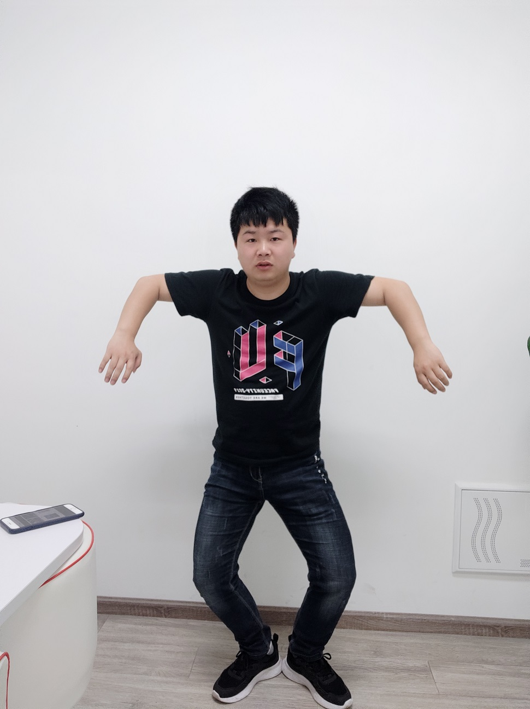
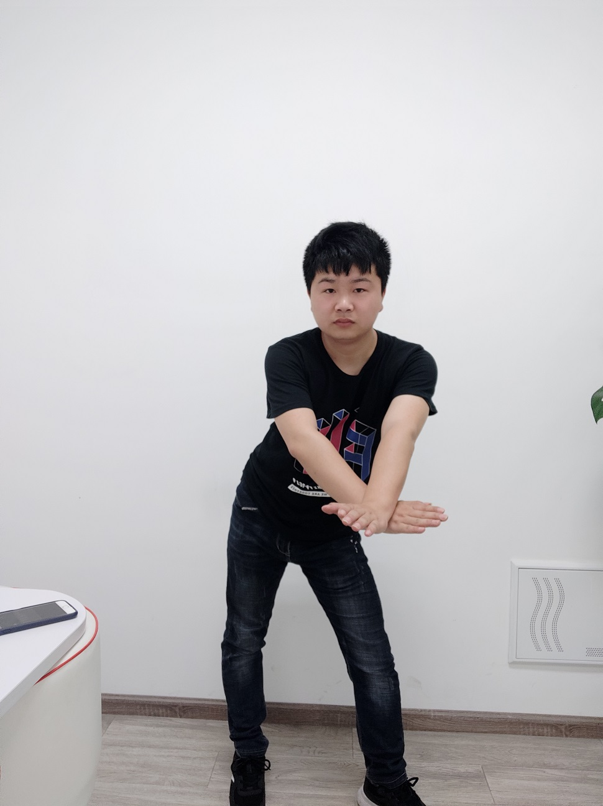
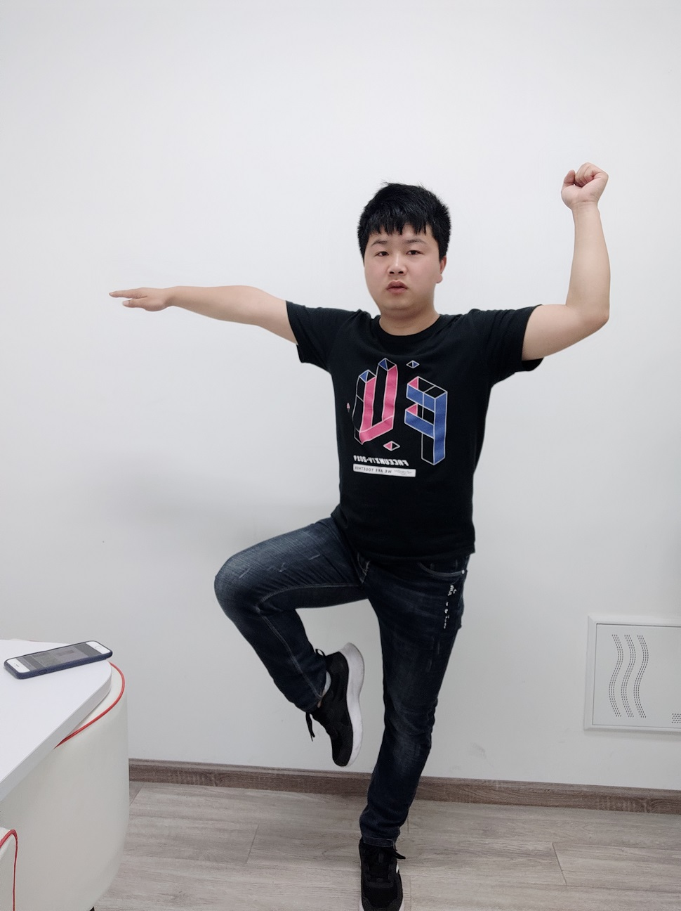
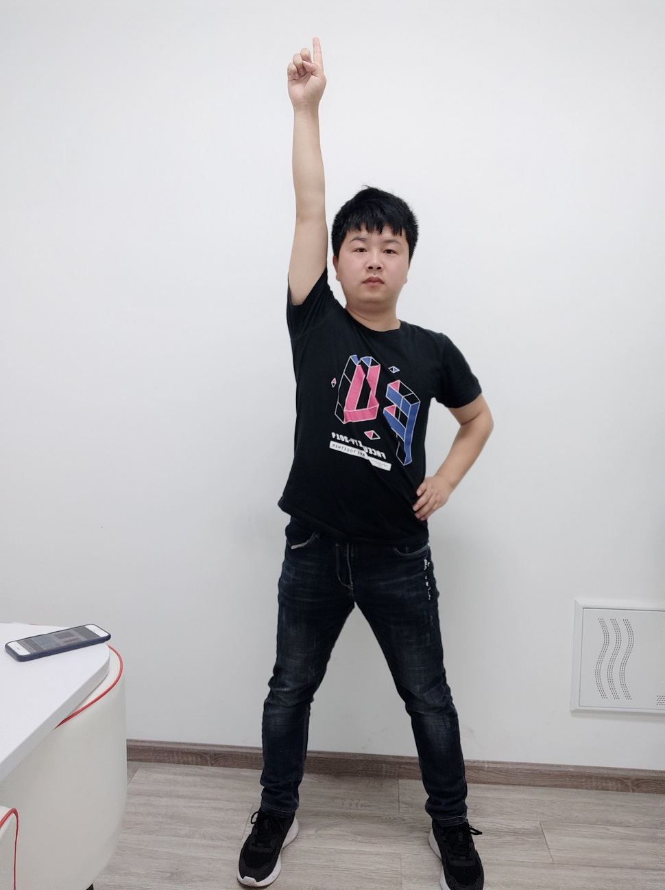
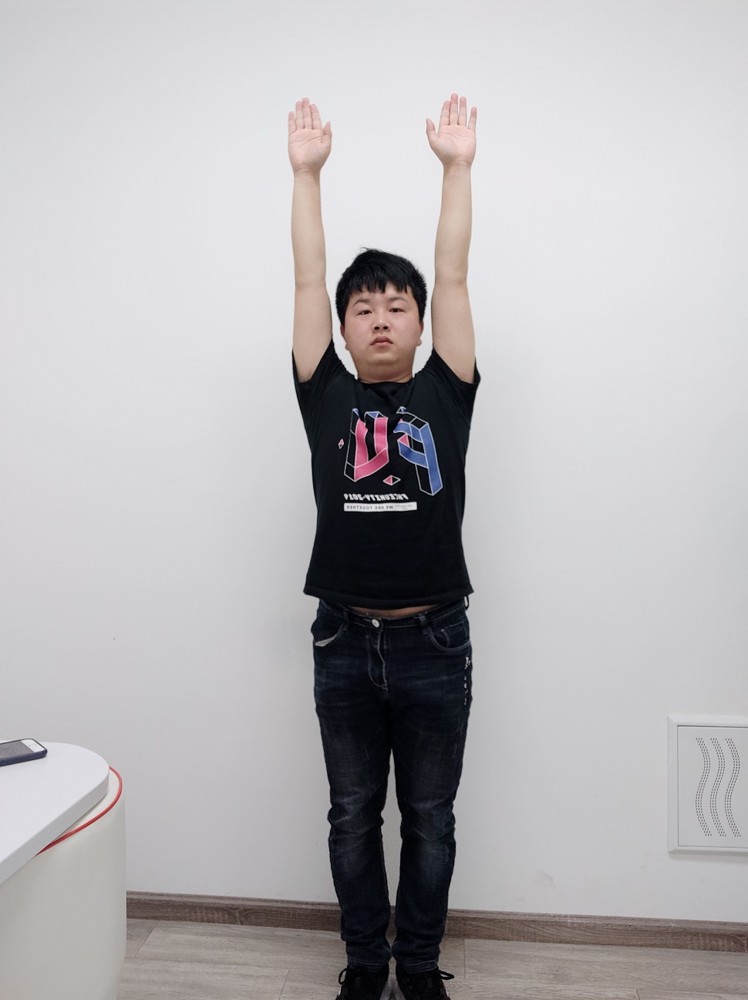
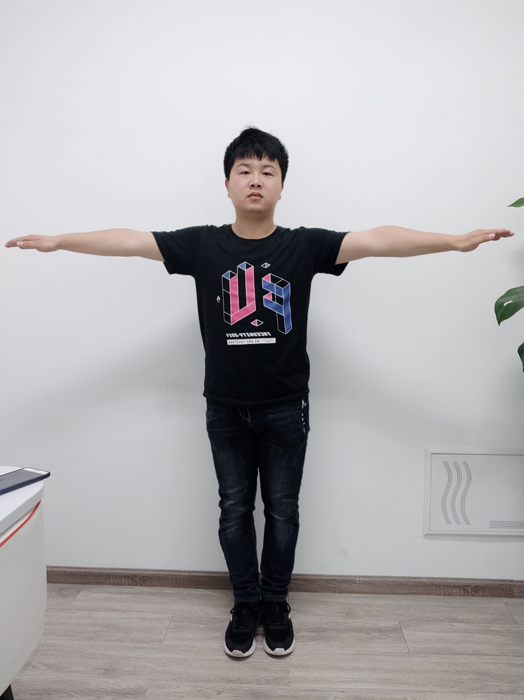
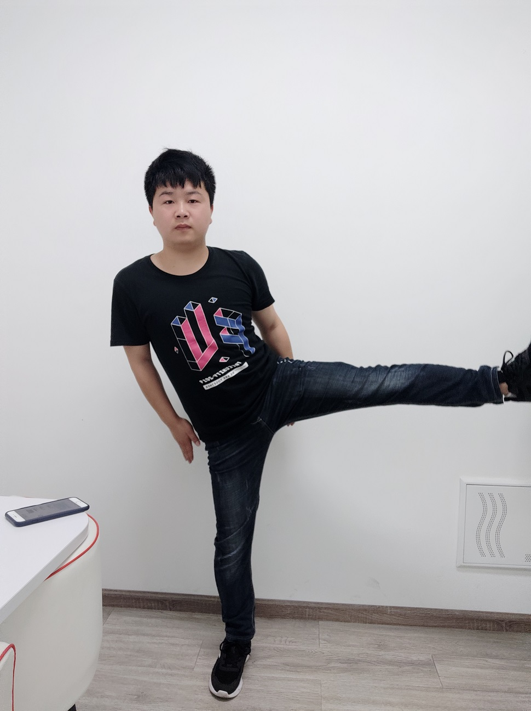

# 人体动作识别文档

## 目录

[TOC]


## 1.功能介绍

SDK具有人体动作识别的功能模块，能够获取预定义的动作类型的判别。

## 2.接口介绍

通过 fuHumanProcessorGetResultActionType  获取预定义的动作类型。

### 获取接口

```
/**
 \brief get ai model HumanProcessor's action type with index.
 \param index, index of fuHumanProcessorGetNumResults
 */
FUNAMA_API int fuHumanProcessorGetResultActionType(int index);

参数：

index：查询的人体编号，单人情况下为0

返回值:

1-14 代表不同的动作类型 0代表未知结果
```

### 动作定义  
动作1到14，未避免歧义，使用图示姿势定义。

动作1


动作2


动作3


动作4


动作5


动作6


动作7


动作8


动作9


动作10


动作11


动作12


动作13


动作14



