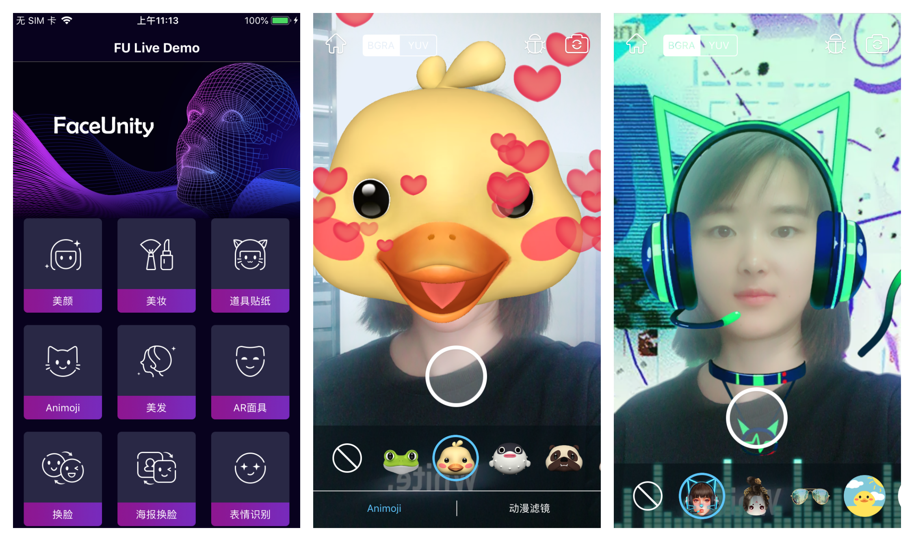

# Demo运行说明文档-Android

级别：Public 

更新日期：2020-06-30

SDK版本: 7.0.0

------
### 最新更新内容：

**2020-06-30 v7.0.0:**

1. 上线FULiveDemo算法版，新增7大人体及mask类算法功能

   - 开放人体关键点(全身/半身)接口，可获取实时画面中的人体2D关键点的位置信息
   - 开放人体骨骼(全身/半身) 接口，可获取实时身体驱动时的3D骨骼信息，并支持手势识别
   - 开放人像分割接口，可获取实时画面中的人像分割mask信息

   - 开放头发分割接口，可获取实时画面中的头发分割mask信息

   - 开放头部分割接口，可获取实时画面中的头部分割mask信息

   - 开放手势识别接口，可获取实时画面中的手势类别信息，包括14种手势

   - 开放动作识别接口，可获取实时画面中的动作类别信息，包括15种动作

2. 原FULiveDemo更名为“FULiveDemo特效版”，新增多款人体及mask类特效功能，交互更有趣，特效更丰富

   - 新增搞笑大头特效，提供大头、大头哈哈镜、微笑大头等6款搞笑大头特效
   - 优化美体功能效果：新增2款美体维度，包括小头、瘦腿；优化美体效果，稳定性提升，画面变形影响降低
   - 新增全身avatar功能，支持虚拟形象的全身/半身驱动，并支持手势的精准识别

   - 新增动作识别小游戏，可以获得跳舞机的有趣体验

   - 原背景分割模块更名为“人像分割”，优化了人像分割的效果，并新增了可以跟随人体的人像分割贴纸3款

3. 优化美颜功能性能，尤其是低端机型，单帧耗时降幅在20%-30%

4. 优化美颜功能效果，对于口罩遮挡时，亮眼跟随效果更贴合，白牙亮片问题大幅优化

5. 优化美妆功能效果，人脸点位优化并扩增为241点，重点提高美瞳、高光、眉毛的准确性和稳定性。

6. 新增最大人脸检测距离接口，支持客户自定义设置最大人脸检测距离

7. 新增日志查询接口，技术对接更便捷

------
### 目录：

本文档内容目录：

[TOC]

------
### 1. 简介

本文档旨在说明如何将Faceunity Nama SDK的 Android Demo运行起来，体验Faceunity Nama SDK的功能。

FULiveDemoDroid 是 Android 平台上，集成相芯人脸跟踪及视频特效开发包（简 Nama SDK）的集成示例。

集成了 Faceunity 面部跟踪、美颜、Animoji、道具贴纸、AR面具、换脸、表情识别、音乐滤镜、背景分割、手势识别、哈哈镜、人像光照以及人像驱动等功能。

Demo新增了一个展示Faceunity产品列表的主界面，新版Demo将根据客户证书权限来控制用户可以使用哪些产品。  

------
### 2. Demo文件结构

本小节，描述Demo文件结构，各个目录，以及重要文件的功能。

```
+FULiveDemoDroid
  +app 			                           // app 模块
    +src
      +main
        +assets                            
          +change_face                     // 海报换脸
            +template_xx                   // 模板资源
            -change_face.bundle            // 海报换脸道具
          +effect                          // 各种道具
            +animoji                       // Animoji
            +ar                            // AR 面具
            +big_head                      // 搞笑大头
            +expression                    // 表情识别
            +facewarp                      // 哈哈镜
            +gesture                       // 手势识别
            +hair_seg                      // 美发道具
            +musicfilter                   // 音乐滤镜
            +normal                        // 道具贴纸
            +portrait_drive                // 人像驱动
            +segment                       // 人像分割
            -actiongame_android.bundle     // 动作识别
          +light_makeup                    // 轻美妆
            +blusher...                    // 腮红等资源
            -light_makeup.bundle           // 轻美妆道具
          +makeup                          // 美妆
            +combination_bundle            // 组合妆 bundle 资源
            +config_json                   // 组合妆 json 资源
            +item_bundle                   // 美妆子妆 bundle 资源
            -color_setup.json              // 颜色配置
          +pta                             // 全身 Avatar
            +boy                           // 男孩效果道具
            +gesture                       // 手势算法模型
            +girl                          // 女孩效果道具
            -controller_config.bundle      // controller 配置文件
            -default_bg.bundle             // 白色背景
        +java                              // Java 源码
        +jniLibs                           // 高通 DSP 库
        +res                               // App 资源文件

  +faceunity                               // faceunity 模块
    +libs                                  
      -nama.jar                            // nama.jar
    +src
      +main
        +assets
          +graphic                         // 图形效果道具
            -body_slim.bundle              // 美体道具
            -controller.bundle             // 全身 Avatar 道具
            -face_beautification.bundle    // 美颜道具
            -face_makeup.bundle            // 美妆道具
            -fuzzytoonfilter.bundle        // 动漫滤镜道具
            -fxaa.bundle                   // 3D 绘制抗锯齿
            -tongue.bundle                 // 舌头跟踪数据包
          +model                           // 算法能力模型
            -ai_face_processor.bundle      // 人脸识别AI能力模型，需要默认加载
            -ai_face_processor_lite.bundle // 人脸识别AI能力模型，轻量版
            -ai_gesture.bundle             // 手势识别AI能力模型
			-ai_human_processor.bundle     // 人体点位AI能力模型
        +java                              // Java 源码
        +jniLibs                           // CNama fuai 库
  +docs		    	                       // 开发文档目录
  +README.md	 	                       // 工程说明文档
```

------

### 3. 运行Demo 

#### 3.1 开发环境
##### 3.1.1 支持平台
```
Android API 19 及以上，GLES 2.0 及以上
```
##### 3.1.2 开发环境
```
Android Studio 3.4 及以上
```

#### 3.2 准备工作 

- 下载 [FULiveDemoDroid](https://github.com/Faceunity/FULiveDemoDroid) 工程
- 获取证书:
  1. 拨打电话 **0571-88069272** 
  2. 发送邮件至 **marketing@faceunity.com** 进行咨询。

#### 3.3 相关配置

Android 端发放的证书为 authpack.java 文件，如果您已经获取到鉴权证书，将证书文件放到工程中 faceunity 模块 com.faceunity 包下即可。

#### 3.4 编译运行

- 点击 Sync 按钮，同步一下工程。或者 Build-->Make Projects。


- 点击 Run 按钮运行，部署到手机上。


- Demo 运行效果。



------
### 4. 常见问题 

如有使用问题，请联系技术支持。