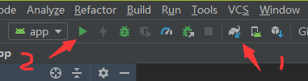

# Android Nama SDK 集成指导文档  
级别：Public

更新日期：2020-06-30

SDK版本: 7.0.0

------
## 最新更新内容：

**2020-06-30 v7.0.0:**

1. 上线FULiveDemo算法版，新增7大人体及mask类算法功能

   - 开放人体关键点(全身/半身)接口，可获取实时画面中的人体2D关键点的位置信息
   - 开放人体骨骼(全身/半身) 接口，可获取实时身体驱动时的3D骨骼信息，并支持手势识别
   - 开放人像分割接口，可获取实时画面中的人像分割mask信息

   - 开放头发分割接口，可获取实时画面中的头发分割mask信息

   - 开放头部分割接口，可获取实时画面中的头部分割mask信息

   - 开放手势识别接口，可获取实时画面中的手势类别信息，包括14种手势

   - 开放动作识别接口，可获取实时画面中的动作类别信息，包括15种动作

2. 原FULiveDemo更名为“FULiveDemo特效版”，新增多款人体及mask类特效功能，交互更有趣，特效更丰富

   - 新增搞笑大头特效，提供大头、大头哈哈镜、微笑大头等6款搞笑大头特效
   - 优化美体功能效果：新增2款美体维度，包括小头、瘦腿；优化美体效果，稳定性提升，画面变形影响降低
   - 新增全身avatar功能，支持虚拟形象的全身/半身驱动，并支持手势的精准识别

   - 新增动作识别小游戏，可以获得跳舞机的有趣体验

   - 原背景分割模块更名为“人像分割”，优化了人像分割的效果，并新增了可以跟随人体的人像分割贴纸3款

3. 优化美颜功能性能，尤其是低端机型，单帧耗时降幅在20%-30%

4. 优化美颜功能效果，对于口罩遮挡时，亮眼跟随效果更贴合，白牙亮片问题大幅优化

5. 优化美妆功能效果，人脸点位优化并扩增为241点，重点提高美瞳、高光、眉毛的准确性和稳定性。

6. 新增最大人脸检测距离接口，支持客户自定义设置最大人脸检测距离

7. 新增日志查询接口，技术对接更便捷

**各功能模块的相关文档：**

- [美颜道具功能文档](./美颜道具功能文档.md)
- [美颜道具功能文档_基础美颜](./美颜道具功能文档_基础美颜.md)
- [美妆道具功能文档](./美妆道具功能文档.md)
- [海报换脸功能文档](./海报换脸功能文档.md)
- [表情动图功能文档](./表情动图功能文档.md)
- [轻美妆功能文档](./轻美妆功能文档.md)
- [美发道具功能文档](./美发道具功能文档.md)
- [美体道具功能文档](./美体道具功能文档.md)
- [controller功能文档](./controller功能文档.md)

------

## 目录：
本文档内容目录：

[TOC]

------

## 1. 简介

本文档旨在说明如何将 Faceunity Nama SDK 集成您的 Android 工程中。  

------

## 2. SDK文件结构

本小节，描述 Demo 文件结构，各个目录，以及重要文件的功能。

```
+FULiveDemoDroid
  +app 			                           // app 模块
    +src
      +main
        +assets                            
          +change_face                     // 海报换脸
            +template_xx                   // 模板资源
            -change_face.bundle            // 海报换脸道具
          +effect                          // 各种道具
            +animoji                       // Animoji
            +ar                            // AR 面具
            +big_head                      // 搞笑大头
            +expression                    // 表情识别
            +facewarp                      // 哈哈镜
            +gesture                       // 手势识别
            +hair_seg                      // 美发道具
            +musicfilter                   // 音乐滤镜
            +normal                        // 道具贴纸
            +portrait_drive                // 人像驱动
            +segment                       // 人像分割
            -actiongame_android.bundle     // 动作识别
          +light_makeup                    // 轻美妆
            +blusher...                    // 腮红等资源
            -light_makeup.bundle           // 轻美妆道具
          +makeup                          // 美妆
            +combination_bundle            // 组合妆 bundle 资源
            +config_json                   // 组合妆 json 资源
            +item_bundle                   // 美妆子妆 bundle 资源
            -color_setup.json              // 颜色配置
          +pta                             // 全身 Avatar
            +boy                           // 男孩效果道具
            +gesture                       // 手势算法模型
            +girl                          // 女孩效果道具
            -controller_config.bundle      // controller 配置文件
            -default_bg.bundle             // 白色背景
        +java                              // Java 源码
        +jniLibs                           // 高通 DSP 库
        +res                               // App 资源文件

  +faceunity                               // faceunity 模块
    +libs                                  
      -nama.jar                            // nama.jar
    +src
      +main
        +assets
          +graphic                         // 图形效果道具
            -body_slim.bundle              // 美体道具
            -controller.bundle             // 全身 Avatar 道具
            -face_beautification.bundle    // 美颜道具
            -face_makeup.bundle            // 美妆道具
            -fuzzytoonfilter.bundle        // 动漫滤镜道具
            -fxaa.bundle                   // 3D 绘制抗锯齿
            -tongue.bundle                 // 舌头跟踪数据包
          +model                           // 算法能力模型
            -ai_face_processor.bundle      // 人脸识别AI能力模型，需要默认加载
            -ai_face_processor_lite.bundle // 人脸识别AI能力模型，轻量版
            -ai_gesture.bundle             // 手势识别AI能力模型
			-ai_human_processor.bundle     // 人体点位AI能力模型
        +java                              // Java 源码
        +jniLibs                           // CNama fuai 库
  +docs		    	                       // 开发文档目录
  +README.md	 	                       // 工程说明文档
```

------
## 3. 集成指引

### 3.1 集成方式

#### 3.1.1 Gradle 配置

全功能版本（支持 TensorFlow 和物理特效）：

```groovy
implementation 'com.faceunity:nama:7.0.1'
```

lite 版（不含物理特效的版本）：

```groovy
implementation 'com.faceunity:nama:7.0.1-lite'
```

**注：** Gradle 集成的 aar 中仅包含库文件（libCNamaSDK.so、libfuai.so 与 nama.jar）以及初始化必须的数据模型等，如需美颜等数据包可以在[这里](https://github.com/Faceunity/FULiveDemoDroid/releases)下载。

#### 3.1.2 GitHub 下载

- 全功能版本（支持 TensorFlow 和物理特效）：[Faceunity-Android-v7.0.zip](https://github.com/Faceunity/FULiveDemoDroid/releases/download/v7.0/Faceunity-Android-v7.0.zip)

- lite 版（不含物理特效的版本）：[Faceunity-Android-v7.0-lite.zip](https://github.com/Faceunity/FULiveDemoDroid/releases/download/v7.0/Faceunity-Android-v7.0-lite.zip)

#### 3.1.3 库文件说明

1. 库文件
   - jniLibs 文件夹下 libCNamaSDK.so 和 libfuai.so 人脸跟踪及道具绘制核心静态库。
   -  libs 文件夹下 nama.jar 是提供使用的 JNI 接口类集合。

2. 数据文件

  - graphics 下的 bundle 为图形效果道具，需要时可以创建道具使用。

  - model 下的 bundle 为算法能力模型，SDK 初始化后，可以按需加载可能用到的 AI 能力。
  - effects 文件夹下的 \*.bundle 文件是我司制作的特效贴纸道具，如需制作自定义的特效贴纸，请联系我司获取相关工具和说明。

**注：** 这些数据文件都是二进制数据，与扩展名无关。实际使用时，可以将数据包打包在应用内或者通过网络下载，只要在函数接口传入正确的文件字节数组即可。

### 3.2 开发环境

#### 3.2.1 支持平台
```
Android API 19 及以上
```
#### 3.2.2 开发环境
```
Android Studio 3.4 及以上，Open GLES 2.0 及以上
```

### 3.3 准备工作 

- 下载 [FULiveDemoDroid](https://github.com/Faceunity/FULiveDemoDroid) 工程
- 获取证书：
  1. 拨打电话 **0571-88069272** 
  2. 发送邮件至 **marketing@faceunity.com** 进行咨询

### 3.4 工程配置

Android 端发放的证书为 authpack.java 文件，如果您已经获取到鉴权证书，将证书文件放到工程中 faceunity 模块 com.faceunity.fulivedemo 包下即可。

- 点击 Sync 按钮，同步一下工程。或者 Build-->Make Projects。


- 点击 Run 按钮运行，部署到手机上。



### 3.5 初始化

初始化SDK环境，加载SDK数据，并进行网络鉴权。必须在调用SDK其他接口前执行，否则会引发崩溃。

```java
public static native int fuSetup(byte[] v3data, byte[] authdata);
```

参数说明：

`v3data` 传空字节数组即可

`authdata` 鉴权证书文件

`authdata` 密钥数组，必须配置好密钥，SDK才能正常工作

调用示例：

```java
int isSetup = faceunity.fuSetup(new byte[0], authpack.A());
Log.d(TAG, "fuSetup. isSetup: " + (isSetup == 0 ? "no" : "yes"));
```
注：app 启动后只需要 setup 一次即可，其中 authpack.A() 密钥数组声明在 authpack.java 中。

### 3.6 道具创建、销毁、切换

#### 3.6.1 道具创建

**创建道具句柄接口：**

```java
public static native int fuCreateItemFromPackage(byte[] data);
```

**参数说明：**

`data` 道具二进制数据

**返回值：**

`int` 道具句柄

在实际应用中有时需要同时使用多个道具，我们的图像处理接口接受的的参数是一个包含多个道具句柄的int数组，所以我们需要将创建一个int数组来保存这些道具句柄。下面我们将创建一个美颜道具的句柄并保存在int数组的第 ITEM_ARRAYS_EFFECT 个位置，示例如下：

```java
InputStream is = mContext.getAssets().open(bundle.path());
byte[] itemData = new byte[is.available()];
int len = is.read(itemData);
is.close();
mItemsArray[ITEM_ARRAYS_EFFECT] = faceunity.fuCreateItemFromPackage(itemData);
updateEffectItemParams( mItemsArray[ITEM_ARRAYS_EFFECT]);//更新道具参数
```

#### 3.6.2 道具销毁

**销毁单个道具：**

```java
public static native void fuDestroyItem(int item);
```

**参数说明：**

`item ` 要销毁的道具句柄

该接口将释放传入的句柄所对应的资源。示例如下：

```java
if (mItemsArray[ITEM_ARRAYS_EFFECT] > 0)
    faceunity.fuDestroyItem(mItemsArray[ITEM_ARRAYS_EFFECT]);
```

**销毁全部道具：**

```java
public static native void fuDestroyAllItems();
```

该接口可以销毁全部道具句柄所对应的资源,同样在执行完该接口后请将所有句柄都置为0。示例如下：

```java
Arrays.fill(mItemsArray, 0);
faceunity.fuDestroyAllItems();
```

#### 3.6.3 道具切换

如果需要切换句柄数组中某一位的句柄时，需要先创建一个新的道具句柄，并将该句柄替换到句柄数组中需要被替换的位置上，最后再把被替换的句柄销毁掉。下面以替换句柄数组的第ITEM_ARRAYS_EFFECT位为例进行说明：

```java
final Effect effect = (Effect) msg.obj;
final int newEffectItem = loadItem(effect);
queueEvent(new Runnable() {
    @Override
    public void run() {
        if (mItemsArray[ITEM_ARRAYS_EFFECT] > 0) {
            faceunity.fuDestroyItem(mItemsArray[ITEM_ARRAYS_EFFECT]);
        }
        mItemsArray[ITEM_ARRAYS_EFFECT] = newEffectItem;
        setMaxFaces(effect.maxFace());
    }
});
```

由于采用异步加载，本demo中采用queueEvent方法来实现对句柄的更新。（queueEvent机制与GLSurfaceView的queueEvent机制相同）

注意，如果这里先销毁了老的道具，再创建新的道具会可能出现卡顿的现象。

### 3.7 视频处理

将视频图像数据及道具句柄一同传入我们的绘制接口，处理完成之后道具中的特效就被绘制到图像中了。

#### 3.7.1 图像处理双输入接口

```java
public static native int fuDualInputToTexture(byte[] img, int tex_in, int flags, int w, int h, int frame_id, int[] h);
```

**参数说明：**

`img ` 图像数据byte[]，支持的格式为：NV21（默认）、I420、RGBA

`tex_in ` 图像数据纹理ID

`flags ` flags，可以指定数据img数据格式，返回纹理ID的道具镜像等

`w ` 图像数据的宽

`h ` 图像数据的高

`frame_id ` 当前处理的视频帧序数

`items ` 包含多个道具句柄的int数组

**返回值：**

`int ` 被处理过的的图像数据纹理ID

具体示例如下：

```java
int flags = mInputTextureType | mInputImageFormat;
if (mCurrentCameraType != Camera.CameraInfo.CAMERA_FACING_FRONT)
    flags |= FU_ADM_FLAG_FLIP_X;
int fuTex = faceunity.fuDualInputToTexture(img, tex, flags, w, h, mFrameId++, mItemsArray);
```

#### 3.7.2 图像处理单输入接口

```java
public static native int fuRenderToNV21Image(byte[] img, int w, int h, int frame_id, int[] items, int flags);
```

**参数说明：**

`img ` 图像数据byte[]，被处理过的的图像数据会回写到该byte[]中

`w ` 图像数据的宽

`h ` 图像数据的高

`frame_id ` 当前处理的视频帧序数

`items ` 包含多个道具句柄的int数组

`flags ` flags，可以指定返回纹理ID的道具镜像等

**返回值：**

`int ` 被处理过的的图像数据纹理ID

具体示例如下：

```java
int flags = mInputImageFormat;
if (mCurrentCameraType != Camera.CameraInfo.CAMERA_FACING_FRONT)
    flags |= FU_ADM_FLAG_FLIP_X;
int fuTex = faceunity.fuRenderToNV21Image(img, w, h, mFrameId++, mItemsArray, flags);
```
------

## 4. 功能模块
### 4.1 视频美颜

**美颜处理**

视频美颜配置方法与视频加特效道具类似，首先创建美颜道具句柄，并保存在句柄数组中。

**示例代码：**

```java
InputStream beauty = mContext.getAssets().open(BUNDLE_face_beautification);//BUNDLE_face_beautification为bundle的assets路径
byte[] beautyData = new byte[beauty.available()];
beauty.read(beautyData);
beauty.close();
mItemsArray[ITEM_ARRAYS_FACE_BEAUTY_INDEX] = faceunity.fuCreateItemFromPackage(beautyData);
```

在处理视频时，美颜道具句柄会通过句柄数组传入图像处理接口，处理完成后美颜效果将会被作用到图像中。

**示例代码：**

```java
//mItemsArray数组为承载句柄的int数组
int fuTex = faceunity.fuDualInputToTexture(img, tex, flags, w, h, mFrameId++, mItemsArray);
```

**参数设置**
美颜道具主要包含七个模块的内容：滤镜、美白、红润、磨皮、亮眼、美牙、美型。每个模块都有默认效果，它们可以调节的参数如下。

#### 4.1.1 滤镜

滤镜功能主要通过参数 `filter_level` 和 `filter_name` 来控制。

`filter_name` 参数的取值和相关介绍详见：[美颜道具功能文档](美颜道具功能文档.md) ，在**滤镜对应key值**部分有详细介绍，对于老版本（6.0之前）的用户，可以参考**新老滤镜对应关系**部分。

`filter_level` 取值范围 0.0-1.0，0.0为无效果，1.0为最大效果，默认值1.0。

**示例代码：**

```java
faceunity.fuItemSetParam(mItemsArray[ITEM_ARRAYS_FACE_BEAUTY_INDEX], "filter_level", mFilterLevel);
```

`filter_name` 取值为一个字符串，默认值为 “`origin`” ，即为使用原图效果。

**示例代码：**

```java
faceunity.fuItemSetParam(mItemsArray[ITEM_ARRAYS_FACE_BEAUTY_INDEX], "filter_name", mFilterName);
```

#### 4.1.2 美白红润

##### 美白

美白功能主要通过参数 `color_level` 来控制。

`color_level` 取值范围 0.0-1.0，0.0为无效果，1.0为最大效果，默认值0.2。

**示例代码：**

```java
faceunity.fuItemSetParam(mItemsArray[ITEM_ARRAYS_FACE_BEAUTY_INDEX], "color_level", mFaceBeautyColorLevel);
```

##### 红润

红润功能主要通过参数 `red_level` 来控制。

`red_level` 取值范围 0.0-1.0，0.0为无效果，1.0为最大效果，默认值0.5。

**示例代码：**

```java
faceunity.fuItemSetParam(mItemsArray[ITEM_ARRAYS_FACE_BEAUTY_INDEX], "red_level", mFaceBeautyRedLevel);
```

#### 4.1.3 磨皮

控制磨皮的参数有四个：`blur_level`，`skin_detect`，`nonshin_blur_scale`，`heavy_blur`。

- `blur_level`: 磨皮程度，取值范围 0.0-6.0，默认6.0
- `skin_detect`: 肤色检测开关，0为关，1为开
- `nonskin_blur_scale`: 肤色检测之后非肤色区域的融合程度，取值范围0.0-1.0，默认0.45
- `heavy_blur`: 重度磨皮开关，0为清晰磨皮，1为重度磨皮

**示例代码：**

```java
faceunity.fuItemSetParam(mItemsArray[ITEM_ARRAYS_FACE_BEAUTY_INDEX], "skin_detect", mFaceBeautyALLBlurLevel);
faceunity.fuItemSetParam(mItemsArray[ITEM_ARRAYS_FACE_BEAUTY_INDEX], "heavy_blur", mFaceBeautyType);
faceunity.fuItemSetParam(mItemsArray[ITEM_ARRAYS_FACE_BEAUTY_INDEX], "blur_level", 6 * mFaceBeautyBlurLevel);
faceunity.fuItemSetParam(mItemsArray[ITEM_ARRAYS_FACE_BEAUTY_INDEX], "nonshin_blur_scale", 0.45);
```

#### 4.1.4 亮眼

亮眼功能主要通过参数 `eye_bright` 来控制。

`eye_bright`  取值范围 0.0-1.0，0.0为无效果，1.0为最大效果，默认值1.0。

**示例代码：**

```java
faceunity.fuItemSetParam(mItemsArray[ITEM_ARRAYS_FACE_BEAUTY_INDEX], "eye_bright", mBrightEyesLevel);
```

#### 4.1.5 美牙

美牙功能主要通过参数 `tooth_whiten` 来控制。

`tooth_whiten` 取值范围 0.0-1.0，0.0为无效果，1.0为最大效果，默认值1.0。

**示例代码：**

```java
faceunity.fuItemSetParam(mItemsArray[ITEM_ARRAYS_FACE_BEAUTY_INDEX], "tooth_whiten", mBeautyTeethLevel);
```

#### 4.1.6 美型

美型支持四种基本美型：女神、网红、自然、默认，一种高级美型：自定义。由参数 `face_shape` 指定：默认（3）、女神（0）、网红（1）、自然（2）、精细变形（4）。

美型的整体程度由`face_shape_level`参数控制。取值范围 0.0-1.0，0.0为无效果，1.0为最大效果，默认值1.0。

美型的渐变由`change_frames`参数控制，0为关闭 ，大于0开启渐变，值为渐变所需要的帧数。

将 `face_shape` 设为 4 即可开启精细脸型调整功能。FULiveDemo 中可以在脸型中选择自定义，来开启精细脸型调整功能。在 `face_shape` 选取不同参数时，对应可以使用的参数也不同。

__使用方法__：
- 加载face_beautification.bundle
- 调整如下参数
  `face_shape`: 4,   // 4为开启高级美型模式，0～3为基本美型

**V脸**

优化V脸变形效果，比之前更加自然

__使用方法__：

- 加载face_beautification.bundle
- 调整如下参数
  `face_shape`: 4,   // 4为开启高级美型模式，0～3为基本美型
  `cheek_v`: 0.0,   // 范围0 - 1，0为正常大小，大于0开始V脸，默认0.0

**大眼**

优化大眼变形效果，比之前更加自然

__使用方法__：
- 加载face_beautification.bundle
- 调整如下参数
  `face_shape`: 4,   // 4为开启高级美型模式，0～3为基本美型
  `eye_enlarging`: 0.5,   // 范围0 - 1，大于0.5 变大，小于0.5变小，默认0.5

**额头调整**

新增加的一款美颜变形，可以调整额头大小

__使用方法__：
- 加载face_beautification.bundle
- 调整如下参数
  `face_shape`: 4,   // 4为开启高级美型模式，0～3为基本美型
  `intensity_forehead`: 0.5,   // 范围0 - 1，大于0.5 变大，小于0.5变小，默认0.5

**下巴调整**

新增的一款美颜变形，可以调整下巴大小

__使用方法__：
- 加载face_beautification.bundle
- 调整如下参数
  `face_shape`: 4,   // 4为开启高级美型模式，0～3为基本美型
  `intensity_chin`: 0.5,   // 范围0 - 1，大于0.5 变大，小于0.5变小，默认0.5

**瘦鼻**

新增的一款美颜变形，可以调整鼻子大小

__使用方法__：
- 加载face_beautification.bundle
- 调整如下参数
  `face_shape`: 4,   // 4为开启高级美型模式，0～3为基本美型
  `intensity_nose`: 0.0,   // 范围0 - 1，0为正常大小，大于0开始瘦鼻，默认0.0

**嘴型调整**

新增的一款美颜变形，可以调整嘴型大小

__使用方法__：
- 加载face_beautification.bundle
- 调整如下参数
  `face_shape`: 4,   // 4为开启高级美型模式，0～3为基本美型
  `intensity_mouth`: 0.5,   // 范围0 - 1，大于0.5变大，小于0.5变小，默认0.5

**示例代码：**

```java
            faceunity.fuItemSetParam(mItemsArray[ITEM_ARRAYS_FACE_BEAUTY_INDEX], "face_shape_level", mFaceShapeLevel);
            faceunity.fuItemSetParam(mItemsArray[ITEM_ARRAYS_FACE_BEAUTY_INDEX], "face_shape", mFaceShape);
            faceunity.fuItemSetParam(mItemsArray[ITEM_ARRAYS_FACE_BEAUTY_INDEX], "eye_enlarging", mEyeEnlarging);
            faceunity.fuItemSetParam(mItemsArray[ITEM_ARRAYS_FACE_BEAUTY_INDEX], "cheek_thinning", mCheekThinning);
            faceunity.fuItemSetParam(mItemsArray[ITEM_ARRAYS_FACE_BEAUTY_INDEX], "intensity_chin", mIntensityChin);
            faceunity.fuItemSetParam(mItemsArray[ITEM_ARRAYS_FACE_BEAUTY_INDEX], "intensity_forehead", mIntensityForehead);
            faceunity.fuItemSetParam(mItemsArray[ITEM_ARRAYS_FACE_BEAUTY_INDEX], "intensity_nose", mIntensityNose);
            faceunity.fuItemSetParam(mItemsArray[ITEM_ARRAYS_FACE_BEAUTY_INDEX], "intensity_mouth", mIntensityMouth);
```

**注意：**变形为高级美颜功能，需要相应证书权限才能使用

------

### 4.2 手势识别

目前我们的手势识别功能也是以道具的形式进行加载的。一个手势识别的道具中包含了要识别的手势、识别到该手势时触发的动效、及控制脚本。加载该道具的过程和加载普通道具、美颜道具的方法一致。

Demo 中 ssd_thread_korheart.bundle 为单手比心手势道具，将其作为道具加载进行绘制即可启用手势识别功能。手势识别道具可以和普通道具及美颜共存，类似美颜将手势道具句柄保存在items句柄数组即可。

自定义手势道具的流程和2D道具制作一致，具体打包的细节可以联系我司技术支持。

------

### 4.3 3D绘制抗锯齿功能

高效全屏抗锯齿，使得3D绘制效果更加平滑。

__使用方法__：

- 加载fxaa.bundle，随新版本SDK提供
- 绘制时将fxaa.bundle放在道具数组最后一个

```
InputStream animoji3D = mContext.getAssets().open(BUNDLE_animoji_3d);
byte[] animoji3DData = new byte[animoji3D.available()];
animoji3D.read(animoji3DData);
animoji3D.close();
mItemsArray[ITEM_ARRAYS_EFFECT_ABIMOJI_3D] = faceunity.fuCreateItemFromPackage(animoji3DData);
```

### 4.4 照片驱动功能

针对照片进行精确的人脸重建，然后支持实时表情驱动，预置表情播放。可以用于实时应用，也可以用于生成表情包等。

该功能的资源有两种方式生成方式：

- 使用FUEditor v4.3.0以上版本离线制作道具
- 利用相芯提供的云服务在线上传照片生成道具
  在线云服务的方式请联系技术支持获取更多细节。

__使用方法__：

- 直接加载对应的道具
- 需要带有照片驱动权限的证书

### 4.5 人脸夸张变形功能

新增了5款夸张变形。

__使用方法__：

- 直接加载对应的道具
- 需要带有人脸变形权限的证书

### 4.6 音乐滤镜

音乐滤镜是使用播放音乐的时间戳进行驱动的，在每次处理图像前，将音乐的播放进度传入音乐滤镜道具即可，方式如下：

```java
faceunity.fuItemSetParam(mItemsArray[ITEM_ARRAYS_EFFECT_INDEX], "music_time", time);
```

如果没有音乐则可以模拟音乐播放进度，demo中提供的道具对应的音乐时长为28s，换算成ms为28000ms，在没有音乐的情况下，可以从加载音乐滤镜开始计时，每次处理图像前获取一下当前时间与开始加载音乐滤镜的时间差，转换成ms传入音乐滤镜即可，当时间差超过28000ms时归0重新开始计时即可。效果详见FULiveDemo，道具可以通过FUEditor进行制作（v4.2.1及以上）。

### 4.7 Avatar捏脸

Nama SDK 从 6.0.0 开始支持 Avatar 捏脸功能。

虚拟角色支持捏脸功能，通过使用FUEditor 6.0.0模板facepup生成的bundle，在客户端调节对应参数，可以实现用户对脸型，发型，唇色等部位自定义，生成和保存用户想要的虚拟形象的功能。该虚拟形象可以通过引擎实时根据人脸驱动，做出和人脸同步的表情。

加载制作好的捏脸道具后，可以设置以下参数进行捏脸。

**进入捏脸状态**

```java
//进入捏脸状态
faceunity.fuItemSetParamd(mItemsArray[ITEM_ARRAYS_EFFECT_INDEX],"enter_facepup",1);
```

**清除全部捏脸参数**

```java
//清除全部捏脸参数
faceunity.fuItemSetParamd(mItemsArray[ITEM_ARRAYS_EFFECT_INDEX],"clear_facepup",1);
```

**设置捏脸参数**

```java
//设置第一个捏脸属性“大眼”的权值，范围[0-1]。这里param对应的就是第几个捏脸属性，从1开始。
faceunity.fuItemSetParamd(mItemsArray[ITEM_ARRAYS_EFFECT_INDEX],"\{\"name\":\"facepup\",\"param\":\"1\"\}",1);

//设置第二个捏脸属性“尖下巴”的权值，范围[0-1]。这里param对应的就是第几个捏脸属性，从1开始。
faceunity.fuItemSetParamd(mItemsArray[ITEM_ARRAYS_EFFECT_INDEX],"\{\"name\":\"facepup\",\"param\":\"2\"\}",0.5);
```

**保存或退出捏脸状态**

二选一即可

```java
//1. 直接退出捏脸状态，不保存当前捏脸状态，进入跟踪状态。使用上一次捏脸，进行人脸表情跟踪。
faceunity.fuItemSetParamd(mItemsArray[ITEM_ARRAYS_EFFECT_INDEX],"quit_facepup",1);
//2. 触发保存捏脸，并退出捏脸状态，进入跟踪状态。耗时操作，必要时设置。
fuItemSetParamd(mItemsArray[ITEM_ARRAYS_EFFECT_INDEX],"need_recompute_facepup",1);
```

### 4.8 动漫滤镜+Animoji的AR模式

**动漫滤镜**

一款动漫风格的滤镜，使用方式与普通道具一致，只需要加载并保存在道具具柄数组中传入视频处理接口即可。Demo使用的场景是配合Animoji道具的AR模式一起使用，不过动漫滤镜并不局限于和Animoji的AR模式一起使用，你可以单独使用，也可以配合其他任何道具一起使用。需要注意的是，客户端需要根据当前OpenGL ES版本，设置动漫滤镜的 `glVer` 属性。当使用OpenGL ES 3.0版本才能较好的使用动漫滤镜效果，如果使用3.0以下版本的GL环境，效果会稍微差一些。设置方法如下：

```java
faceunity.fuItemSetParam(itemHandle, "glVer", 3); // 2代表兼容模式，3代表正常模式。
```

**Animoji的AR模式**

与Animoji普通模式不同，AR模式会显示真实的场景，且Animoji形象会跟随人脸移动，有了更多的互动性。如果配合动漫滤镜使用Animoji的AR模式，可以使Animoji形象与真实场景的风格更加一致，使融合更加自然。Animoji开启AR模式的方式如下：

```java
// 设置 Animoji 跟随人脸
faceunity.fuItemSetParam(itemHandle, "{\"thing\":\"<global>\",\"param\":\"follow\"}", 1); // value为1代表开启，value为0代表关闭。
```

切换相机时，需要设置道具的参数，解决 Animoji 镜像问题。设置方法如下：

```java
int back = mCurrentCameraType == Camera.CameraInfo.CAMERA_FACING_BACK ? 1 : 0; 
// 镜像顶点
faceunity.fuItemSetParam(itemHandle, "is3DFlipH", back);
// 镜像表情
faceunity.fuItemSetParam(itemHandle, "isFlipExpr", back);        
// 镜像跟踪（位移和旋转）
faceunity.fuItemSetParam(itemHandle, "isFlipTrack", back);
// 镜像灯光
faceunity.fuItemSetParam(itemHandle, "isFlipLight ", back);
```

### 4.9 舌头驱动

Nama SDK 从5.6.0开始支持舌头驱动功能，使用具有舌头特效的道具时，需要先加载驱动舌头的数据模型，加载方式如下：

```java
InputStream tongue = context.getAssets().open(BUNDLE_tongue);
byte[] tongueDate = new byte[tongue.available()];
tongue.read(tongueDate);
tongue.close();
faceunity.fuLoadTongueModel(tongueDate);
```

### 4.10 海报换脸

Nama SDK 从5.8.0开始支持新版海报换脸功能，该功能可实现将用户的脸完美的融合到海报中模特的脸上，实现换脸功能。

首先需要加载 change_face.bundle 道具，然后参考[海报换脸功能文档](./海报换脸功能文档.md)，同时也可以参考我们Demo中的实际使用方法。


### 4.11 人脸美妆

Nama SDK 从5.8.0开始支持新版的人脸美妆功能，该功能可实现口红、腮红、眉毛、眼影、眼线、睫毛、美瞳等功能，同时支持精细调整。

首先需要加载 face_makeup.bundle 道具，然后参考[美妆道具功能文档](./美妆道具功能文档.md)进行开发，同时也可以参考我们Demo中的实际使用方法。

### 4.12 美发功能

Nama SDK 从5.8.0开始支持美发功能，该功能可以改变人物头发颜色，目前支持8种普通发色及5种渐变色，同时调节美发程度。

#### 普通发色

首先加载 hair_color.bundle，然后使用参数 Index 来切换发色，该参数的推荐取值范围为0~7。通过参数 Strength 可以调节发色的强度，该参数的推荐取值范围为0~1。示例：

```java
/**设置美发参数**/
faceunity.fuItemSetParam(mItemsArray[ITEM_ARRAYS_EFFECT_HAIR_NORMAL_INDEX], "Index", mHairColorIndex);
                    faceunity.fuItemSetParam(mItemsArray[ITEM_ARRAYS_EFFECT_HAIR_NORMAL_INDEX], "Strength", mHairColorStrength);
```

#### 渐变色

首先加载 hair_gradient.bundle，然后使用参数 `Index` 来切换发色，该参数的推荐取值范围为0~4。通过参数 `Strength` 可以调节发色的强度，该参数的推荐取值范围为0~1。示例：

```java
/**设置美发参数**/
faceunity.fuItemSetParam(mItemsArray[ITEM_ARRAYS_EFFECT_HAIR_GRADIENT_INDEX], "Index", mHairColorIndex);
                    faceunity.fuItemSetParam(mItemsArray[ITEM_ARRAYS_EFFECT_HAIR_GRADIENT_INDEX], "Strength", mHairColorStrength);
```

### 4.13 轻美妆功能

Nama SDK 从 6.0.0 开始支持轻美妆功能。

轻美妆是一套更为精致高效的美颜解决方案，包含磨皮、美型、滤镜、美妆4大模块，提供60+套丰富素材库，支持客户任意切换风格与效果变化。

首先加载 light_makeup.bundle，然后设置腮红、眼影、眼线、口红等参数，使用方法请参考 FULiveDemo 中的示例代码。

### 4.14 美体功能

Nama SDK 从 6.4.0 开始支持美体瘦身功能，包括瘦身、长腿、美臀、细腰、肩部调整，一键美体，仅支持单人。

首先加载 BodySlim.bundle，然后设置瘦身、长腿、美臀、细腰等参数，参数说明请查阅 [美体道具功能文档](./美体道具功能文档.md)，同时也可以参考我们 Demo 中的示例代码。

### 4.15 全身 Avatar 功能

Nama SDK 从 7.0.0 开始支持全身 Avatar 功能。支持虚拟形象的全身/半身驱动，并支持手势的精准识别。使用方法请参考 [controller功能文档](./controller功能文档.md)，以及 Demo 中的示例代码。

------

## 5. 常见问题 

### Apk打包混淆规则

```
-keep class com.faceunity.wrapper.faceunity {*;}
-keep class com.faceunity.wrapper.faceunity$RotatedImage {*;}
```

**如有使用问题，请联系技术支持。**