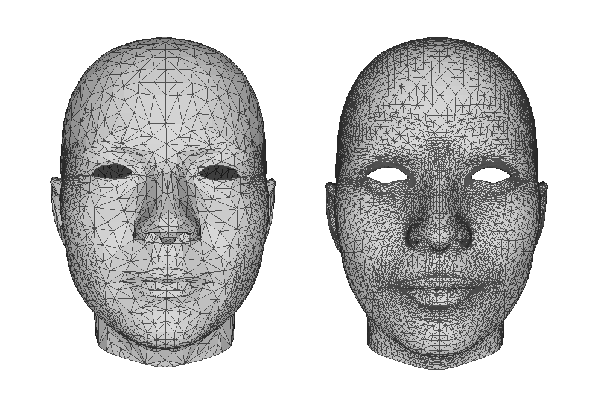

# FUNama SDK v4.4 更新文档

本次更新主要包含以下改动：

- 新增表情优化功能
- 优化表情校准功能
- 修复高精度人脸重建相关问题
- 修复偶现网络鉴权失败问题
- 其他累积问题修复、接口调整

## 表情跟踪优化功能

为优化Animoji及avatar表情驱动的效果，v4.4中新增了表情优化功能。启用该功能可以使表情系数及avatar驱动表情更加自然，减少异常表情、模型缺陷的出现。该功能对性能的影响较小。

启用该功能时，通过 ```fuLoadAnimModel``` 加载动画模型数据，加载成功即可启动。该功能会影响通过```fuGetFaceInfo```获取的```expression```表情系数，以及通过表情驱动的avatar模型。

动画数据文件为 ```anim_model.bundle```，随SDK包提供，文件大小为214KB。

```C
/**
\brief Load facial animation model data, to enable expression optimization
\param data - the pointer to facial animation model data 'anim_model.bundle', 
	which is along beside lib files in SDK package
\param sz - the data size, we use plain int to avoid cross-language compilation issues
\return zero for failure, one for success
*/
int fuLoadAnimModel(void* dat, int dat_sz);
```
| 函数参数   | 含义                        |
| ------ | ------------------------- |
| dat    | 动画数据的内存指针                 |
| dat_sz | 动画数据的内存大小                 |
| 返回值    | 1为成功加载，0为失败，失败原因打印至各平台控制台 |

如开启该功能后，发现特定表情做不出来，或不到位，请提供特定表情的照片或视频，将信息反馈给我司技术支持，以安排该特定表情的优化。

## 优化表情校准功能

SDK v4.4中优化了表情校准功能，校准速度更快，能力更强。该功能对性能的影响极小。

表情校准是指在表情驱动时，实时校准不同人的自然表情，减少由于人脸特征带来的错误表情。正确校准表情后，不但可以使自然表情更准确，还可以增强各种表情的灵活性。

开启表情校准功能后，会在以下几种情况触发表情校准：
- 检测到新的人脸
- 跟踪失败后重新检测到人脸
- 出现非法表情之后的0.5s

在SDK v4.4中表情校准功能默认为关闭状态（之前版本默认打开），通过接口 ```fuSetExpressionCalibration``` 开启表情校准功能。
```C
/**
\brief Control auto expression calibration
\param i - zero to disable calibration, non-zero to enable calibration
*/
void fuSetExpressionCalibration(int i);
```
| 函数参数 | 含义                     |
| ---- | ---------------------- |
| i    | 0为禁用表情校准，1启用表情校准，默认为禁用 |

触发表情校准后，约2s的时间内会累积表情数据，并用来自动校准表情偏差。因此在校准进行中，用户尽量保持自然表情可以协助表情校准功能更准确。

校准进行中，如果用户长期处于非自然表情状态，会使表情校准出现误差，使接下来表情驱动时的表情不正确。一旦出现这种情况，系统会自动检测异常表情触发新一轮校准，或者用户可以主动使人脸跟踪失败（如人脸移出屏幕），然后重新使用该功能。

校准进行中的状态可以通过```fuGetFaceInfo```接口获取，人脸信息名为```is_calibrating```。
```C
/**
\brief Get face info. Certificate aware interface.
\param face_id is the id of face, index is smaller than which is set in fuSetMaxFaces
	If this face_id is x, it means x-th face currently tracking
	To get a unique id for each face, use fuGetFaceIdentifier interface
\param name the name of certain face info
\param pret allocated memory space as container
\param num is number of float allocated in pret
\return 1 means successful fetch, container filled with info
	0 means failure, general failure is due to invalid face info
	other specific failure will print on the console
*/
int fuGetFaceInfo(int face_id, char* name, float* pret, int num);
```
| 函数参数    | 含义                                       |
| ------- | ---------------------------------------- |
| face_id | 要查询信息的人脸编号，编号范围为0...n-1，n为fuSetMaxFace中指定的最大人脸数 |
| name    | 人脸信息的字符串标识                               |
| pret    | float*指针，用于接收返回值，内存空间需要在函数调用外部预先分配，应大于等于所要求人脸信息的大小。如果内存空间申请有误，会导致访存异常，请注意。 |
| num     | pret指针中已分配的内存空间大小，以sizeof(float)为单位      |
| 返回值     | 1表示成功，0表示失败，失败原因会打在各平台控制台上               |

| 人脸信息标识         | 信息大小 | 权限要求 | 含义及用途                             |
| -------------- | ---- | ---- | --------------------------------- |
| is_calibrating | 1    | 无    | 表示该人脸是否正处于表情校准过程中，1.0表示肯定，0.0表示否定 |

例程：
```java
// Android
faceunity.fuSetExpressionCalibration(1);
float[] faceCalibrating = new float[1];
faceunity.fuGetFaceInfo(0, "is_calibrating", faceCalibrating);
```

## 高精度人脸重建

根据人脸跟踪的结果，我们会进行人脸模型的三维重建。该步骤会根据当前图像中人的脸型、表情、五官特征，重建出贴合图像的人脸三维模型。基于该重建结果，我们可以精确分析人的表情信息，并可以绘制其他跟脸的AR特效，如脸谱或饰品等。

SDK v4.4 中提供普通精度和高精度两种模式的人脸重建，分别对应 2455 和 10232 个模型顶点。两种模式都可以完整建模人脸，只有模型精度上的差别，重建出来的模型例子如下：



### 启用高精度模式

由于高精度模式需要额外的三维张量数据，SDK不会默认开启高精度模式。使用时，需要在平台代码中额外添加数据包文件 `ardata_ext.bundle`，并调用下面的接口。该数据包文件随SDK包提供，文件大小为5.44MB。

```C
/**
\brief Load extended AR data, which is required for high quality AR items
\param data - the pointer to the extended AR data
\param sz - the data size, we use plain int to avoid cross-language compilation issues
\return zero for failure, non-zero for success
*/
int fuLoadExtendedARData(void* data,int sz);
```

| 函数参数 | 含义          |
| ---- | ----------- |
| data | 数据包文件的字节流指针 |
| sz   | 数据包文件的字节大小  |

加载数据文件后，在道具的绘制脚本中调用以下接口即可完成高精度人脸模型的计算和绘制：
```javascript
/**
\brief Compute and render reconstructed face AR mesh
\param texture - the handle to main texture, loaded by FaceUnity.LoadTexture
\param frag_shader - customized fragment shader string, default to be “”
\param uniforms - customized uniform variables used by *frag_shader*, default to be null
\param face_context - the container of face information, default to be null
\param need_recompute_normal - enable real-time recomputation of vertex normal, impact the performance according to mesh complexity, default to be disabled, enable it via pass 1
*/
FUNAMA_JS_API FaceUnity.RenderAREx(texture, frag_shader, uniforms, face_context, need_recompute_normal);
```

| 函数参数                  | 含义                                 |
| --------------------- | ---------------------------------- |
| texture               | 通过FaceUnity.LoadTexture加载的主贴图文件    |
| frag_shader           | 自定义的fragment着色器操作，默认可传“”           |
| uniforms              | 自定义着色器所需要的参数列表，没有可传null            |
| face_context          | 进行重建人脸信息容器，用于实现复杂的多人脸运算逻辑，默认可传null |
| need_recompute_normal | 实时计算法向，根据模型精度对性能有影响，默认为禁用，启用传1     |

随后在新版FUEditor中会集成高精度人脸重建的功能，使相关道具的制作更简单。

## 网络鉴权问题修复

在SDK v4.4中我们修复了一系列弱网条件下导致的鉴权问题，现在在多种弱网条件下均不会触发鉴权失败，鉴权失败只有服务器确实检测到非法证书时发生。

如果在实际使用中仍然发现了鉴权问题，请提供相应平台的控制台打印，以及尽可能多的网络情况说明，联系我司技术支持进行修正。

## 新增人脸信息接口

人脸信息接口指```fuGetFaceInfo```。在SDK v4.4中，我们将```face_rect```和```rotation_mode```的获取权限从“landmark”改为“无”。并新增了以下信息接口。

| 人脸信息标识         | 信息大小 | 权限要求 | 含义及用途                              |
| -------------- | ---- | ---- | ---------------------------------- |
| is_calibrating | 1    | 无    | 表示该人脸是否正处于表情校准过程中，1.0表示肯定，0.0表示否定  |
| failure_rate   | 1    | 无    | 当前人脸跟踪的确信度，越小表示跟踪质量越高，取值一般在0.0-2.0 |
| focal_length   | 1    | 无    | 当前系统内采用的focal_length               |


