# FUNama SDK v5.0 更新文档

本次更新主要包含以下改动：
- 新增高级美颜功能
- 新增精细脸型调整功能
- 新增3D绘制抗锯齿功能
- 新增照片驱动功能
- 新增人脸夸张变形功能
- 新增音乐节奏滤镜
- 新增被动表情校准模式
- 优化手势识别
- 人脸跟踪底层性能进一步优化
- 其他累积问题修复、接口调整

## 新增高级美颜系列功能

### 朦胧美肤

增加了一款新的美肤，新的美肤算法使用了比较强的模糊算法，优点是会把皮肤磨得更加光滑，瑕疵更少，缺点是会降低一些清晰度

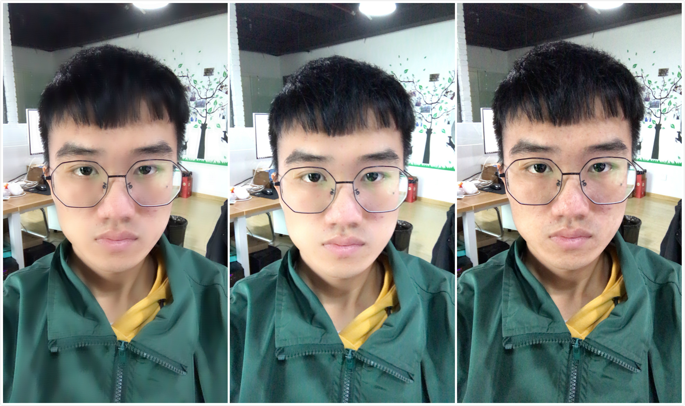
从左到右分别是：朦胧美肤、清晰美肤（默认美肤）、无美肤

__使用方法__：

- 加载face_beautification.bundle
- 调整如下参数

  磨皮新增了两个参数，老参数保留

  heavy_blur: 0.0,   // 大于1开启朦胧美肤功能

  blur_blend_ratio: 1.0,   // 磨皮结果和原图融合率 范围0 -1

  朦胧美肤使用了以下两个原有参数，使用其它原有参数对新磨皮无效

  blur_level: 6.0,   // 磨皮的模糊程度，6为默认

  skin_detect: 0,   // 肤色检测开关，0为关闭，1为开启

### 亮眼

使眼睛区域的纹理变得更加清晰，眼眸更加明亮。

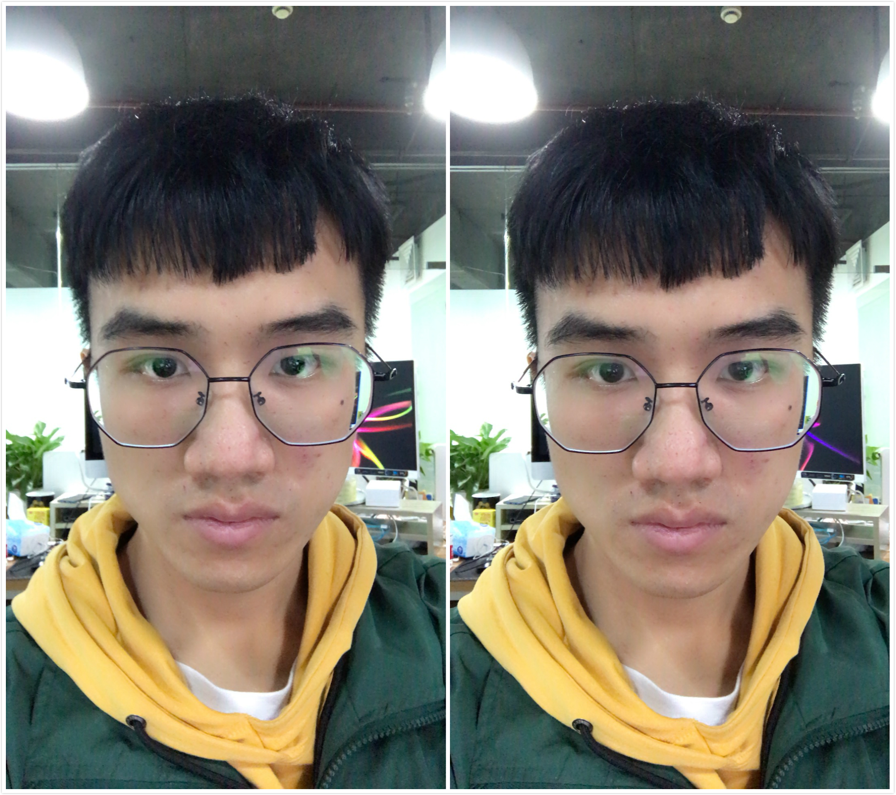
从左到右分别是：开启亮眼、无亮眼

__使用方法__：

- 加载face_beautification.bundle
- 调整如下参数
  eye_bright: 0.0,   // 亮眼程度，范围是0 - 1，大于0即为开启

### 美牙

使牙齿区域变得更亮更白。

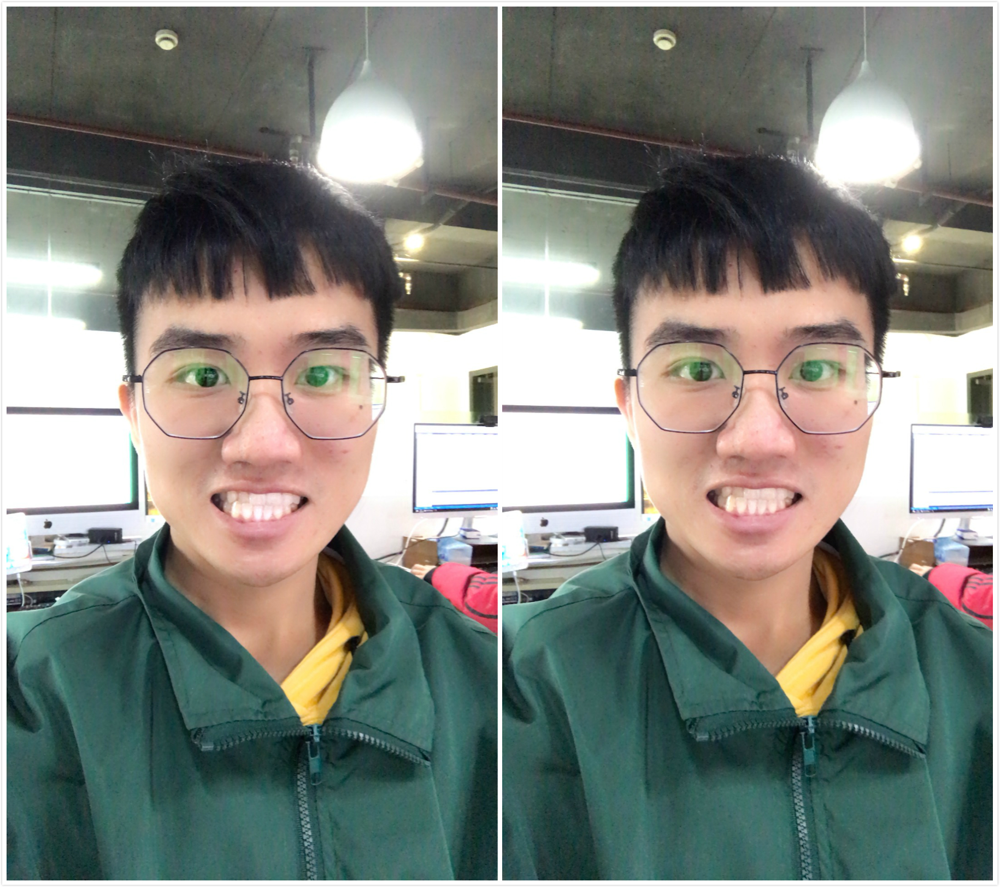
从左到右分别是：开启美牙、无美牙

__使用方法__：
- 加载face_beautification.bundle
- 调整如下参数
  tooth_whiten: 0.0,   // 美牙程度，范围是0 - 1，大于0即为开启

## 新增精细脸型调整功能

### 精细脸型调整功能

新增优化瘦脸、大眼的效果，增加额头调整、下巴调整、瘦鼻、嘴型调整4项美颜变形，将 face_shape 设为4即可开启精细脸型调整功能，FULiveDemo中可以在脸型中选择自定义来开启精细脸型调整功能

**使用方法：**

- 加载face_beautification.bundle
- 调整如下参数
  新增参数：
  face_shape: 4,   // 4为开启高级美型模式，0～3为基本美型

### 瘦脸

优化瘦脸变形效果，比之前更加自然

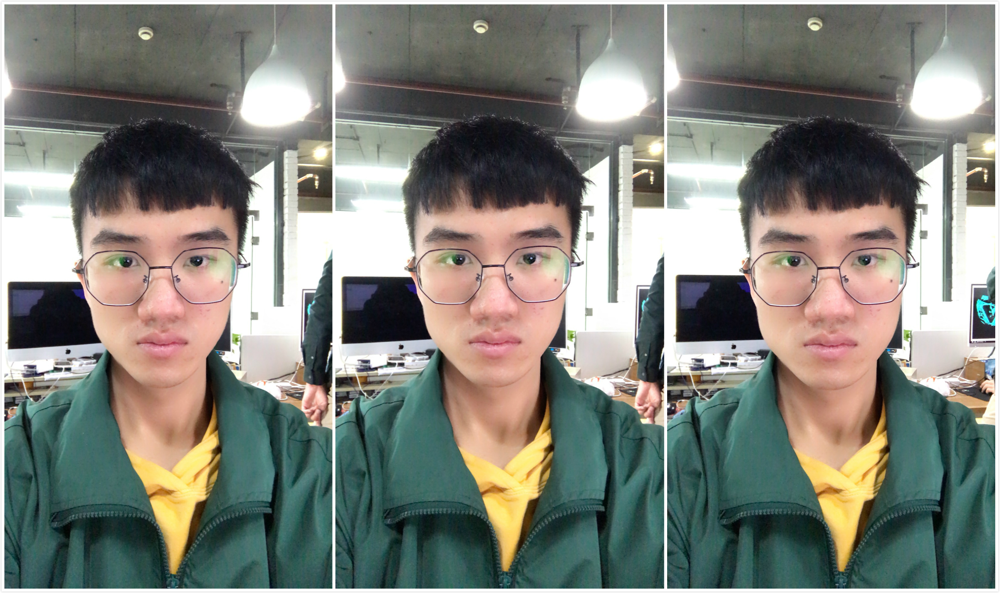
从左到右分别是：新瘦脸、旧瘦脸、无瘦脸

__使用方法__：
- 加载face_beautification.bundle
- 调整如下参数
  新增参数：
  face_shape: 4,   // 4为开启高级美型模式，0～3为基本美型
  原有参数：
  cheek_thinning: 0.0,   // 使用了原有参数cheek_thinning控制瘦脸 ，范围0 - 1
  face_shape: 3,   // 控制当前变形模式 0：女神 1：网红 2：自然 3：默认
  face_shape_level: 0   // 所有脸型参数的总控制，范围 0 - 1

### 大眼

优化大眼变形效果，比之前更加自然

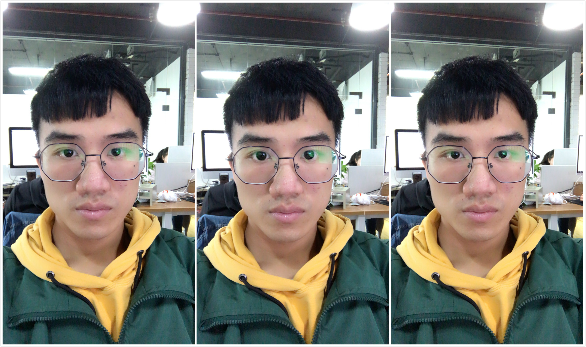
从左到右分别是：新大眼、旧大眼、无大眼

__使用方法__：
- 加载face_beautification.bundle
- 调整如下参数
  新增参数：
  face_shape: 4,   // 4为开启高级美型模式，0～3为基本美型
  原有参数：
  eye_enlarging: 0.0,   // 使用了原有参数eye_enlarging控制大眼，范围0 - 1
  face_shape: 3,   // 控制当前变形模式 0：女神 1：网红 2：自然 3：默认
  face_shape_level: 0   // 所有参数的总控制参数，范围 0 - 1

### 额头调整

新增加的一款美颜变形，可以调整额头大小

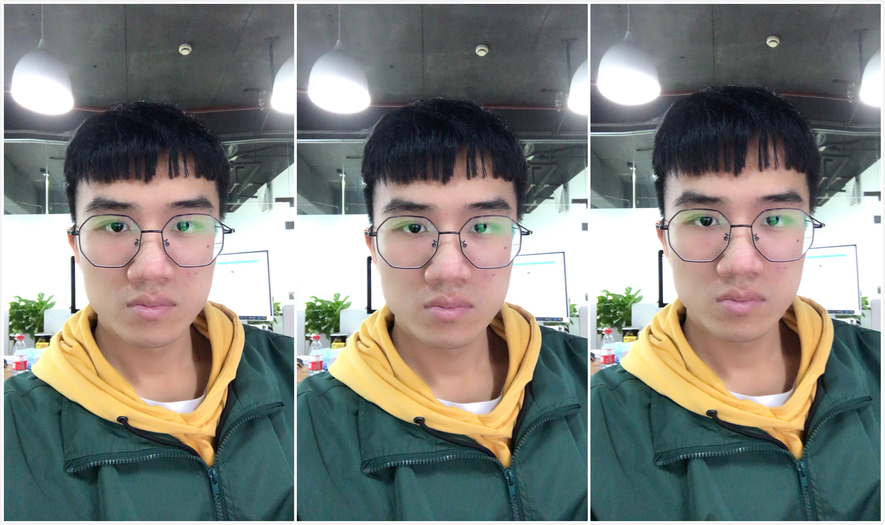
从左到右分别是：额头变小、正常额头、额头变大

__使用方法__：
- 加载face_beautification.bundle
- 调整如下参数
  新增参数：
  face_shape: 4,   // 4为开启高级美型模式，0～3为基本美型
  intensity_forehead: 0.5,   // 大于0.5 变大，小于0.5变小
  原有参数：
  face_shape: 3,   // 控制当前变形模式 0：女神 1：网红 2：自然 3：默认
  face_shape_level: 0   // 所有参数的总控制参数，范围 0 - 1

### 下巴调整

新增加的一款美颜变形，可以调整下巴大小

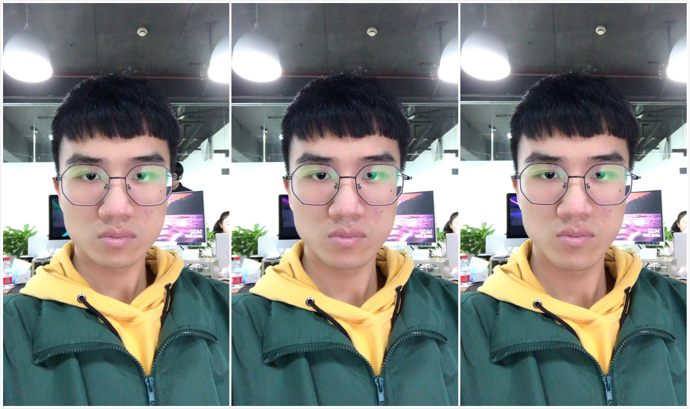
从左到右分别是：下巴变小、正常下巴、下巴变大

__使用方法__：
- 加载face_beautification.bundle
- 调整如下参数
  新增参数：
  face_shape: 4,   // 4为开启高级美型模式，0～3为基本美型
  intensity_chin: 0.5,   // 大于0.5 变大，小于0.5变小
  原有参数：
  face_shape: 3,   // 控制当前变形模式 0：女神 1：网红 2：自然 3：默认
  face_shape_level: 0   // 所有参数的总控制参数，范围 0 - 1

### 瘦鼻

新增加的一款美颜变形，可以进行瘦鼻操作

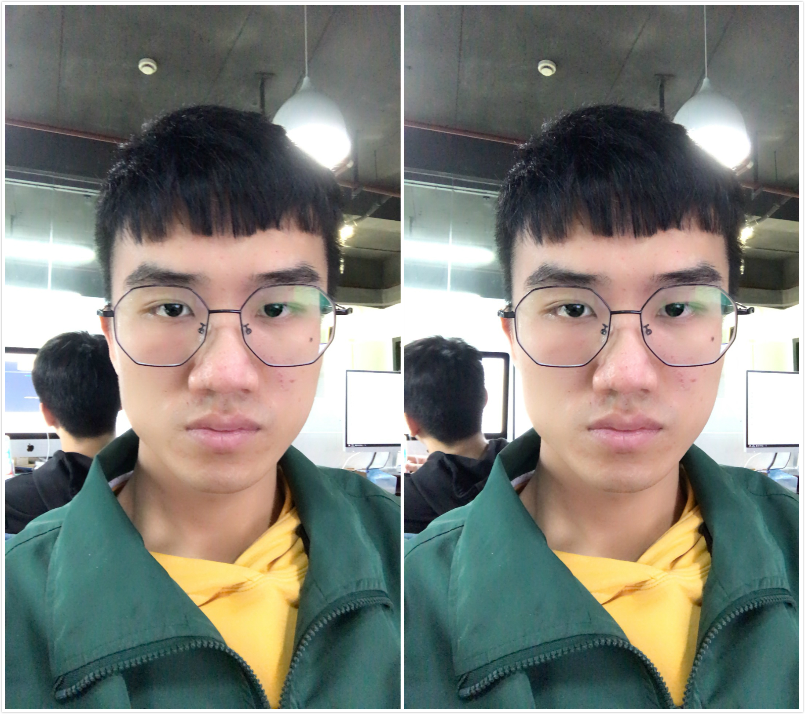
从左到右分别是： 正常鼻子、瘦鼻之后

__使用方法__：
- 加载face_beautification.bundle
- 调整如下参数
  新增参数：
  face_shape: 4,   // 4为开启高级美型模式，0～3为基本美型
  intensity_nose: 0.0,   // 0为正常大小，大于0开始瘦鼻，范围0 - 1
  原有参数：
  face_shape: 3,   // 控制当前变形模式 0：女神 1：网红 2：自然 3：默认
  face_shape_level: 0   // 所有参数的总控制参数，范围 0 - 1

### 嘴型调整

新增加的一款美颜变形，可以调整嘴型大小

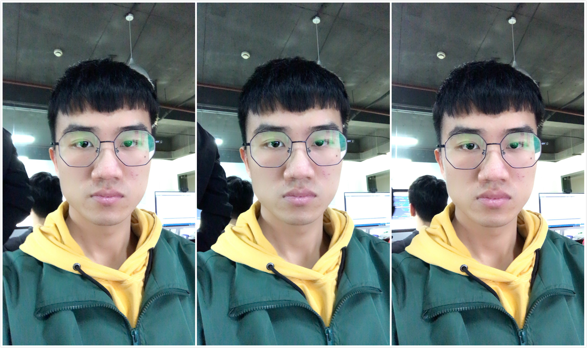
从左到右分别是： 嘴巴变小、正常嘴巴、嘴巴变大

__使用方法__：
- 加载face_beautification.bundle
- 调整如下参数
  新增参数：
  face_shape: 4,   // 4为开启高级美型模式，0～3为基本美型
  intensity_mouth: 0.5,   // 大于0.5变大，小于0.5变小
  原有参数：
  face_shape: 3,   //控制当前变形模式 0：女神 1：网红 2：自然 3：默认
  face_shape_level: 0   //所有参数的总控制参数，范围 0 - 1

## 新增3D绘制抗锯齿功能

高效全屏抗锯齿，使得3D绘制效果更加平滑。

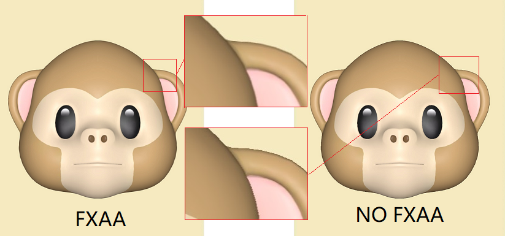

__使用方法__：
- 加载fxaa.bundle，随新版本SDK提供
- 绘制时将fxaa.bundle放在道具数组最后一个

## 新增照片驱动功能

针对照片进行精确的人脸重建，然后支持实时表情驱动，预置表情播放。可以用于实时应用，也可以用于生成表情包等。

该功能的资源有两种方式生成方式：
- 使用FUEditor v4.3.0以上版本离线制作道具
- 利用相芯提供的云服务在线上传照片生成道具
  在线云服务的方式请联系技术支持获取更多细节。


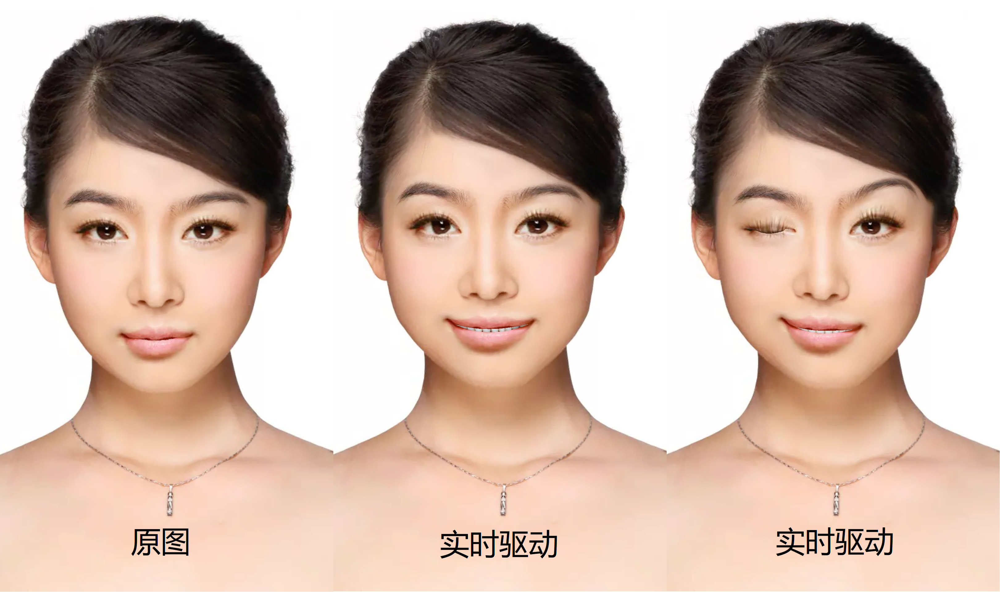
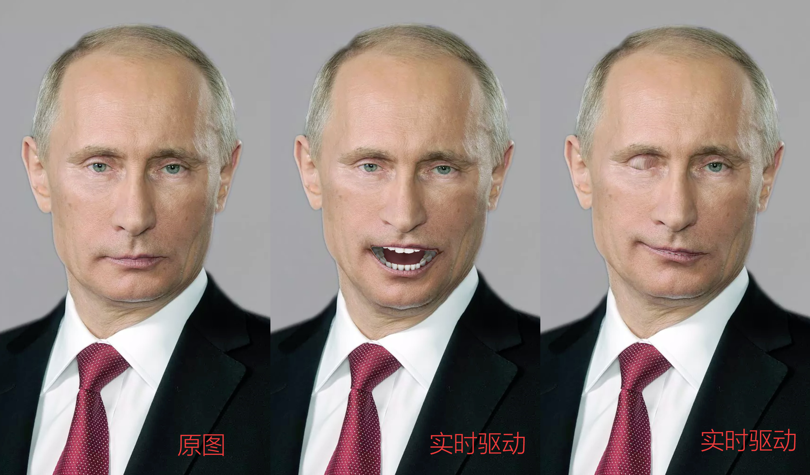

__使用方法__：
- 直接加载对应的道具
- 需要带有照片驱动权限的证书

## 新增人脸夸张变形功能

新增了5款夸张变形。

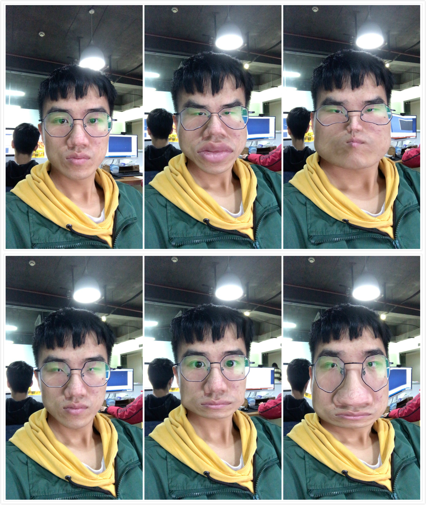
从左到右从上到下分别是： 1原图，2大嘴小眼，3小眼胖脸，4超级小眼，5方脸，6双眼分开大鼻头

__使用方法__：
- 直接加载对应的道具
- 需要带有照片驱动权限的证书

## 新增音乐节奏滤镜

效果详见FULiveDemo，道具可以通过FUEditor进行制作（v4.3.0及以上）。

## 优化表情校准功能

增加被动校准模式，将之前的表情校准定义为主动校准模式。
- 被动校准：该种模式下会在整个用户使用过程中逐渐进行表情校准，用户对该过程没有明显感觉。该种校准的强度相比主动校准较弱。
- 主动校准：老版本的表情校准模式。该种模式下系统会进行快速集中的表情校准，一般为初次识别到人脸之后的2-3秒钟。在该段时间内，需要用户尽量保持无表情状态，该过程结束后再开始使用。该过程的开始和结束可以通过 ```fuGetFaceInfo``` 接口获取参数 ```is_calibrating```。

__使用方法__：
- 调用 ```fuSetExpressionCalibration``` 接口控制表情校准功能的开关及不同模式，参数为0时关闭表情校准，1为主动校准，2为被动校准。
