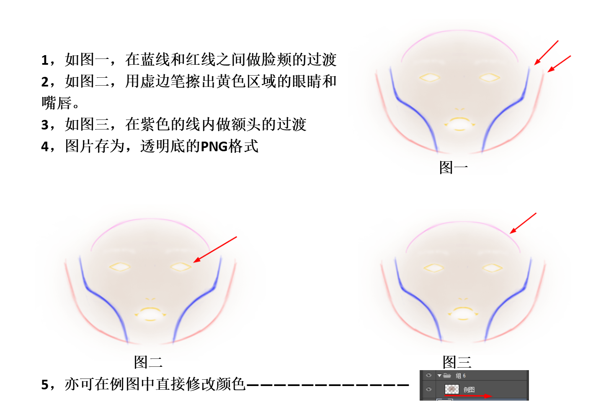

# 质感美颜bundle参数说明

## 目录

[TOC]


## 功能介绍

质感美颜是妆容和美颜的结合，使用比较轻薄的妆效使美颜效果更佳，美颜的使用可以参考**美颜道具功能文档**，以下介绍妆容功能的使用。

## 参数说明

### 质感美颜参数

以下参数为质感美颜的一些开关和程度参数，通过**fuItemSetParam**接口来设置值：

```
	is_makeup_on:	1,     //美妆开关
	makeup_intensity:1.0,       //美妆程度
	//下面是每个妆容单独的参数，intensity设置为0即为关闭这种妆效
	makeup_intensity_lip:1.0,		//kouhong
	makeup_intensity_pupil:1.0,		//meitong
	makeup_intensity_eye:1.0,  		//yanying
	makeup_intensity_eyeLiner:1.0,  		//yanxian
	makeup_intensity_eyelash:1.0,  		//jiemao
	makeup_intensity_eyeBrow:1.0,  		//meimao
	makeup_intensity_blusher：1.0,     //saihong
	makeup_lip_color：[0,0,0,0]   //长度为4的数组，rgba颜色值
	makeup_lip_mask：0.0        //嘴唇优化效果开关，1.0为开 0为关
```

### 纹理输入

**注意 5.8之后都使用以下接口**

使用**fuCreateTexForItem**接口，直接在接口中传入图片数据即可

```
fuCreateTexForItem(int obj_handle,__pointer name,__pointer value,int width,int height)
```

**obj_handle**对应美妆bundle的bundleID

**name** 可以取以下值

```
tex_brow 眉毛
tex_eye 眼影
tex_pupil 美瞳
tex_eyeLash 睫毛
tex_highlight 口红高光
tex_eyeLiner 眼线
tex_blusher腮红
```

**value**对应一个u8类型的数组，对应图片rgba8数据

**width**和**height**对应图片宽高

### landmark修改

landmark相关参数也是通过**fuItemSetParam**接口来设置值：

```
landmark修改主要为编辑美妆使用的特征点，优化效果使用。
landmark的修改主要通过两个参数控制，客户端同学需要设置这两个参数来修改和使用landmark：
1. is_use_fix：这个参数控制是否使用修改过得landmark点，如果设为1为使用，0为不使用
2. fix_makeup_data：这个参数为一个数组，需要客户端传递一个数组进去，传递的数组的长度为 150*人脸数，也就是将所有的点位信息存储的数组中传递进来。

```

#### 注意事项：

这里fix_makeup_data长度为150的原因是：咱们一共返回75个landmark点，每个landmark点有x和y两个数据，所以为75 * 2 = 150


## 附录

### 质感美颜推荐素材组合

以下素材组合为推荐的妆容素材和滤镜的组合，妆容和滤镜的参数都已经给出，建议使用。

| 妆容   | 妆容参数 | 口红      | 口红参数 | 腮红        | 腮红参数 | 眉毛          | 眉毛参数 | 眼影            | 眼影参数 | 滤镜名称&参数 | 滤镜参数 |
| :----- | :------- | :-------- | :------- | :---------- | :------- | :------------ | :------- | :-------------- | :------- | :------------ | :------- |
| 桃花妆 | 90       | mu_lip_01 | 90       | mu_blush_01 | 90       | mu_eyebrow_01 | 50       | mu_eyeshadow_01 | 90       | fennen3       | 100      |
| 复古妆 | 100      | mu_lip_11 | 100      | mu_blush_14 | 100      | mu_eyebrow_11 | 50       | mu_eyeshadow_11 | 100      | lengsediao11  | 85       |
| 朋克妆 | 85       | mu_lip_03 | 85       |             | 0        | mu_eyebrow_03 | 50       | mu_eyeshadow_03 | 85       | bailiang4     | 50       |
| 枫叶妆 | 100      | mu_lip_10 | 100      | mu_blush_13 | 100      | mu_eyebrow_10 | 50       | mu_eyeshadow_10 | 100      | bailiang3     | 80       |
| 锦鲤妆 | 90       | mu_lip_12 | 90       | mu_blush_15 | 90       | mu_eyebrow_12 | 50       | mu_eyeshadow_12 | 90       | fennen2       | 70       |
| 梅子妆 | 85       | mu_lip_13 | 85       | mu_blush_16 | 85       | mu_eyebrow_13 | 50       | mu_eyeshadow_13 | 85       | nuansediao2   | 80       |
| 宿醉妆 | 100      | mu_lip_14 | 100      | mu_blush_17 | 100      | mu_eyebrow_14 | 50       | mu_eyeshadow_14 | 100      | fennen8       | 55       |
| 赤茶妆 | 100      | mu_lip_16 | 90       | mu_blush_18 | 100      | mu_eyebrow_10 | 60       | mu_eyeshadow_16 | 100      | xiaoqingxin2  | 75       |
| 冬日妆 | 90       | mu_lip_17 | 90       | mu_blush_19 | 80       | mu_eyebrow_12 | 60       | mu_eyeshadow_17 | 80       | nuansediao1   | 80       |
| 男友妆 | 100      | mu_lip_18 | 100      | mu_blush_20 | 80       | mu_eyebrow_16 | 65       | mu_eyeshadow_18 | 90       | xiaoqingxin3  | 90       |
| 奶油妆 | 100      | mu_lip_19 | 75       | mu_blush_21 | 100      | mu_eyebrow_17 | 50       | mu_eyeshadow_19 | 95       | bailiang1     | 75       |
| 清透妆 | 90       | mu_lip_20 | 80       | mu_blush_22 | 90       | mu_eyebrow_18 | 45       | mu_eyeshadow_20 | 65       | xiaoqingxin1  | 80       |
| 西柚妆 | 100      | mu_lip_21 | 80       | mu_blush_23 | 100      | mu_eyebrow_19 | 60       | mu_eyeshadow_21 | 75       | lengsediao4   | 70       |
| 厌世妆 | 100      | mu_lip_22 | 80       | mu_blush_24 | 100      | mu_eyebrow_13 | 60       | mu_eyeshadow_22 | 100      | bailiang2     | 85       |
| 黑白妆 | 100      | mu_lip_15 | 100      |             | 0        | mu_eyebrow_15 | 60       | mu_eyeshadow_15 | 100      | heibai1       | 100      |

### 粉底制作

粉底是使用腮红的方式来制作的，对应的参数是**tex_blusher**

粉底资源制作方式如下

